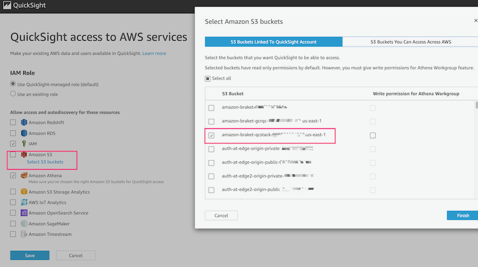

# Quantum Ready Solution For Drug Discovery (beta)

## Overview

AWS Solution Quantum-Ready Solution for Drug Discovery (abbrev. QRSDDSolution), an open-sourced solution that helps customers study drug discovery problems using quantum computing (Amazon Braket), like molecular docking and protein folding. With QRSDD, customers use job management service (AWS Batch) and workflow service (AWS Step Functions) to orchestrate different kinds of computing resources. To be at the forefront of innovations in drug discovery, customers can tailor sample codes to reuse the pipeline for different problems.

The overall architecture is shown as below:


This solution deploys the Amazon CloudFormation template in your 
AWS Cloud account and provides three URLs. One for **Visualization**.
The others provide user with two approaches to study drug discovery 
problems: **Notebook Experiment** and **Batch Evaluation**:

1. The solution deploys an instance for 
[AWS SageMaker Notebook](https://docs.aws.amazon.com/sagemaker/latest/dg/nbi.html). 
The user can do **Notebook Experiment** for drug discovery on classical computing and 
quantum computing in this notebook.

2. The notebook comes with prepared sample code for different problems 
in drug discovery, like molecule unfolding, molecule simulation and so on. 
The user can learn how to study these problems based on classical 
or quantum computing resource through 
[Amazon Braket](https://aws.amazon.com/braket/). The step-by-step guide is 
provided in the workshop page.

3. The notebook provides the user with the public network access to download 
necessary software for experiments.


4. The solution also deploys 
[AWS Step Function](https://aws.amazon.com/step-functions/) for user to do 
**Batch Evaluation**. 

5. The AWS Step Function launches various computing tasks through 
    [AWS Batch](https://aws.amazon.com/batch/) jobs based on different resources.

6. Instances launched by AWS Batch try to evaluate a particular problem based 
on different computing resources , classical computing or quantum computing. 
For example, for the problem of molecule unfolding, the performance difference 
between quantum annealer and simulated annealer can be figured out. 

7. The images for **Batch Evaluation** have been built in 
[Amazon ECR](https://aws.amazon.com/ecr/). For customizing
the logic for **Batch Evaluation**, please refer to the instructions in workshop page.

8. The **Batch Evaluation** deploys [VPC Endpoints](https://docs.aws.amazon.com/vpc/latest/privatelink/vpc-endpoints.html) to ensure secure connection to AWS 
services: AWS Step Function, [Amazon SNS](https://aws.amazon.com/sns/), 
Amazon ECR, Amazon S3, Amazon Braket and 
[Amazon EventBridge](https://aws.amazon.com/eventbridge/).

9. The batch job for testing quantum algorithm submits the quantum computing 
jobs/tasks through Amazon Braket.

10. Either classical computing task or quantum computing jobs/tasks complete, 
the results will be saved to 
[Amazon S3](https://aws.amazon.com/s3/),

11. When quantum computing jobs/tasks complete, Amazon EventBridge triggers 
the listener [AWS Lambda](https://aws.amazon.com/lambda/).

12. The listener lambda sends a callback to the step function.

13. When all the steps complete, a notification is send out by Amazon SNS.

14. The Glue table is created by Amazon Athena based on metrics data in 
Amazon S3.

15. The user can view the **Batch Evaluation** results(e.g. cost, performance) 
through [Amazon QuickSight](https://aws.amazon.com/quicksight/)

## Dataset

We use molecule data for this solution (source/src/molecule-unfolding/molecule-data/117_ideal.mol2). These data comes from the PDB protein data bank which is under [CC0 license](https://www.rcsb.org/pages/usage-policy). Please refer to the link for [117 mol file](https://www.rcsb.org/ligand/117)

## Quick start

### Sign up for QuickSight

- Go to [quicksight](https://quicksight.aws.amazon.com/sn/start)
- Click "Sign uup for QuickSight"
- Choose `Enterprise`, click continue
- In the `Create your QuickSight account` page, fill the necessary information:

   

- Go to [quicksight admin](https://us-east-1.quicksight.aws.amazon.com/sn/admin), record your QuickSight username

   

### Update `cdk.context.json`

```shell
cd source

# edit cdk.context.json
# fill `quicksight_user` in previous step

```

### Deploy

```shell
cd source

npm install
npm run deploy

```

### Deployment output

 After deployment, go to [cloudformation](https://console.aws.amazon.com/cloudformation/home), find the stack `QCStack`, from the output, you will get links for Notebook, Step Functions to run batch test tasks, and QuickSight dashboard URL


### Update QuickSight permissions

- Go to [quicksight admin](https://us-east-1.quicksight.aws.amazon.com/sn/admin#aws)
- In `QuickSight access to AWS services`, click 'Manage' button, select the S3 bucket create in step `deployment output`



- Save the change

### Run batch test through Step Functions

- open Step Functions link in `deployment output`
- click the **Start Execution** button, click **Start Execution** to execute the Step Functions workflow
- wait the execution of Step Functions to complete

### View batch test dashboard

- open the QuickSight dashboard link in step `deployment output`

### Notebook experiment

- open the Notebook link in step `deployment output`

### More

- [Batch Test Experiment](./docs/en/workshop/a-molecule-unfolding/batch-test.md)
- [Notebook Experiment](./docs/en/notebook.md)
- [Workshop](./docs/en/workshop)

## License

This project is licensed under the Apache-2.0 License.
