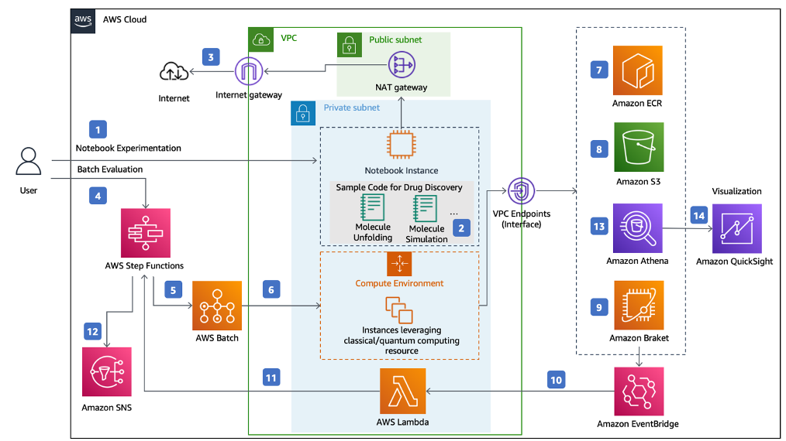

# Quantum Computing Exploration for Drug Discovery on AWS

## Overview

Quantum Computing Exploration for Drug Discovery on AWS is an open-source solution that allows researchers and quantum computing advocates to design and run computational studies in the field of drug discovery. With this solution, you can access quantum computers via the Amazon Braket service. The Amazon Braket Hybrid Job feature allows you to use classical computing and quantum computing resources to evaluate experiment values such as cost, time, and performance. The solution comes with built-in sample code for certain drug discovery problems, such as molecular docking, protein folding, RNA folding, and retrosynthetic planning, to help you get started with quantum computing in the field.

The overall architecture is shown as below:



For detailed description of architecture, please refer to the
[Architecture Page](https://awslabs.github.io/quantum-computing-exploration-for-drug-discovery-on-aws/en/architecture/)

This solution deploys the Amazon CloudFormation template in your
AWS Cloud account and provides the URL for Notebook Experiment about drug discovery problems. 

## Pre-built Examples for Drug Discovery[<sup>1,</sup>](#more-example)[<sup>2</sup>](#data)

<table border='1' style="text-align: center">
    <tr>
        <td><B>Problem Name</B></td>
        <td><B>Method</td>
        <td><B>Reference</td>
    </tr>
    <tr>
        <td>Molecular Unfolding </td>
        <td>QUBO</td>
        <td><a href="https://arxiv.org/abs/2107.13607">Quantum Molecular Unfolding(2021)</a></td>
    </tr>
    <tr>
        <td rowspan='2'>RNA folding</td>
        <td rowspan='2'>QUBO</td>
        <td ><span><a href="https://journals.plos.org/ploscompbiol/article?id=10.1371/journal.pcbi.1010032">RNA folding using quantum computers(2022)</a></span></td>
    </tr>
    <tr>
        <td ><span><a href="https://github.com/XanaduAI/QHack2022/issues/114">QHack 2022 winner</a></span></td>
    </tr>
    <tr>
        <td rowspan='5'>Protein folding</td>
        <td rowspan='2'>Quantum Walk</td>
        <td ><span><a href="https://iopscience.iop.org/article/10.1088/2058-9565/ac4f2f">QFold: quantum walk and deep learning to solve protein folding(2022)</a></span></td>
    </tr>
    <tr>
        <td ><span><a href="https://github.com/roberCO/QFold">Roberto Campos's Implementation</a></span></td>
    </tr>
    <tr>
        <td>VQE</td>
        <td >--</td>
    </tr>
    <tr>
        <td rowspan='2'>Grover's Algorithm</td>
        <td ><span><a href="https://ieeexplore.ieee.org/document/9374469">Quantum Speedup for Protein Structure Prediction(2022)</a></span></td>
    </tr>
    <tr>
        <td ><span><a href="https://github.com/renatawong/quantum-protein-structure-prediction">Renata Wong's Implementation</a></span></td>
    </tr>
    <tr>
        <td >Retrosynthetic Planning</td>
        <td >Quantum Reinforcement Learning</td>
        <td ><span><a href="https://pubs.acs.org/doi/10.1021/acscentsci.9b00055">Learning Retrosynthetic Planning through Simulated Experience(2019)</a></span></td>
    </tr>
</table>

<div id='more-example'></div>
1.More examples to be added with continuous update

## File Structure

Upon successfully cloning the repository into your local development environment, you will see the following file structure in your editor:

```
├── CHANGELOG.md                  [Change log file]
├── CODE_OF_CONDUCT.md            [Code of conduct file]
├── CONTRIBUTING.md               [Contribution guide]
├── LICENSE                       [LICENSE for this solution]
├── NOTICE                        [Notice for 3rd-party libraries]
├── README.md                     [Read me file]
├── docs                          [Solution's document]
│   ├── en
│   ├── index.html
│   ├── mkdocs.base.yml
│   ├── mkdocs.en.yml
│   ├── mkdocs.zh.yml
│   └── zh
└── source                        [Solution's source and test code]
    ├── README.md
    ├── cdk.json
    ├── package-lock.json
    ├── package.json
    ├── src                       [Solution's source code]
    │   ├── cdk
    │   ├── notebook
    │   │   └── healthcare-and-life-sciences
    │   │       ├── a-1-molecular-unfolding-quadratic-unconstrained-binary-optimization
    │   │       ├── b-1-folding-quadratic-unconstrained-binary-optimization
    │   │       ├── c-1-rna-folding-quadratic-unconstrained-binary-optimization
    │   │       ├── c-2-protein-folding-variational-quantum-eigensolver
    │   │       ├── c-3-protein-folding-grover-search
    │   │       └── d-1-retrosynthetic-planning-quantum-reinforcement-learning 
    │   └── stack.ts
    ├── test                      [Solution's unit test code]
    ├── tsconfig.jest.json
    ├── tsconfig.json
    └── version.json
```

## Deploy From Source

Refer to [prerequisites and deployment](source/README.md)

## Running Unit Tests

The `/source/run-all-tests.sh` script is the centralized script for running all unit, integration, and snapshot tests for both the CDK project as well as any associated Lambda functions or other source code packages.

```

cd ./source
chmod +x ./run-all-tests.sh
./run-all-tests.sh

```

---

## Documents

- [Github latest page](https://awslabs.github.io/quantum-computing-exploration-for-drug-discovery-on-aws/en/)

- [Solution landing page](https://aws.amazon.com/solutions/implementations/quantum-computing-exploration-for-drug-discovery/)
