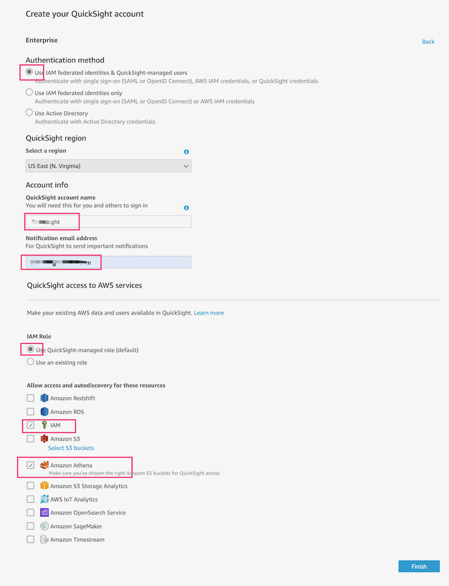
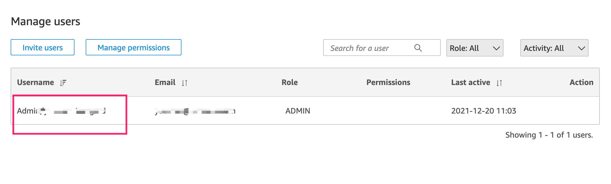
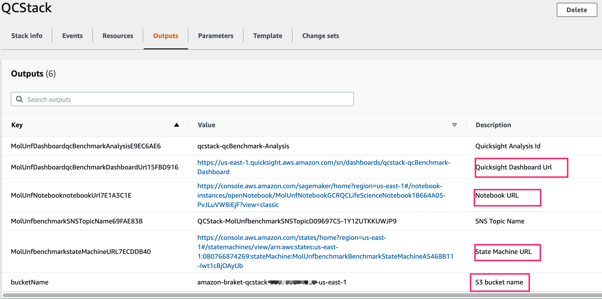
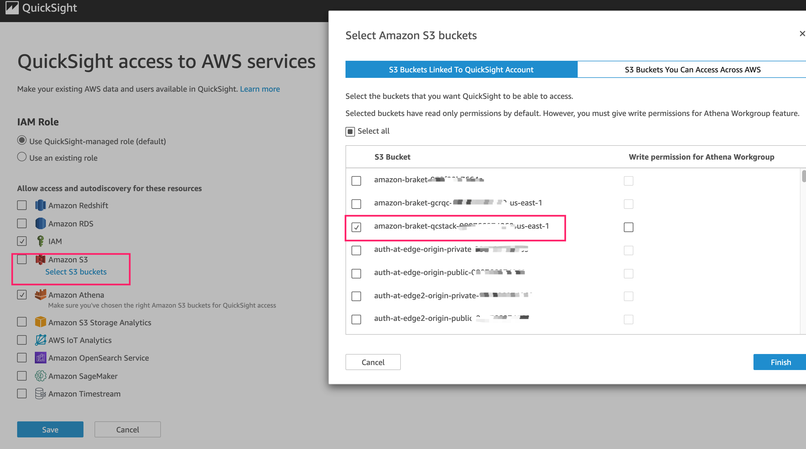

# Quantum Ready Solution For Drug Discovery

## Quick start

### Signup for QuickSight
   - Go to [quicksight](https://quicksight.aws.amazon.com/sn/start)
   - Click "Sign uup for QuickSight"
   - Choose `Enterprise`, click continue
   - In the `Create your QuickSight account` page, fill the necessary infomaiton:
   
    
   
   - Go to [quicksight admin](https://us-east-1.quicksight.aws.amazon.com/sn/admin), record your QuickSight username
   
       

### Create `cdk.context.json`

```shell
cd source
cp cdk.context.template.json cdk.context.json 

# edit cdk.context.json, 
# fill  `quicksight_user` in step 1, 
# fill `quicksight_template_account_id` from user guide.

```

### Deploy 

```shell
cd source

npm install
npm run deploy

```

### Deployment output

 After deployment, go to [cloudformation](https://console.aws.amazon.com/cloudformation/home), find the statck `QCStack`, from the output, you will get related links for Notebook, stepFunctions to run benchmark tasks, and QuickSight dashboard URL

   


### Change QuickSight permissions

 - Go to [quicksight admin](https://us-east-1.quicksight.aws.amazon.com/sn/admin#aws) 
 - In `QuickSight access to AWS services`, click 'Manage' button, select the S3 bucket create in step `deployment output`

 

 - Save the change 


### Run benchmark through Stepfunctons

 -  open StepFunctons link in `deployment output`
 -  click the 'Start execution' button, click 'Start execution' to exuecute the StepFunctons workflow
 -  wait Stepfunctons to complete

### View benchmark dashbaord

 - open the QuickSight dashboard link in step `deployment output`

### Notebook experiment 

 - open the Notebook link in step `deployment output`


