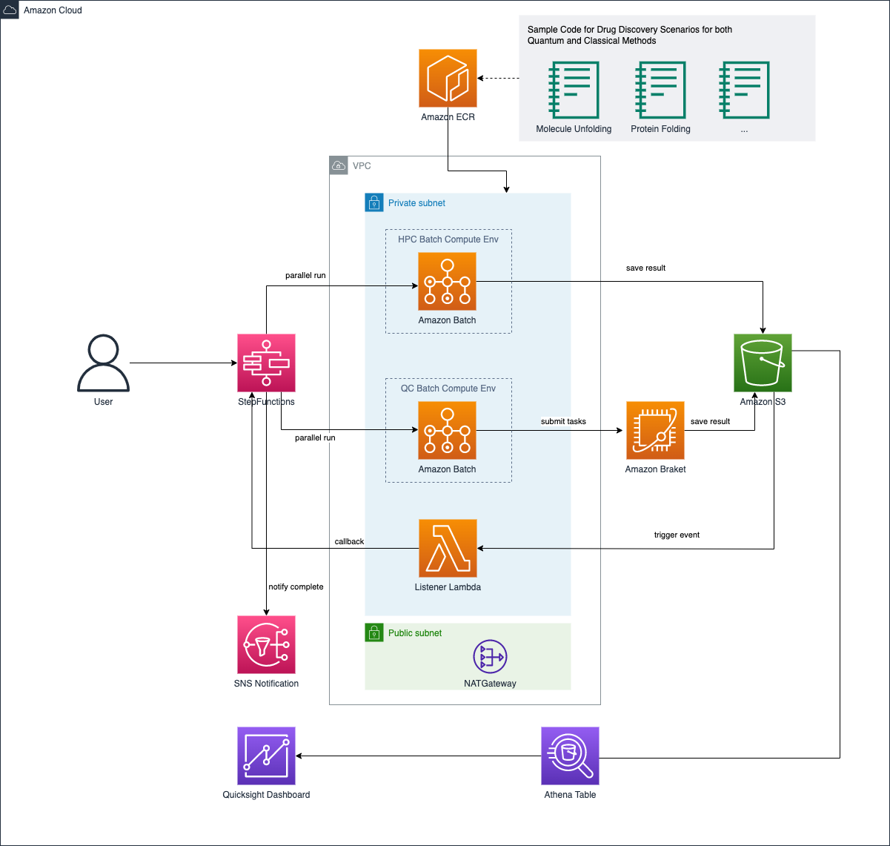

# Quantum Ready Solution For Drug Discovery

## Overview 

AWS Solution Quantum-Ready Solution for Drug Discovery (abbrev. QRSDDSolution), an open-sourced solution that helps customers study drug discovery problems using quantum computing (Amazon Braket), like molecular docking and protein folding. With QRSDD, customers use job management service (AWS Batch) and workflow service (AWS Step Functions) to orchestrate different kinds of computing resources. To be at the forefront of innovations in drug discovery, customers can tailor sample codes to reuse the pipeline for different problems.

The overall architecture is shown as below:



There are two types of Experiments of this solution: Benchmark experiment and Notebook experiment.

### Benchmark Experiment:

1. User triggers the benchmark execution through AWS StepFunctions from AWS console.

1. The StepFunctions parallel run HPC tasks and QC tasks.

   - HPC tasks
      1. StepFunctions synchronous parallel launch various HPC tasks through AWS batch jobs based on different resources (vcpu and memory) and different parameters of the algorithm.
      1. Batch jobs save result to S3.
      1. StepFunctions continue to next step.
  
   - QC tasks
     1. StepFunctions parallel launch various QC tasks through AWS lambda based on different QC devices (DW_2000Q_6/Advantage_system4) and different parameters of the algorithm.
     1. Each lambda asynchronous submits the QC task as AWS Braket job/task to AWS Braket service. 
     1. StepFunctions wait for completion callback to continue.
     1. When a Braket job/task completed, it saves its result to S3, which triggers the listener lambda.
     1. The listener lambda sends a callback token to StepFunctions.
     1. When StepFunctions get all callback tokens, continue to next step.

1. An Athena table is created based on metrics data in S3.

1. A SNS notification is sent out when all HPC and QC tasks completed.

1. User views the benchmarking result through AWS Quicksight dashboard.

### Notebook Experiment:

This solution also deploys SageMaker notebooks, user can run and study backend algorithms for drug discovery in notebook. The code is step-by-step guide user to build models, run them by HPC and Braket service and post process the result. 


## Quick start

### Signup for QuickSight
   - Go to [quicksight](https://quicksight.aws.amazon.com/sn/start)
   - Click "Sign uup for QuickSight"
   - Choose `Enterprise`, click continue
   - In the `Create your QuickSight account` page, fill the necessary infomaiton:
   
    
   
   - Go to [quicksight admin](https://us-east-1.quicksight.aws.amazon.com/sn/admin), record your QuickSight username
   
       

### Create `cdk.context.json`

```shell
cd source
cp cdk.context.template.json cdk.context.json 

# edit cdk.context.json, 
# fill `quicksight_user` in previous step, 
# fill `quicksight_template_account_id` from user guide.

```

### Deploy 

```shell
cd source

npm install
npm run deploy

```

### Deployment output

 After deployment, go to [cloudformation](https://console.aws.amazon.com/cloudformation/home), find the statck `QCStack`, from the output, you will get related links for Notebook, stepFunctions to run benchmark tasks, and QuickSight dashboard URL

   


### Change QuickSight permissions

 - Go to [quicksight admin](https://us-east-1.quicksight.aws.amazon.com/sn/admin#aws) 
 - In `QuickSight access to AWS services`, click 'Manage' button, select the S3 bucket create in step `deployment output`

 

 - Save the change 


### Run benchmark through Stepfunctons

 -  open StepFunctons link in `deployment output`
 -  click the 'Start execution' button, click 'Start execution' to exuecute the StepFunctons workflow
 -  wait Stepfunctons to complete

### View benchmark dashbaord

 - open the QuickSight dashboard link in step `deployment output`

### Notebook experiment 

 - open the Notebook link in step `deployment output`


### More 
 - [Benchmark Experiment](./docs/en/benchmark.md) 
 - [Notebook Experiment](./docs/en/notebook.md) 
