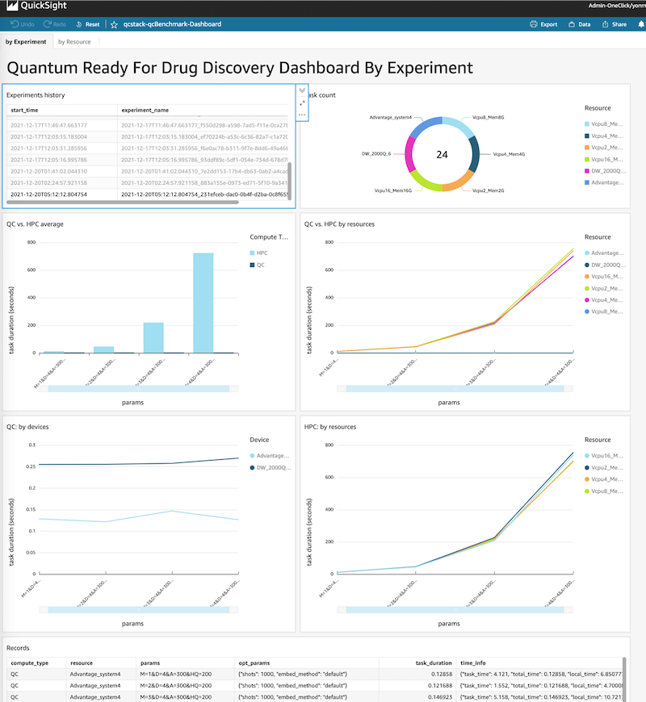

## Run Benchmark

We will run benchmark through AWS StepFunctions workflow and view the result via AWS QuickSight dashboard

### Get StepFunctions link from deployment output


### Start Execution

All input fields of the input json is optional, but you can customize anything about model parameters, computing rescoures, QC devices, optimizer parameters. 

The input scheam:
```json
{
    "version": "string",
    "runMode": "string",
    "molFile": "string",
    "modelVersion": "string",
    "experimentName": "string",
    "optParams": {
        "qa": {
            "shots": "int",
            "embed_method": "string"
        },
        "sa": {
            "shots": "int",
            "notes": "string"
        }
    },

    "modelParams": {
        "M": "int []",
        "D": "int []",
        "A": "int []",
        "HQ": "int []",
    },
    "devicesArns": "string []",
    "hpcResources": "[int, int] []",
}

```
Definition: 

    version:  the version of input schema, current only support  value is: '1'

    runModel:  ALL|HPC|QC, default: 'ALL'

    molFile: s3 url of the file

    modelVersion: any string, default: 'latest'

    experimentName: any string

    hpcResources: 2-d array, e.g: 2 vCPU 4GiB memory and 4 vCPU 8GiB memory : [[2, 4], [4, 8]] 

A typical and default(if input json is `{}`) input:
```json
{
    "version": "1",
    "runMode": "ALL",
    "optParams": {
        "qa": {
            "shots": 1000,
            "embed_method": "default"
        },
        "sa": {
            "shots": 1000,
            "notes": "benchmarking"
        }
    },

    "modelParams": {
        "M": [1, 2, 3, 4],
        "D": [4],
        "A": [300],
        "HQ": [200]
    },
    "devicesArns": [
        "arn:aws:braket:::device/qpu/d-wave/DW_2000Q_6",
        "arn:aws:braket:::device/qpu/d-wave/Advantage_system4"
    ],
    "hpcResources": [
        [2, 2],
        [4, 4],
        [8, 8],
        [16, 16]
    ]
}

```

### View dashboard

Dashbaord [link](https://us-east-1.quicksight.aws.amazon.com/sn/dashboards/qcstack-qcBenchmark-Dashboard)

If you run StepFunctions multi-times, by default, the dashbaord average  metrics of all executions. You can click a item in the experiment hist table in the left-upper corner to view the result of a specific execution.  




### Trouble shooting

1. StepFunctions failed becasue of "Check Input" step failed

    If the input json not is passed the input validation, this step fails. Check the `errorMessage` of the step, fix your input.

1. StepFunctions failed becasue of `Lambda.TooManyRequestsException`

    If you run the StepFunctions with high a frequency, you may get this error, you can wait serveal seconds and retry.

1. Dashboard can not be displayed, the error message complains permission error when accessing data in S3 bucket

    Go to [quicksight admin](https://us-east-1.quicksight.aws.amazon.com/sn/admin#aws), in `QuickSight access to AWS services`, make sure your S3 bucket is checked.


