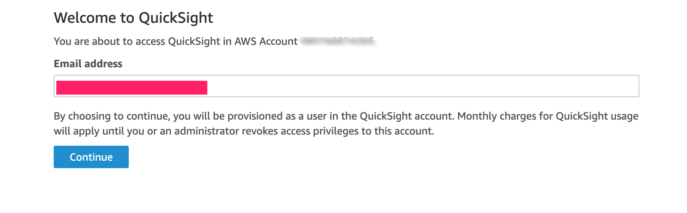
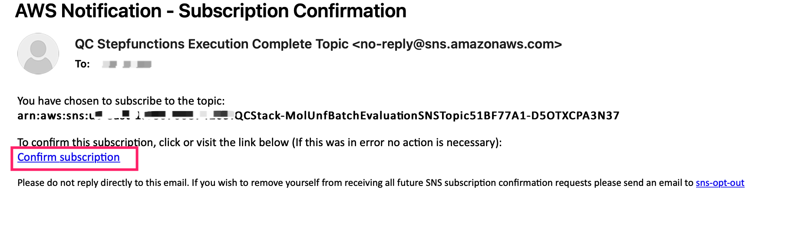

Before you launch the solution, review the architecture, supported regions, and other considerations discussed in this guide. Follow the step-by-step instructions in this section to configure and deploy the solution into your account.


!!! notice

    It's good practice to set a billing alarm before deploying this solution. Refer to this [link](https://docs.aws.amazon.com/AmazonCloudWatch/latest/monitoring/monitor_estimated_charges_with_cloudwatch.html)


**Time to deploy**: Approximately 10 minutes


## Prerequisites

### Sign up for QuickSight

!!! notice
    You need correct AWS Identity and Access Management (IAM) permissions to sign up for QuickSight, please refer to [Signing up for an Amazon QuickSight subscription](https://docs.aws.amazon.com/quicksight/latest/user/signing-up.html)

* Sign in to the AWS Management Console, navigate to [QuickSight](https://quicksight.aws.amazon.com/).

* If you did not have a QuickSight account, you need to sign up for QuickSight.

* Choose **Enterprise**, click continue.

* In the **Create your QuickSight account** page, fill the necessary information:

<center>

|      Field Name      |   Value |  Comment |
|:--------------------:|:-------------------:| :-------------------:|
| Authentication method | Choose **Use IAM federated identities & QuickSight-managed users** | The default value|
| Select a region | Choose **US East(N.Virginia)**  | The default value |
| QuickSight account name | Any string value | Unique QuickSight account name|
| Notification email address | your email | |
|IAM Role| Choose **Use QuickSight-managed role (default)**| The default value |
|Allow access and autodiscovery for these resources| Choose  **IAM**, **Amazon Athena**| The default value |

</center>


### Update QuickSight permissions

* Go to [IAM Roles](https://console.aws.amazon.com/iamv2/home?#/roles).

* Search role by prefix: `aws-quicksight-service-role`, you should find one result, e.g. `aws-quicksight-service-role-v0`

* Click the role name.

* Click **Add permissions**, in the drop down list, click **Create inline policy**.

* Click **JSON** tab, pasted below json into it.

```json
{
    "Version": "2012-10-17",
    "Statement": [
         {
            "Effect": "Allow",
            "Action": "s3:ListAllMyBuckets",
            "Resource": "arn:aws:s3:::*"
        },

        {
            "Action": [
                "s3:ListBucket"
            ],
            "Effect": "Allow",
            "Resource": [
                "arn:aws:s3:::amazon-braket-qcstack-*"
            ]
        },

         {
            "Action": [
                "s3:GetObject",
                "s3:GetObjectVersion"
            ],
            "Effect": "Allow",
            "Resource": [
                "arn:aws:s3:::amazon-braket-qcstack-*/*"
            ]
        }
    ]
}

```

* Click **Review policy**.

* Fill **Name**: `QC-QuickSight-S3-Policy`.

* Click **Create policy**. 

* Navigate to [QuickSight Security & permissions](https://us-east-1.quicksight.aws.amazon.com/sn/admin#aws).

* Click button **Manage**.

* Select **Use an existing role** for IAM Role.

* In the drop down list, select the role with prefix: `aws-quicksight-service-role`

* Click **Save**.

### Get QuickSight Username

* (Optional) Navigate to [QuickSight](https://quicksight.aws.amazon.com/), fill your email in below screen

!!! notice
    This step is only necessary if you login your AWS console with different IAM user(not the user sign up with QuickSight).

<center>



Figure 3: QuickSight email

</center>


* Go to [QuickSight Admin](https://us-east-1.quicksight.aws.amazon.com/sn/admin), record your **QuickSight Username**(not QuickSight account name) for your email.

<center>


Figure 2: QuickSight username

</center>

## Deployment

Use the following steps to deploy this solution on AWS.

### Launch the AWS CloudFormation template into your AWS account to deploy the solution

This automated AWS CloudFormation template deploys the solution in the AWS Cloud.

* [Launch solution in AWS Standard Regions][template-url] to deploy solution via the AWS CloudFormation template.

* The template launches in the US West(Oregon) by default. To launch this solution in a different AWS Region(for example `us-east-1`), use the Region selector in the console navigation bar.

* Under **Parameters**, review the parameters for the template and modify them as necessary. This solution uses the following values. Choose **Next**.

<center>

|      Parameter      |   Description |
|:-------------------:|:----:|
| QuickSightUser | **QuickSight Username** |

</center>

* On the **Configure stack options** page, choose **Next**.

* On the **Review** page, review and confirm the settings. Check the box acknowledging that the template will create AWS Identity and Access Management (IAM) resources.

* Choose **Create stack** to deploy the stack.

You can view the status of the stack in the AWS CloudFormation Console in the **Status** column. You should receive a CREATE_COMPLETE status in approximately 10 minutes.

## Post Deployment
### Subscribe SNS notification (optional)

!!! notice
    This step is optional.

Follow below steps to subscribe SNS notification via Email, you might subscribe the notification via [text messages](https://docs.aws.amazon.com/sns/latest/dg/sns-mobile-phone-number-as-subscriber.html).

* Get your SNS topic name in the CloudFormation deployment output

<center>


Figure 7: SNS topic name

</center>


* Navigate to [SNS topics](https://console.aws.amazon.com/sns/v3/home?region=us-east-1#/topics) AWS console.

* Click the SNS topic which is in CloudFormation deployment output.

* Click **Create subscription** button.

* Subscribe the SNS topic by email, fill **Protocol** and **Endpoint**, click **Create subscription**.

    - Protocol: **Email**
    - Endpoint: `<your-email-address>`

<center>


Figure 8: Subscribe SNS by email

</center>

* Confirm subscription.

    Check inbox of your email, you will get an email as below, click the **Confirm subscription** link to confirm the subscription.

<center>


Figure 9: Confirm subscription

</center>

[template-url]: https://console.aws.amazon.com/cloudformation/home?region=us-west-2#/stacks/create/template?stackName=QRADDStack&templateURL=https://aws-gcr-solutions.s3.amazonaws.com/AWS-gcr-qc-life-science/v0.8.6/default/QCStack.template.json
