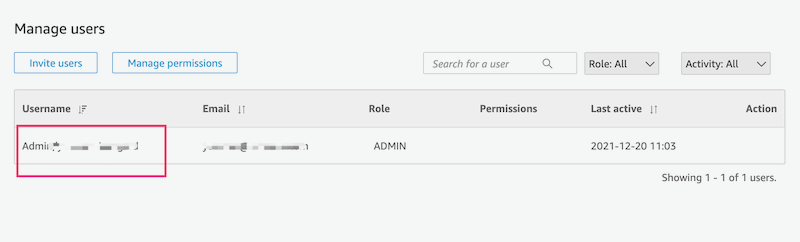
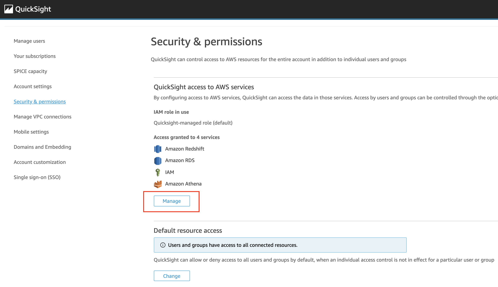
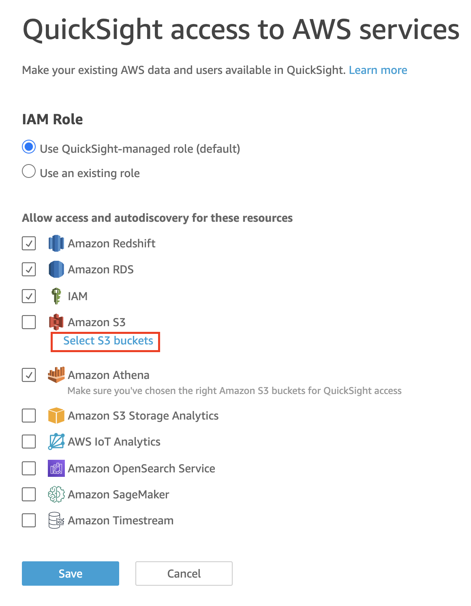
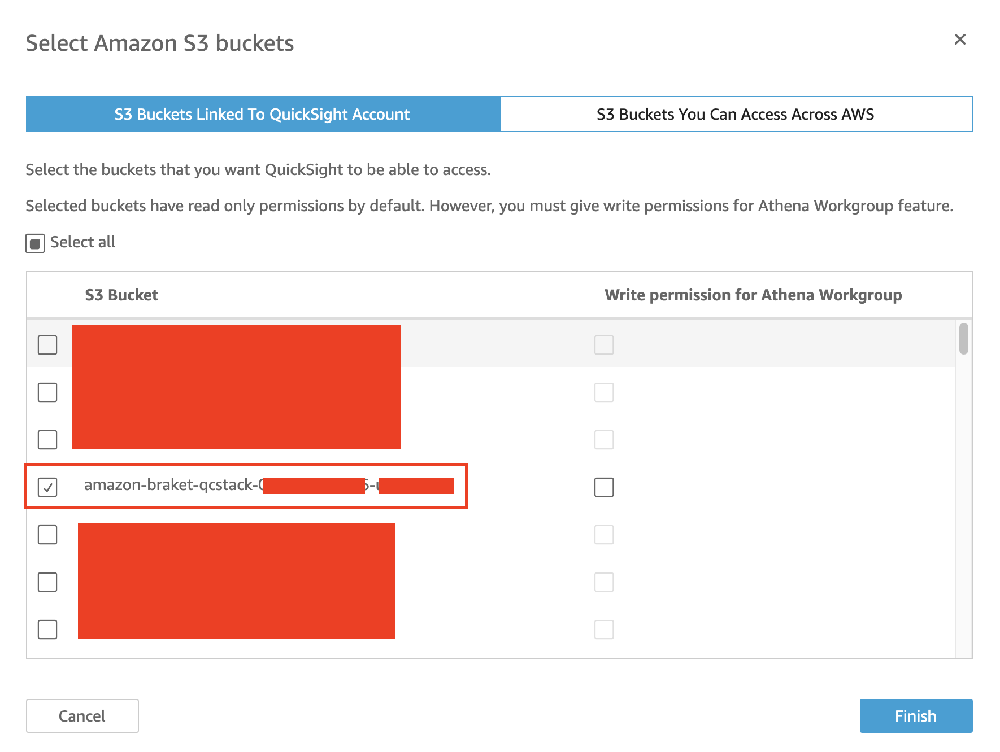

Before you launch the solution, review the architecture, supported regions, and other considerations discussed in this guide. Follow the step-by-step instructions in this section to configure and deploy the solution into your account.

**Time to deploy**: Approximately 10 minutes

## Deployment overview

Use the following steps to deploy this solution on AWS.

* Step1: Check your QuickSight account
* Step2: Launch the AWS CloudFormation template into your AWS account to deploy the solution.
* Step3: Update QuickSight permissions

!!! notice

    Step1 and Step3 are one time setup per account when deploying this solution for the first time. You don't have to do them when repeating deployment

## Deployment

### Step1: Check your QuickSight

* Sign in to the AWS Management Console, navigate to
[QuickSight](https://quicksight.aws.amazon.com/)

* If you did not have a QuickSight account, you need to sign up for QuickSight(you need Administrator permission to sign up, [doc](https://docs.aws.amazon.com/quicksight/latest/user/setting-up-create-iam-user.html)).

* Choose **Enterprise**, click continue

* In the **Create your QuickSight account** page, fill the necessary information:

Figure 1: Fill information for quicksight

* Go to [quicksight admin](https://us-east-1.quicksight.aws.amazon.com/sn/admin), record your **QuickSight Username**(not QuickSight account name).

Figure 2: Quicksight username

### Step2: Deploy solution

This automated AWS CloudFormation template deploys the solution in the AWS Cloud.

* Use 
[Launch solution in AWS Standard Regions](https://console.aws.amazon.com/cloudformation/home?region=us-west-2#/stacks/new?stackName=qrsdd-stack) to launch the AWS CloudFormation template.

* The template launches in the US West 2 (Oregon) Region by default. To launch this solution in a different AWS Region, use the Region selector in the console navigation bar.

* On the **Create stack** page, verify that the correct [quantum-ready-solution-for-drug-discovery.template](https://aws-gcr-solutions.s3.amazonaws.com/AWS-gcr-qc-life-science/v0.8.2/default/QCStack.template.json) is shown in the **Amazon S3 URL** text box and choose **Next**.

* Under **Parameters**, review the parameters for the template and modify them as necessary. This solution uses the following values. Choose **Next**.

|      Parameter      |   Description |
|:-------------------:|:----:|
| QuickSightUser | **QuickSight Username** |

* On the **Configure stack options** page, choose **Next**.

* On the **Review** page, review and confirm the settings. Check the box acknowledging that the template will create AWS Identity and Access Management (IAM) resources.

* Choose **Create stack** to deploy the stack.

You can view the status of the stack in the AWS CloudFormation Console in the **Status** column. You should receive a CREATE_COMPLETE status in approximately 10 minutes.

### Step3: Update QuickSight permissions

* Navigate to QuickSight [admin page](https://us-east-1.quicksight.aws.amazon.com/sn/admin#aws)

* Click **Manage**

Figure 3: Manage quicksight

* Click **Select S3 Buckets**

Figure 4: Check s3 in quicksight

* Check the bucket `amazon-braket-qcstack-<AWS account>-<region>`

Figure 5: Select s3 in quicksight

* Click **Finish** and then **Save**

