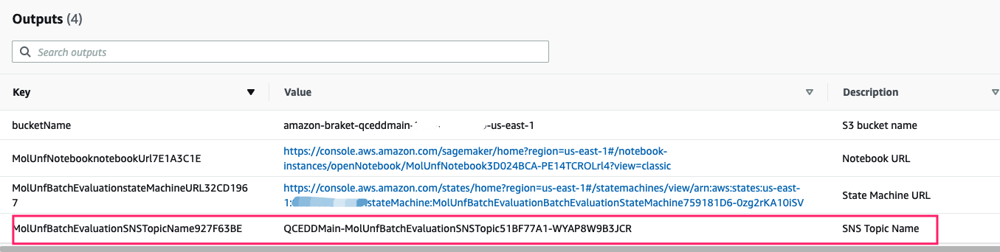

Before you launch the solution, review the architecture, supported regions, and other considerations discussed in this guide. Follow the step-by-step instructions in this section to configure and deploy the solution into your account.

**Time to deploy**: Approximately 10 minutes(all parts)

!!! notice "Note"

    Before deploying this solution, we recommend you [create a billing alarm to monitor your estimated AWS charges](https://docs.aws.amazon.com/AmazonCloudWatch/latest/monitoring/monitor_estimated_charges_with_cloudwatch.html). 

The user or IAM role to perform the deployment must have at least [permissions](./workshop/a-molecular-unfolding/permissions.json). If you use the permissions defined in this file to deploy this solution, your CloudFormation stack name should start with `QCEDD`, e.g `QCEDDStack` .

## Prerequisites
### Enable Amazon Braket service

1. Sign in to the AWS Management Console, and search for Amazon Braket.

2. Access the Amazon Braket console, and select **I have read and accepted the above terms & conditions**.

3. Choose **Enable Amazon Braket**.

### Visualization Configuration

!!! notice "Note"
    Skip this step if you do not want to deploy the **Visualization** part. If you skip it at this time, you can do it any time you like.
#### Create IAM Role for QuickSight

1. Navigate to [IAM console](https://console.aws.amazon.com/iamv2/home?#/policies).

2. Choose **Policies** from the left navigation pane, then choose **Create Policy**. The policy will be added to the IAM role that is to be created.

3. In the Create policy page, click the **JSON** tab, and enter the QuickSight policy as below. This is the least policy required for QuickSight in this solution. 
        
        {
            "Version": "2012-10-17",
            "Statement": [{
                    "Effect": "Allow",
                    "Action": [
                        "athena:BatchGetQueryExecution",
                        "athena:CancelQueryExecution",
                        "athena:GetCatalogs",
                        "athena:GetExecutionEngine",
                        "athena:GetExecutionEngines",
                        "athena:GetNamespace",
                        "athena:GetNamespaces",
                        "athena:GetQueryExecution",
                        "athena:GetQueryExecutions",
                        "athena:GetQueryResults",
                        "athena:GetQueryResultsStream",
                        "athena:GetTable",
                        "athena:GetTables",
                        "athena:ListQueryExecutions",
                        "athena:RunQuery",
                        "athena:StartQueryExecution",
                        "athena:StopQueryExecution",
                        "athena:ListWorkGroups",
                        "athena:ListEngineVersions",
                        "athena:GetWorkGroup",
                        "athena:GetDataCatalog",
                        "athena:GetDatabase",
                        "athena:GetTableMetadata",
                        "athena:ListDataCatalogs",
                        "athena:ListDatabases",
                        "athena:ListTableMetadata"
                    ],
                    "Resource": [
                        "*"
                    ]
                },
                {
                    "Effect": "Allow",
                    "Action": [
                        "glue:CreateDatabase",
                        "glue:DeleteDatabase",
                        "glue:GetDatabase",
                        "glue:GetDatabases",
                        "glue:UpdateDatabase",
                        "glue:CreateTable",
                        "glue:DeleteTable",
                        "glue:BatchDeleteTable",
                        "glue:UpdateTable",
                        "glue:GetTable",
                        "glue:GetTables",
                        "glue:BatchCreatePartition",
                        "glue:CreatePartition",
                        "glue:DeletePartition",
                        "glue:BatchDeletePartition",
                        "glue:UpdatePartition",
                        "glue:GetPartition",
                        "glue:GetPartitions",
                        "glue:BatchGetPartition"
                    ],
                    "Resource": [
                        "*"
                    ]
                },
                {
                    "Effect": "Allow",
                    "Action": [
                        "s3:GetBucketLocation",
                        "s3:GetObject",
                        "s3:ListBucket",
                        "s3:ListBucketMultipartUploads",
                        "s3:ListMultipartUploadParts",
                        "s3:AbortMultipartUpload",
                        "s3:CreateBucket",
                        "s3:PutObject",
                        "s3:PutBucketPublicAccessBlock"
                    ],
                    "Resource": [
                        "arn:aws:s3:::aws-athena-query-results-*"
                    ]
                },
                {
                    "Effect": "Allow",
                    "Action": [
                        "lakeformation:GetDataAccess",
                        "iam:List*"
                    ],
                    "Resource": [
                        "*"
                    ]
                }
            ]
        }

4. Choose **Next:Tags**.

5. Choose **Next:Review**.

6. Enter the **Name** of the policy. This deployment uses `qcedd-quicksight-service-role-policy` as an example.

7. Choose **Create policy**.

8. Navigate to [IAM Roles](https://console.aws.amazon.com/iamv2/home?#/roles).

9. Choose **Create Role**.

10. Select **Custom trust policy** in the **Select trusted entity** page, and enter the trust policy in **Custom trust policy** as below.
        
        {
            "Version": "2012-10-17",
            "Statement": [
                {
                    "Effect": "Allow",
                    "Principal": {
                        "Service": "quicksight.amazonaws.com"
                    },
                    "Action": "sts:AssumeRole"
                }
            ]
        }

11. Choose **Next**.

12. Enter the policy name created in the above step in the **Permissions policies** search box. 

13. Select the policy, and choose **Next**.

14. Enter the **Role name**. This deployment uses`qcedd-quicksight-service-role` as an example.

15. Choose **Create role**.

16. Record the name of this role.

#### Sign up for QuickSight

!!! notice "Note"
     
     Skip this step if your AWS Account already signed up for QuickSight.

1. Sign in to the [Amazon QuickSight console](https://quicksight.aws.amazon.com/).

2. Choose **Enterprise**, and click continue.

3. In the **Create your QuickSight account** page, complete the following settings. 

    - Choose **Use IAM federated identities & QuickSight-managed users** from the Authentication method.
    - Choose **US East (N.Virginia)** no matter in which regions you will deploy this solution.
    - Enter the unique **QuickSight account name**.
    - Enter the **Email** to receive notifications.
    - For other parameters, keep default values.

#### Assign the Created IAM Role to QuickSight

1. Sign in to Amazon QuickSight console.
2. Use the Region selector to select the **US East (N.Virginia)** Region.
3.	Select the account name in the upper right corner, and choose **Manage QuickSight**.
4.	Choose **Security & permissions** from the left navigation pane.
5.	In the **QuickSight access to AWS services** area, choose **Manage**.
6. Choose **Use an existing role**, and select the role created in previous step. As an example, the deployment uses`qcedd-quicksight-service-role`.

#### Obtain QuickSight Username

1. Sign in to the [Amazon QuickSight console](https://us-east-1.quicksight.aws.amazon.com/sn/admin) in the **US East (N.Virginia)** Region.

2. Record your **QuickSight Username** (not QuickSight account name) in the upper right corner.

## Step 1: Launch the AWS CloudFormation template into your AWS account

1. Sign in to the [AWS management console](https://console.aws.amazon.com/cloudformation/home?), and select the [Launch solution][template-url] button to launch the AWS CloudFormation template. Alternatively, you can download the template as a starting point for your own implementation.
 
2. The template launches in the US West (Oregon) by default. To launch this solution in a different AWS Region, use the Region selector in the console navigation bar.

3. On the **Create stack** page, verify that Amazon S3 URL is filled with this [template URL][cf-template-url] automatically and choose **Next**.

4. On the Specify stack details page, assign a name to your solution stack. For information about naming character limitations, refer to [IAM and STS Limits](https://docs.aws.amazon.com/IAM/latest/UserGuide/reference_iam-limits.html) in the *AWS Identity and Access Management User Guide*.

5. Under **Parameters**, review the parameters for the template and modify them as necessary. This solution uses the following values. 

    Parameter | Default | Description 
    ---|---|---
    Deploy Notebook | yes | Choose yes to deploy **Notebook** part, no to skip |
    Deploy Batch Evaluation | yes | Choose yes to deploy **Batch Evaluation** part, no to skip |
    Deploy Visualization | no | Choose yes to deploy **Visualization** part, no to skip |
    QuickSight User |  | QuickSight Username, which can be obtained from [Manage users](https://us-east-1.quicksight.aws.amazon.com/sn/admin?#users), requires input if choose yes to Deploy Visualization.                 |
    QuickSight Role Name | | QuickSight Service Role name, which can be obtained from [Security & permissions](https://us-east-1.quicksight.aws.amazon.com/sn/admin?#aws), requires input if choose yes to Deploy Visualization.
   

6. Choose **Next**.

7. On the **Configure stack options** page, choose **Next**.

8. On the **Review** page, review and confirm the settings. Check the box acknowledging that the template will create AWS Identity and Access Management (IAM) resources.

9. Choose **Create stack** to deploy the stack.

You can view the status of the stack in the AWS CloudFormation Console in the **Status** column. You should receive a **CREATE_COMPLETE** status in approximately 10 minutes.

## Step 2: (Optional) Subscribe to SNS notification 

Follow below steps to subscribe to SNS notification via email to receive result notifications from AWS Step Functions. You can also subscribe to the notification via text messages.

1. Sign in to the [AWS CloudFormation console](https://console.aws.amazon.com/cloudformation/).

2. On the **Stacks** page, select the solution’s root stack.

3. Choose the **Outputs** tab and record the value for the SNS topic.

    

4. Navigate to the [Amazon SNS](https://console.aws.amazon.com/sns/v3/home?region=us-east-1#/topics) console.

5. Choose **Topics**, then select the SNS topic that you obtained from the CloudFormation deployment output.

6. Choose **Create subscription**.

7. Select **Email** from the **Protocol** list.

8. Enter your email in **Endpoint**.

9. Choose **Create subscription**.

10. Check your inbox for the email, and select the **Confirm Subscription** link to confirm the subscription.

## Step 3: (Optional) Update AWS CloudFormation template

1. Sign in to the [AWS CloudFormation console](https://console.aws.amazon.com/cloudformation/).

2. Select CloudFormation stack of this solution, if you follow the **Step 1: Launch the AWS CloudFormation template into your AWS account**, the stack name is **QCEDDStack**.

3. Choose **Update** button.

4. Choose **Use current template**, Click **Next**.

5. Select or fill required parameters.

6. Choose **Next**.

7. On the **Configure stack options** page, choose **Next**.

8. On the **Review** page, review and confirm the settings. Check the box acknowledging that the template will create AWS Identity and Access Management (IAM) resources.

9. Choose **Update stack** to update the stack.

[template-url]: https://console.aws.amazon.com/cloudformation/home?region=us-west-2#/stacks/create/template?stackName=QCEDDStack&templateURL={{ cf_template.url }}
[cf-template-url]: {{ cf_template.url }}
