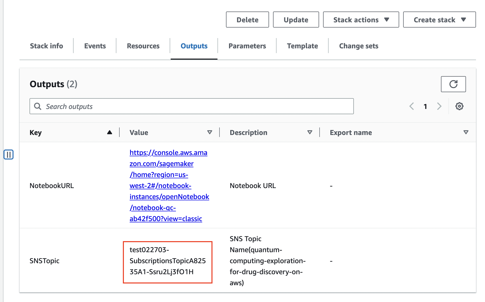

Before you launch the solution, review the architecture, supported regions, and other considerations discussed in this guide. Follow the step-by-step instructions in this section to configure and deploy the solution into your account.

**Time to deploy**: Approximately 15 minutes

!!! notice "Note"

    Before deploying this solution, we recommend you [create a billing alarm to monitor your estimated AWS charges](https://docs.aws.amazon.com/AmazonCloudWatch/latest/monitoring/monitor_estimated_charges_with_cloudwatch.html).

The user or IAM role to perform the deployment must have at least permissions defined in the [permissions.json](https://awslabs.github.io/quantum-computing-exploration-for-drug-discovery-on-aws/en/workshop/permissions.json) file. If you use the permissions defined in this file to deploy this solution, your CloudFormation stack name should start with `QCEDD`, for example, `QCEDDStack`.

## Prerequisites

If bellow steps have already been done, please skip this section.

## Preparation: Enable Amazon Braket service

1. Log into the AWS Management Console, and go to Amazon Braket console.
   

2. Choose **Permissions and Settings** in the left navigation pane, then choose the **General** tab, and choose **Accept and Enable**
   

3. Choose the **Execution Roles** tab, and choose **Create Service-linked Role** to create service-linked role.
   

4. Choose **Verify Existing Roles** to create jobs execution role.
   

## Step 1: Launch the AWS CloudFormation template into your AWS account

1.  Sign in to the [AWS management console](https://console.aws.amazon.com/cloudformation/home?), and select the [Launch solution][template-url] button to launch the AWS CloudFormation template. Alternatively, you can download the template as a starting point for your own implementation.

2.  The template launches in the US West (Oregon) by default. To launch this solution in a different AWS Region, use the Region selector in the console navigation bar.

3.  On the **Create stack** page, verify that Amazon S3 URL is filled with this [template URL][cf-template-url] automatically and choose **Next**.

4.  On the Specify stack details page, assign a name to your solution stack. For information about naming character limitations, refer to [IAM and STS Limits](https://docs.aws.amazon.com/IAM/latest/UserGuide/reference_iam-limits.html) in the _AWS Identity and Access Management User Guide_.

5.  Under **Parameters**, review the parameters for the template and modify them as necessary.

    This solution uses the following parameters.

    | Parameter | Default | Description                 |
    | --------- | ------- | --------------------------- |
    | snsEmail  | null    | email for subscribe message |

6.  Choose **Next**.

7.  On the **Configure stack options** page, choose **Next**.

8.  On the **Review** page, review and confirm the settings. Check the box acknowledging that the template will create AWS Identity and Access Management (IAM) resources.

9.  Choose **Create stack** to deploy the stack.

10. If you configured a subscription email, please pay attention to the email inbox, and then click the **Confirm Subscription** link to confirm the subscription.

You can view the status of the stack in the AWS CloudFormation Console in the **Status** column. You should receive a **CREATE_COMPLETE** status in approximately 15 minutes.

## Step 2: (Optional) Subscribe to SNS notification

Follow below steps to subscribe to SNS notification via email to receive result notifications from AWS Step Functions. You can also subscribe to the notification via text messages.

1. Sign in to the [AWS CloudFormation console](https://console.aws.amazon.com/cloudformation/).

2. On the **Stacks** page, select the solution’s root stack.

3. Choose the **Outputs** tab and record the value for the SNS topic.

   

4. Navigate to the [Amazon SNS](https://console.aws.amazon.com/sns/v3/home?region=us-east-1#/topics) console.

5. Choose **Topics**, then select the SNS topic that you obtained from the CloudFormation deployment output.

6. Choose **Create subscription**.

7. Select **Email** from the **Protocol** list.

8. Enter your email in **Endpoint**.

9. Choose **Create subscription**.

10. Check your mailbox, you will receive an email, click the **Confirm Subscription** link in the email to confirm the subscription.

## Update AWS CloudFormation template

If needed, you can update the AWS CloudFormation stack to change the deployment settings.

!!! Important "Important"

      If the content of the notebook algorithm changed, please delete the original CloudFormation and create a new CloudFormation. Updating the CloudFormation will not make your algorithm changes take effect.

1. Sign in to the [AWS CloudFormation console](https://console.aws.amazon.com/cloudformation/).

2. Select the root stack of this solution, not the nested stack.

3. Choose **Update**.

4. Select **Use current template**, and choose **Next**.

5. Update the parameters as needed, and choose **Next**.

6. On the **Configure stack options** page, choose **Next**.

7. On the **Review** page, review and confirm the settings. Check the box acknowledging that the template will create AWS Identity and Access Management (IAM) resources.

8. Choose **Update stack** to update the stack.

[template-url]: https://console.aws.amazon.com/cloudformation/home?region=us-west-2#/stacks/create/template?stackName=QCEDDStack&templateURL={{ cf_template.url }}
[cf-template-url]: {{ cf_template.url }}
