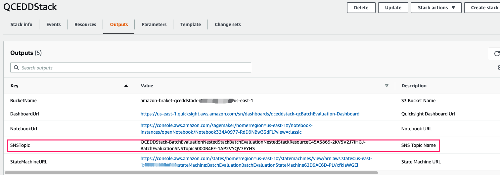

Before you launch the solution, review the architecture, supported regions, and other considerations discussed in this guide. Follow the step-by-step instructions in this section to configure and deploy the solution into your account.

**Time to deploy**: Approximately 10 minutes

!!! notice "Note"

    Before deploying this solution, we recommend you [create a billing alarm to monitor your estimated AWS charges](https://docs.aws.amazon.com/AmazonCloudWatch/latest/monitoring/monitor_estimated_charges_with_cloudwatch.html). 

## Deployment Overview

- Step 1: Make preparations
    - Enable Amazon Braket service
    - Create IAM Role for QuickSight
    - Sign up for QuickSight
    - Obtain QuickSight Username

- Step 2: Launch the AWS CloudFormation template into your AWS account
- Step 3: Subscribe to SNS notification (optional)

## Step 1: Make preparations

### Enable Amazon Braket service

1. Sign in to the AWS Management Console, and search for Amazon Braket.

2. Access the Amazon Braket console, and select **I have read and accepted the above terms & conditions**.

3. Choose **Enable Amazon Braket**.

### Create IAM Role for QuickSight

1. Navigate to [IAM Policies](https://console.aws.amazon.com/iamv2/home?#/policies).

2. Choose **Create Policy**.

<<<<<<< HEAD
3. In the Create policy page, click the **JSON** tab, and enter the QuickSight policy as below. This is the least policy required for QuickSight to work in this solution.
=======
3. In the Create policy page, click the **JSON** tab, and enter the QuickSight policy as below. This is the least policy required for QuickSight to work in this solution. Please ignore **Errors** in the bottom of the input.
>>>>>>> main
        
        {
            "Version": "2012-10-17",
            "Statement": [{
                    "Effect": "Allow",
                    "Action": [
                        "athena:BatchGetQueryExecution",
                        "athena:CancelQueryExecution",
                        "athena:GetCatalogs",
                        "athena:GetExecutionEngine",
                        "athena:GetExecutionEngines",
                        "athena:GetNamespace",
                        "athena:GetNamespaces",
                        "athena:GetQueryExecution",
                        "athena:GetQueryExecutions",
                        "athena:GetQueryResults",
                        "athena:GetQueryResultsStream",
                        "athena:GetTable",
                        "athena:GetTables",
                        "athena:ListQueryExecutions",
                        "athena:RunQuery",
                        "athena:StartQueryExecution",
                        "athena:StopQueryExecution",
                        "athena:ListWorkGroups",
                        "athena:ListEngineVersions",
                        "athena:GetWorkGroup",
                        "athena:GetDataCatalog",
                        "athena:GetDatabase",
                        "athena:GetTableMetadata",
                        "athena:ListDataCatalogs",
                        "athena:ListDatabases",
                        "athena:ListTableMetadata"
                    ],
                    "Resource": [
                        "*"
                    ]
                },
                {
                    "Effect": "Allow",
                    "Action": [
                        "glue:CreateDatabase",
                        "glue:DeleteDatabase",
                        "glue:GetDatabase",
                        "glue:GetDatabases",
                        "glue:UpdateDatabase",
                        "glue:CreateTable",
                        "glue:DeleteTable",
                        "glue:BatchDeleteTable",
                        "glue:UpdateTable",
                        "glue:GetTable",
                        "glue:GetTables",
                        "glue:BatchCreatePartition",
                        "glue:CreatePartition",
                        "glue:DeletePartition",
                        "glue:BatchDeletePartition",
                        "glue:UpdatePartition",
                        "glue:GetPartition",
                        "glue:GetPartitions",
                        "glue:BatchGetPartition"
                    ],
                    "Resource": [
                        "*"
                    ]
                },
                {
                    "Effect": "Allow",
                    "Action": [
                        "s3:GetBucketLocation",
                        "s3:GetObject",
                        "s3:ListBucket",
                        "s3:ListBucketMultipartUploads",
                        "s3:ListMultipartUploadParts",
                        "s3:AbortMultipartUpload",
                        "s3:CreateBucket",
                        "s3:PutObject",
                        "s3:PutBucketPublicAccessBlock"
                    ],
                    "Resource": [
                        "arn:aws:s3:::aws-athena-query-results-*"
                    ]
                },
                {
                    "Effect": "Allow",
                    "Action": [
                        "lakeformation:GetDataAccess",
                        "iam:List*"
                    ],
                    "Resource": [
                        "*"
                    ]
                }
            ]
        }

4. Choose **Next:Tags**.

5. Choose **Next:Review**.

6. Enter the **Name** of the policy. In this deployment, we use `qradd-quicksight-service-role-policy`.

7. Choose **Create policy**.

8. Navigate to [IAM Roles](https://console.aws.amazon.com/iamv2/home?#/roles).

9. Choose **Create Role**.

10. Select **Custom trust policy** in the **Select trusted entity** page, and enter the trust policy in **Custom trust policy** as below.
        
        {
            "Version": "2012-10-17",
            "Statement": [
                {
                    "Effect": "Allow",
                    "Principal": {
                        "Service": "quicksight.amazonaws.com"
                    },
                    "Action": "sts:AssumeRole"
                }
            ]
        }

11. Choose **Next**.

12. Enter `qradd-quicksight-service-role-policy` in the **Permissions policies** search box.

13. Select the policy, and choose **Next**.

14. Enter the **Role name**. In this deployment, we use `qradd-quicksight-service-role`.

15. Choose **Create role**.

16. Record the name of this role.

### Sign up for QuickSight

!!! notice "Note"
     
     You must have correct AWS Identity and Access Management (IAM) permissions to sign up for QuickSight. Refer to [Signing up for an Amazon QuickSight subscription](https://docs.aws.amazon.com/quicksight/latest/user/signing-up.html) for details.

1. Sign in to the AWS Management Console, and navigate to [QuickSight](https://quicksight.aws.amazon.com/).

2. Choose **Enterprise**, and click continue.

3. In the **Create your QuickSight account** page, complete the following settings. 

    - Choose **Use IAM federated identities & QuickSight-managed users** from the Authentication method.
    - Choose **US East (N.Virginia)**. **Note**: always choose **US East (N.Virginia)** whatever regions you will deploy this solution.
    - Enter the unique **QuickSight account name**.
    - Enter the **Email** to receive notifications.
    - Choose **Use an existing role**, and select the role: `qradd-quicksight-service-role`.

    !!! Caution "Caution"

        If Quicksight service already used default role, you need to change it to the role created above in the page [QuickSight Security & permissions](https://us-east-1.quicksight.aws.amazon.com/sn/admin#aws). Please check in advance because this operation may influence other data under this QuickSight Account. Refer to [Using Amazon QuickSight with IAM](https://docs.aws.amazon.com/quicksight/latest/user/security_iam_service-with-iam.html#security-create-iam-role) for details.

        If you already signed up QuickSight, you can got to [QuickSight admin](https://us-east-1.quicksight.aws.amazon.com/sn/admin) to check your edition (edition should be Enterprise). 

### Obtain QuickSight Username

1. Go to [QuickSight Admin](https://us-east-1.quicksight.aws.amazon.com/sn/admin).

2. Record your **QuickSight Username** (not QuickSight account name) for your email.

    !!! Caution "Caution"

            If QuickSight user is not created for your current AWS account, you need to navigate to [QuickSight](https://quicksight.aws.amazon.com/) and enter your email address.

## Step 2: Launch the AWS CloudFormation template into your AWS account

1. Sign in to the AWS management console, and select the [Launch Stack][template-url] button to launch the AWS CloudFormation template. Alternatively, you can download the template as a starting point for your own implementation.
 
2. The template launches in the US West (Oregon) by default. To launch this solution in a different AWS Region (for example `us-east-1`), use the Region selector in the console navigation bar.

3. On the **Create stack** page, verify that Amazon S3 URL is filled with this [template URL][cf-template-url] automatically and choose **Next**.

4. Under **Parameters**, review the parameters for the template and modify them as necessary. This solution uses the following values. 

    |      Parameter      |   Description |
    |:-------------------|:----|
    | QuickSightRoleName | QuickSight Service Role name, which can be obtained from [Security & permissions](https://us-east-1.quicksight.aws.amazon.com/sn/admin?#aws).|
    | QuickSightUser | QuickSight Username, which can be obtained from [Manage users](https://us-east-1.quicksight.aws.amazon.com/sn/admin?#users). |

5. Choose **Next**.

6. On the **Configure stack options** page, choose **Next**.

7. On the **Review** page, review and confirm the settings. Check the box acknowledging that the template will create AWS Identity and Access Management (IAM) resources.

8. Choose **Create stack** to deploy the stack.

You can view the status of the stack in the AWS CloudFormation Console in the **Status** column. You should receive a **CREATE_COMPLETE** status in approximately 10 minutes.

## Step 3: Subscribe to SNS notification (optional)

Follow below steps to subscribe to SNS notification via Email. You may also subscribe to the notification via [text messages](https://docs.aws.amazon.com/sns/latest/dg/sns-mobile-phone-number-as-subscriber.html).

1. Obtain your SNS topic name in the CloudFormation deployment output.

    

2. Navigate to [SNS topics](https://console.aws.amazon.com/sns/v3/home?region=us-east-1#/topics).

3. Click the SNS topic that you obtained from the CloudFormation deployment output.

4. Choose **Create subscription**.

5. Select Email from the **Protocol** list.

6. Enter your email in **Endpoint**.

7. Choose **Create subscription**.

8. Check the inbox of your email to see that you have received an email, and click the **Confirm Subscription** link to confirm the subscription.

[template-url]: https://console.aws.amazon.com/cloudformation/home?region=us-west-2#/stacks/create/template?stackName=QRADDStack&templateURL={{ cf_template.url }}
[cf-template-url]: {{ cf_template.url }}
