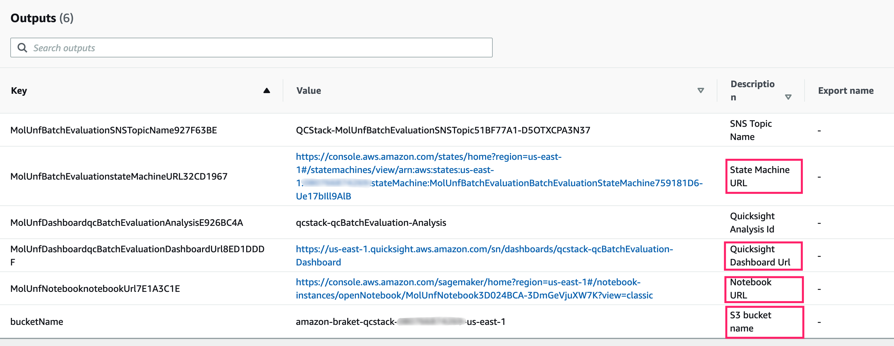

## Experiment in notebook

This solution will deploy a Sagemaker notebook instance with AWS Braket SDK installed and some ready-to-run notebooks of quantum algorithms for drug discovery.

### Get Notebook link from deployment output

- open the Notebook link
- navigate to notebook: `src/molecule-unfolding/molecule_unfolding.ipynb`
- you will see the notebook

### Experiment in notebook
 see [Note book explanation](./workshop/a-molecule-unfolding/notebook-experiment.md)