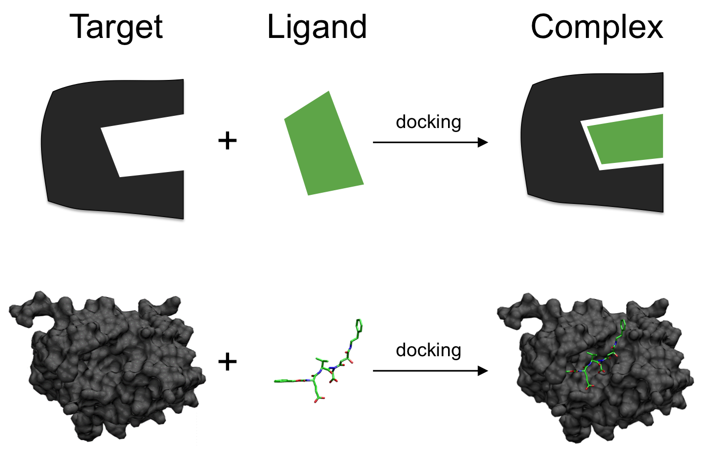

## Notebook experimentation

This notebook implements the work from [Quantum Molecular Unfolding](https://arxiv.org/abs/2107.13607), and the [Molecular Unfolding with Quantum Annealing](https://www.youtube.com/watch?v=1NmAXIHAF2Y) video in Amazon Braket.

## Molecular docking 

Molecular Docking (MD) is an important step of the drug discovery process which aims at calculating the preferred position and shape of one molecule to a second when they are bound to each other. This step focuses on computationally simulating the molecular recognition process. It aims to achieve an optimized conformation for both the protein and ligand and relative orientation between protein and ligand such that the free energy of the overall system is minimized. 

In this work, the protein or the pocket is considered as a rigid structure, and the ligand is considered as a 
flexible set of atoms.

Figure 6: Molecular docking[6](#wiki-docking)

As described in [Quantum Molecular Unfolding](https://arxiv.org/abs/2107.13607), published by Mato et al, there are usually three main phases in MD: 

1. Expansion of the ligand to an unfolded shape, to reduce bias, that is, molecular unfolding (MU). MU includes:
    * Identification of the rotatable bonds
    * Internal distance maximization
    * Removal of tool related bias (for example, SMILES-to-3D)
2. Initial placement, which includes:
    * Ligand main fragments decomposition
    * Ligand initial poses identification
    * Placement of the ligand into the pocket with rigid roto-translations
3. Shape refinement, which includes:
    * Use of the rotatable bonds to modify the ligand shape and to match the protein pocket
    * Docking score maximization

Here we focus on the first phase of MD, ligand expansion, which aims to reduce shape bias that may affect the final quality of docking. In this solution we use the quantum annealing approach to molecular unfolding (MU) as published by Mato et al. 

After deployment, you can go to select the solution’s root stack on the Stacks page, choose the Outputs tab, and open the link for your notebook. See the file **healthcare-and-life-sciences/a-1-molecular-unfolding-quadratic-unconstrained-binary-optimization/molecular-unfolding-qubo.ipynb** for more details.

# References

- 6.[Wiki: Molecular Docking](https://en.wikipedia.org/wiki/Docking_(molecular))
