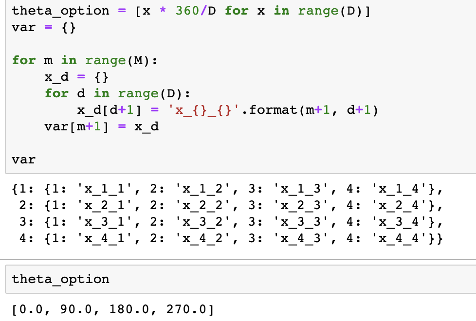
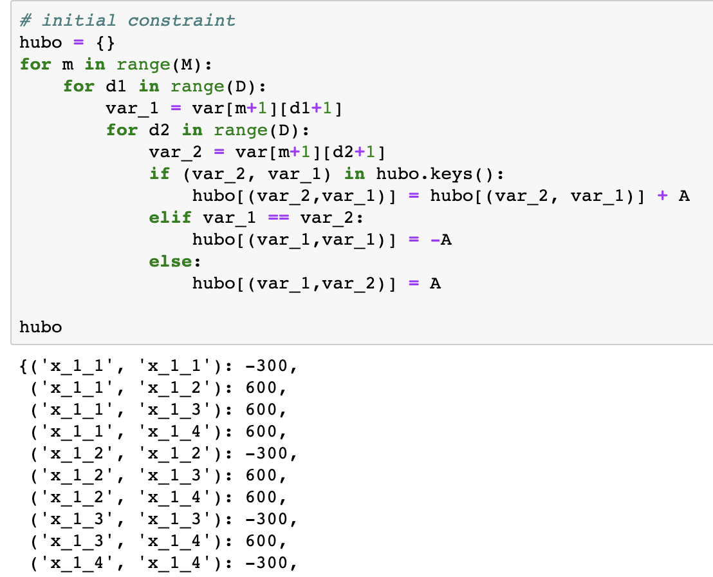
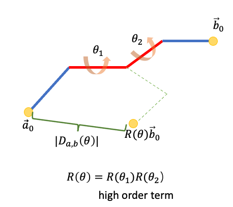
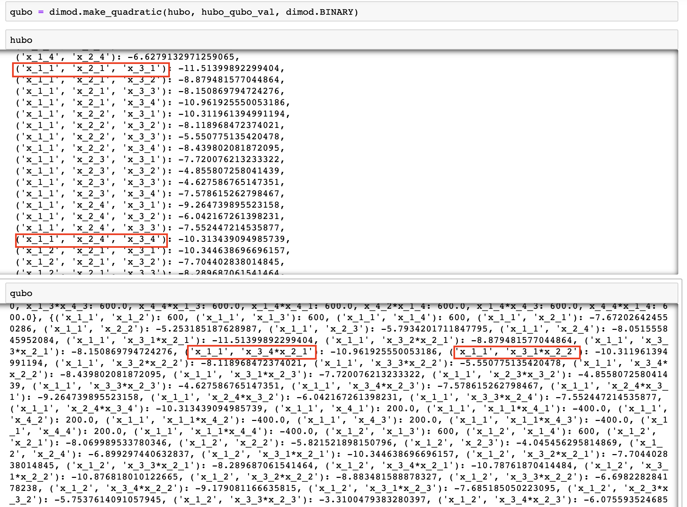

In the quantum molecular unfolding sample code, the solution uses largely the framework of the original author with some changes. Instead of using the HUBO optimization function defined by the original author, the solution uses the below absolute distance instead. The method is named “pre-calc” in the code.

$$ O(x_{ik}) = A\displaystyle\sum\limits_i (\displaystyle\sum\limits_{k=1}^d x_{ik}-1)^2 - \displaystyle\sum\limits_{a,b} |D_{ab} (\theta)| $$

## Model code
The source code for this model is placed in the file **source/src/molecualr-unfolding/untiliy/QMUQUBO.py**.

The following code shows how to initialize the variables:

!!! notice "Note"

    It describes the ideas to build the model. You can find similar codes in the source code file.



Figure 8: The logic for defining the variables

The above code indicates that we have 4 torsions from $x\_1\_?$ to $x\_4\_?$. Each torsion has four optional rotation angles from $0^o$ to $270^o$. For example, $x\_3\_2$ means that the torsion 3 rotates $90^o$, and $x\_4\_2$ means torsion 4 rotates $0^o$.

The following code shows how to implement constraints: 



Figure 9: The Logic for defining the constraints


The model may generate unexpected results, for example, four binary variables $x\_1\_1$ , $x\_1\_2$, $x\_1\_3$ 
and $x\_1\_4$ belong to the same torsion $1$. In reality, only one of them can become $1$. If more than one of them become $1$, a penalty term will be added. As the figure shows, when the model chooses more than one variables of $x\_1\_?$ to become $1$, it has the penalty term $600$ (This example is for $A=300$). 

The following code shows how to recursively calculate the distances for different configurations:

```
def update_hubo(torsion_group, up_list, ris):
    if len(torsion_group) == 1:
        for d in range(D):
            final_list = up_list + \
                [var[rb_var_map[torsion_group[0]]][str(d+1)]]
            # distance
            final_list_name = []
            if len(final_list) == 1:
                final_list_name = final_list + final_list
            else:
                final_list_name = final_list

            # update temp points and distance
            self._init_mol_file()

            rb_set = self.mol_data.bond_graph.sort_ris_data[str(
                M)][ris]

            distance = update_pts_distance(
                self.atom_pos_data, rb_set, final_list, var_rb_map, theta_option, True, True)

            hubo_distances[tuple(final_list_name)] = -distance
            logging.debug(
                f"final list {final_list} with distance {distance}")
    else:
        for d in range(D):
            final_list = up_list + \
                [var[rb_var_map[torsion_group[0]]][str(d+1)]]
            update_hubo(torsion_group[1:], final_list, ris)

for ris in mol_data.bond_graph.sort_ris_data[str(M)].keys():
    start = time.time()
    logging.debug(f"ris group {ris} ")
    end = time.time()
    torsion_group = ris.split(",")
    if len(torsion_group) == 1:
        # update constraint
        update_constraint(ris, hubo_constraints)
    logging.debug(torsion_group)
    # update hubo terms
    update_hubo(torsion_group, [], ris)
    logging.debug(
        f"elapsed time for torsion group {ris} : {(end-start)/60} min")
```

## Quantum annealing

Quantum annealing (QA) can be seen as a variation of the simulated annealing (SA). Both QA and SA are meta-heuristic techniques to address challenging combinatorial problems. QA uses the quantum fluctuation to explore the configuration space instead of thermal effects. This workshop uses Amazon Braket API to access the Canadian company D-Wave. This annealer is implemented using superconductive qubits. Natively, the QUBO can be solved using quantum annealer:

$$ O(x) = \displaystyle\sum\limits_i h_i x_i + \displaystyle\sum_{i>j} J_{i,j} x_i x_j $$

In QUBO form, $x_i \in \{0, 1\}$ are binary variables, and can be considered as the angle chosen for a particular torsion. $h_i$ and $J_{i,j}$ can be considered as the values encoding the optimization task when using corresponding angles. However, it is common that there are more than one torsion between fragments, and the task models it as the HUBO problem:

$$ O(x) = \displaystyle\sum\limits_i \alpha_i x_i + \displaystyle\sum_{i,j} \beta_{i,j} x_i x_j + \displaystyle\sum_{i,j,k} \gamma_{i,j,k} x_i x_j x_k + ../... $$




Figure 10: Multiple torsions


To convert HUBOs to QUBOs, you can add new ancillary binary variables to replace high-order term. In practice, we use the API $make \_ quadratic()$ in D-Wave software package to make this conversion.




Figure 11: HUBO changed to QUBO


As shown in the figure, some high-order terms of HUBO, like $('x\_1\_1','x\_2\_1','x\_3\_1')$, have been transformed to quadratic terms in QUBO.

