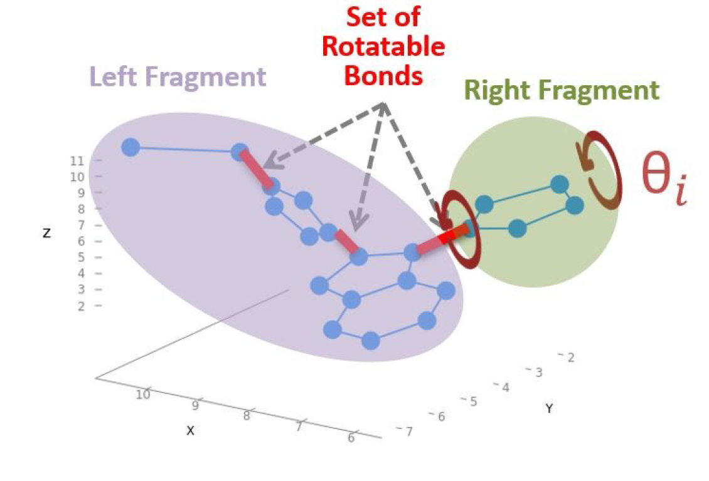
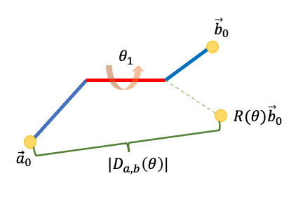

### Problem Definition

In this problem, the ligand is considered as a flexible set of atoms. Strictly speaking, it can be seen as a set of chemical bonds (edges). These bonds have fixed length and only a subset of them are rotatable. Because there are some rotatable bonds (torsions), the molecule is split into different disjointed fragments. Take one bond for instance, the rightmost rotatable one, it splits the molecule into the left and right fragments. These fragments can rotate independently from each other around the axis of the bond. This idea is graphically reported in the following figure. 


 
 Figure 1: Rotatable Bonds [<sup>1</sup>](#qmu-paper)

 
 As it indicates, the objective of MU is to find the shape of the ligand that can maximizes the molecular volume. The shape of the ligand can be expressed as the unfolded shape of the ligand (the torsion configuration of all the rotatable bonds).

### Formulation

Suppose the ligand has $M$ torsions, from $T_i$ to $T_M$, and each torsion must have the angle of rotation $\theta$.


Figure 2: Multiple Torsion


The objective of this model is to find the unfolded torsion configuration ${\Theta}^{unfold}$ which can maximizes the sum of distances $D(\Theta)$:

$$ {\Theta}^{unfold} = [\theta^{unfold}_1,  \theta^{unfold}_2, ../..., \theta^{unfold}_M] $$

$$ D(\Theta) = \sum_{a,b}D_{a,b}(\theta)^2 $$

The $D_{a,b}(\theta)^2$ is $|| \overrightarrow{a}_0 - R(\theta)\overrightarrow{b}_0||^2$. 
This is the distance between fragment a and b. $R(\theta)$ is the rotation matrix associated the torsion angle 
$\theta$.




Figure 3: Two Fragment with One Torsion

Since this is the problem of portfolio optimization, the final configuration can be the combination of any angle of any torsion. However, there are some constraints for applying it to real problem: 

#### constraint-1

In terms of the limitation of computation resource, the torsion cannot have the rotation with infinitely small precision. This means that there are limited candidates of rotation angles for each torsion. Suppose we have $M$ torsions and they have the same precision of rotation angle: $\Delta\theta$ . This means that we need $d$ variables for each torsion:

$$ d = \frac{2\pi}{\Delta\theta} $$

For the whole model, we need $n = d \times M$ binary variables $x_{ik}$ to represent all the combinations. For example, for the torsion $T_i$, its torsion angle $\theta_i$ can have 
$d$ possible values:

$$ \theta_i = [\theta_i^1,\theta_i^2,\theta_i^3, ..., \theta_i^d] $$

#### constraint-2

If we only consider the distance, the final result or configuration may have multiple results from the same torsion as long as this combination means smaller distance. For example, there may be two binary variables of the same torsion, $T_1$, in the final result:

$$ {\Theta}^{unfold} = [\theta^2_1,  \theta^4_1, ../..., \theta^3_M] $$

This cannot happen in real world. $T_1$ can only have one of $d$ angles finally. So we need to integrate the following constraint into our final model:

$$ \displaystyle\sum\limits_{k=1}^{d} x_{ik} = 1 $$

With these two constraints, this problem can be formulated as the High-order Unconstrained Binary Optimization (HUBO).

$$ O(x_{ik}) = A\displaystyle\sum\limits_i (\displaystyle\sum\limits_{k=1}^d x_{ik}-1)^2 - \displaystyle\sum\limits_{a,b} D_{ab} (\theta)^2 $$

The first part is the constraint for each torsion. If one torsion has more than one angles at last, we will add the punishment term $A$. However, in this implementation we calculate the distance-pair under different configuration in advance. This means that we use the absolute distance instead:

$$ O(x_{ik}) = A\displaystyle\sum\limits_i (\displaystyle\sum\limits_{k=1}^d x_{ik}-1)^2 - \displaystyle\sum\limits_{a,b} |D_{ab} (\theta)| $$

#### Model code
We have implemented this model in **source/src/molecualr-unfolding/untiliy/QMUQUBO.py**.
We initialize the variables using the following logic:

!!! notice "Note"

    The following codes are for describing the ideas to build the model. We can find similar codes in the source code.


Figure 4: The logic for defining the variables

The above code indicates that we have 4 torsions from $x\_1\_?$ to $x\_4\_?$. Each torsion has four optional rotation angles from $0^o$ to $270^o$. For example, $x\_3\_2$ means that the torsion 3 rotates $180^o$.

For constraints, we use the following logic to implement: 


Figure 5: The Logic for defining the constraints


As we analyzed before, the model does not know which variables belong to the same physical torsion. For example, $x\_1\_1$ , $x\_1\_2$, $x\_1\_3$ 
and $x\_1\_4$ belong to the same torsion. The model can only let one of them become $1$. If the model choose multiple of them, we must punish it. As the figure shown, when the model choose more than one variables of $x\_1\_?$ to become $1$, we give it the punishment term $600$ (This example is for $A=300$). 

Most importantly, we use the following method to recursively calculate the distances for different configurations:

```
def update_hubo(torsion_group, up_list, ris):
    if len(torsion_group) == 1:
        for d in range(D):
            final_list = up_list + \
                [var[rb_var_map[torsion_group[0]]][str(d+1)]]
            # distance
            final_list_name = []
            if len(final_list) == 1:
                final_list_name = final_list + final_list
            else:
                final_list_name = final_list

            # update temp points and distance
            self._init_mol_file()

            rb_set = self.mol_data.bond_graph.sort_ris_data[str(
                M)][ris]

            distance = update_pts_distance(
                self.atom_pos_data, rb_set, final_list, var_rb_map, theta_option, True, True)

            hubo_distances[tuple(final_list_name)] = -distance
            logging.debug(
                f"final list {final_list} with distance {distance}")
    else:
        for d in range(D):
            final_list = up_list + \
                [var[rb_var_map[torsion_group[0]]][str(d+1)]]
            update_hubo(torsion_group[1:], final_list, ris)

for ris in mol_data.bond_graph.sort_ris_data[str(M)].keys():
    start = time.time()
    logging.debug(f"ris group {ris} ")
    end = time.time()
    torsion_group = ris.split(",")
    if len(torsion_group) == 1:
        # update constraint
        update_constraint(ris, hubo_constraints)
    logging.debug(torsion_group)
    # update hubo terms
    update_hubo(torsion_group, [], ris)
    logging.debug(
        f"elapsed time for torsion group {ris} : {(end-start)/60} min")
```

### Quantum Annealing

The quantum annealing (QA) can be seen as a variation of the simulated annealing (SA). Both QA and SA are meta-heuristic technique to address challenging combinatorial problems. QA uses the quantum fluctuation to explore the configuration space instead of thermal effects. Here, we use Amazon Braket API to access the Canadian company D-Wave. This annealer is implemented using superconductive qubits. Natively, the QUBO can be solved using quantum annealer:

$$ O(x) = \displaystyle\sum\limits_i h_i x_i + \displaystyle\sum_{i>j} J_{i,j} x_i x_j $$

In QUBO form, $x_i \in \{0, 1\}$ are binary variables. We can consider it as the angle that we choose for a particular torsion. $h_i$ and $J_{i,j}$ can be considered as the values encoding the optimization task when we use corresponding angles. However, in our task, it is common that there are more than one torsion between fragments, and we model it as the HUBO problem:

$$ O(x) = \displaystyle\sum\limits_i \alpha_i x_i + \displaystyle\sum_{i,j} \beta_{i,j} x_i x_j + \displaystyle\sum_{i,j,k} \gamma_{i,j,k} x_i x_j x_k + ../... $$


Figure 6: Multiple torsions


It is often possible to convert HUBOs to QUBOs by using some tricks, like adding new ancillary binary variables to replace high-order term. In practice, we use the API $make \_ quadratic()$ in D-Wave software package to make this conversion.


Figure 7: HUBO changed to QUBO


As shown in the figure, some high-order terms of HUBO, like $('x\_1\_1','x\_2\_1','x\_3\_1')$, have been transformed to binary terms in QUBO. We only highlight some of them.


# Reference
<div id='qmu-paper'></div>
- 1.Mato, Kevin, et al. "Quantum Molecular Unfolding." arXiv preprint arXiv:2107.13607 (2021).