Molecular Docking (MD) is an important step of the drug discovery process which aims at calculating 
the preferred position and shape of one molecule to a second when they are bound to each other. This step focuses on computationally simulating the molecular recognition process. It aims to achieve an optimized conformation for both the protein and ligand and relative orientation between protein and ligand such that the free energy of the overall system is minimized. 

Figure 1: Molecular docking[1](#wiki-docking)
 

In this work, The protein or the pocket is considered as a rigid structure. The ligand is considered as a 
flexible set of atoms. There are usually three main phases in MD:

* Ligand expansion
    * Identification of the rotatable bonds
    * Internal distances maximization
    * Remove tool related bias (e.g. smile-to-3D)
* Initial Placement
    * Ligand main fragments decomposition
    * Ligand initial poses identification
    * Placement of the ligand into the pocket with rigid roto-translations
* Shape Refinement
    * Use of the rotatable bonds to modify the ligand shape and to match the protein pocket
    * Docking score maximization

In this work, actually the first phase, ligand expansion or the molecular unfolding (MU), is focused and 
implemented using quantum annealer. This phase is important for improving docking. In fact, an initial
pose of the ligand that is set a priori may introduce shape bias affecting the final quality of the
docking. MU is the technology used for removing such initial bias.

# Notebook Overview

Go to the deployment output page in your cloudformation
and open the link for your notebook

Figure 2: The notebook link in the output of cloudformation

Please open the notebook 
(**source/src/molecular-folding/molecular_unfolding.ipynb**) and make sure that the kernel for this notebook is **qcenv**.

Figure 3: Environment for experiment

Navigate the whole notebook and you can find 
that it consists of four Steps:

|Steps|Contents|
|:--|:--|
|[Step1: Prepare Data](#prepare)|prepare molecular data for experiments|
|[Step2: Build Model](#buildmodel)|build model for molecular unfolding|
|[Step3: Optimize Configuration](#optimize)|run optimization to find the configuration|
|[Step4: PostProcess Result](#postprocess)|post process the results for evaluation and visualization|

# Prepare Data

In this part, we load the raw molecule data for experiment.
The [117 ligand](http://www.rcsb.org/ligand/117) was 
put in the repository. We assign the relative 
path to **raw_path**.
The **s3_bucket** and **prefix** are used to store the 
optimization results. We can use the one created with the 
cloudformation for convenience.

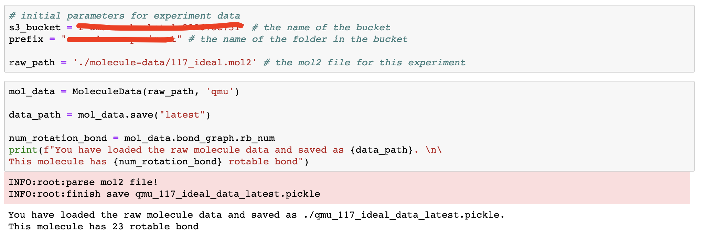

 Process Molecule Data

After running this block, the processed data 
will be saved as **qmu_117_ideal_data_latest.pickle**
and **data_path** will be updated. We can see that this 
molecule has 23 rotatable bonds.

# Build Model

In this part, we build the Quadratic Unconstrained 
Binary Optimization (QUBO) model for molecular unfolding.

First, we set the following parameters and 
initialize the QMUQUBO object. 

| Parameter | Description | Value |
|--- |--- |--- |
|A | penalty scalar |300|
|hubo_qubo_val | energy penalty of make_quadratic() |200|
|M | number of torsions for molecular unfolding| [1, max number of rotatable bonds] |
|D| angle precision of rotation| 8|
|method| the method of building model| 'pre-calc': calculate the score in advance|

 

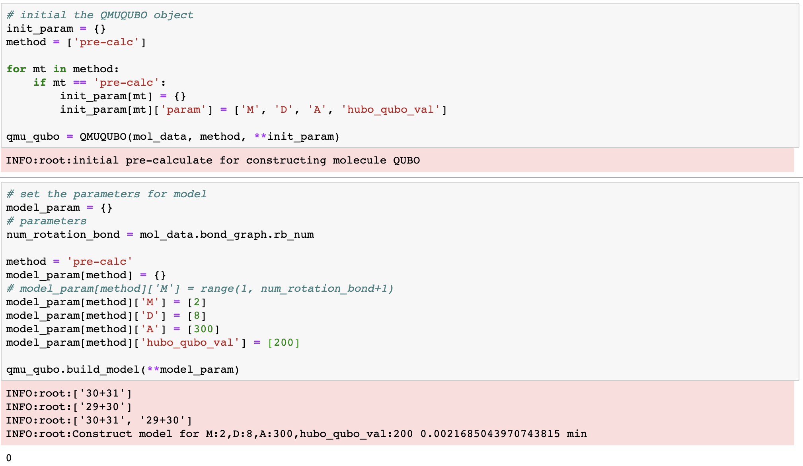

 Build QUBO Model
 

We can see from the image that we use the 'pre-calc' method 
to build the model. This molecule has 23 rotatable bonds and 
we only test 2 of them, so we set the **M** to 2. And we want 
the angle to become $45^o$, so we set the **D** to 8 
(i.e., $8=360^o/45^o$). The **A** and **hubo_qubo_val** are 
test from experiments. 

We can use the following method to check the properties of 
model. This way, we can build many models conveniently. 
After that, we save the model and update the value of 
**model_path**.

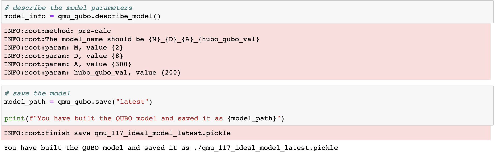

 Describe and Save QUBO Model
 
 

!!! notice

    The following content is the technical details for building model

### Problem Definition

In this problem, the ligand is considered as a flexible set of atoms. Strictly speaking, 
it can be seen as a set of chemical bonds (edges). These bonds have fixed length and 
only a subset of them are rotatable. Because there are some rotatable bonds (torsions)
, the molecule is split into different disjointed fragments. Take one bond for instance, 
the rightmost rotatable one, it splits the molecule into the left and right fragments. 
These fragments can rotate independently from each other around the axis of the bond. This 
idea is graphically reported in the following figure. 

 
 Rotatable Bonds [1](#qmu-paper)
 
 

 As it indicates, the objective of MU is to find the shape of the ligand that can maximizes 
 the molecular volume. The shape of the ligand can be expressed as the unfolded shape of the
  ligand (the torsion configuration of all the rotatable bonds).

### Formulation

Suppose the ligand has $M$ torsions, from $T_i$ to $T_M$, and each torsion must have the angle 
of rotation $\theta$.

Multiple Torsion

The objective of this model is to find the unfolded torsion configuration 
${\Theta}^{unfold}$ which 
can maximizes the sum of distances $D(\Theta)$.

$$ {\Theta}^{unfold} = [\theta^{unfold}_1,  \theta^{unfold}_2, ../..., \theta^{unfold}_M] $$

$$ D(\Theta) = \sum_{a,b}D_{a,b}(\theta)^2 $$

The $D_{a,b}(\theta)^2$ is $|| \overrightarrow{a}_0 - R(\theta)\overrightarrow{b}_0||^2$ . 
This is the distance between fragment a and b. $R(\theta)$ is the rotation matrix associated the torsion angle 
$\theta$.

Two Fragment with One Torsion

Since this is the problem of portfolio optimization, the final configuration can be the combination of any 
angle of any torsion. However, there are some constraints for applying it to real problem: 

#### constraint-1

In terms of the limitation of computation resource, the torsion cannot have the rotation with infinitely small 
precision. This means that there are limited candidates of rotation angles for each torsion. Suppose we have 
$M$ torsions and they have the same precision of rotation angle : 
$\Delta\theta$ . This means that we need $d$ variables 
for each torsion:

$$ d = \frac{2\pi}{\Delta\theta} $$

For the whole model, we need $n = d \times M$ binary variables $x_{ik}$ to represent all the combinations. 
For example, for the torsion $T_i$, its torsion angle $\theta_i$ can have 
$d$ possible values:

$$ \theta_i = [\theta_i^1,\theta_i^2,\theta_i^3, ..., \theta_i^d] $$

#### constraint-2

If we only consider the distance, the final result or configuration may have multiple results from the same torsion as long 
as this combination means smaller distance. For example, there may be two binary variables of the same torsion, $T_i$, in the 
final result:

$$ {\Theta}^{unfold} = [\theta^2_1,  \theta^4_1, ../..., \theta^3_M] $$

This cannot happen in real world. $T_1$ can only have one of 
$d$ angles finally. So we need to integrate the following constraint into our final model:

$$ \displaystyle\sum\limits_{k=1}^{d} x_{ik} = 1 $$

With these two constraints, this problem can be formulated as the high-order unconstrained binary optimization (HUBO).

$$ O(x_{ik}) = A\displaystyle\sum\limits_i (\displaystyle\sum\limits_{k=1}^d x_{ik}-1)^2 - \displaystyle\sum\limits_{a,b} D_{ab} (\theta)^2 $$

The first part is the constraint for each torsion. If one torsion has more than one angles at last, we will add the punishment term $A$. 
However, in this implementation we calculate the distance-pair under different configuration in advance. This 
means that we use the absolute distance instead:

$$ O(x_{ik}) = A\displaystyle\sum\limits_i (\displaystyle\sum\limits_{k=1}^d x_{ik}-1)^2 - \displaystyle\sum\limits_{a,b} |D_{ab} (\theta)| $$

#### The Code for Model
We have implemented this model in **source/src/molecualr-unfolding/untiliy/QMUQUBO.py**.
We initialize 
the variables using the following logic:

!!! notice

    The following codes are for describing the ideas to build the model. We can find similar codes in the source code

The Logic for Defining the Variables

The above code indicates that we have 4 torsions from $x\_1\_?$ 
to $x\_4\_?$. Each torsion has four optional rotation angles from $0^o$ to 
$270^o$. For example, $x\_3\_2$ means that the torsion 3 rotates 
$180^o$.

For constraints, we use the following logic to implement: 

The Logic for Defining the Constraints

As we analyze before, the model does not which variables belong to 
the same physical torsion. For example, $x\_1\_1$ , $x\_1\_2$, $x\_1\_3$ 
and  $x\_1\_4$ belong to the same torsion. The model cannot let only 
one of them become $1$. If the model choose multiple of them, we 
must punish it. As the figure shown, when the model choose more than 
one variables of $x\_1\_?$ to become $1$, we give it the punishment 
term $600$. 

Most importantly, we use $calc\_distance\_func$ to calculate
$|D_{ab} (\theta)|$ under different $\theta$.

The Logic for Calculating the Distance between Fragments.

### Quantum Annealing

The quantum annealing (QA) can be seen as a variation of the simulated annealing (SA). Both QA and SA are meta-heuristic technique for address 
challenging combinatorial problems. QA uses the quantum fluctuation to explore the configuration space instead of thermal effects. Here, we use 
Amazon Braket API to access the Canadian company D-Wave. This annealer is implemented using superconductive qubits. Natively, the quadratic 
unconstrained binary optimization (QUBO) can be solved using quantum annealer:

$$ O(x) = \displaystyle\sum\limits_i h_i x_i + \displaystyle\sum_{i>j} J_{i,j} x_i x_j $$

In QUBO form, $x_i \in \{0, 1\}$ are binary variables. We can consider it as the angle that we choose for a particular torsion. $h_i$ and $J_{i,j}$
 can be considered as the values encoding the optimization task when we use corresponding angles. However, in our task, it is common that there are 
 more than one torsion between fragments, we model it as the high-order quadratic unconstrained binary optimization (HUBO) problem:

$$ O(x) = \displaystyle\sum\limits_i \alpha_i x_i + \displaystyle\sum_{i,j} \beta_{i,j} x_i x_j + \displaystyle\sum_{i,j,k} \gamma_{i,j,k} x_i x_j x_k + ../... $$

It is often possible to convert HUBOs to QUBOs by using some tricks, 
like adding new ancillary binary variables to replace high-order term. 
In practice, we use the API $make \_ quadratic()$ in D-Wave software package to make this conversion.

As the image shown, some high-order term of HUBO, like $('x\_1\_1','x\_2\_1','x\_3\_1')$, have been 
transformed to binary terms in QUBO. We only highlight some of them.

Congratulations! We have already prepared the model and it is time to find the optimized configuration.

# Optimize Configuration

In this part, we use SA and QA to find the optimized configuration of molecular unfolding.
At first, we load the model file using **QMUQUBO** object.

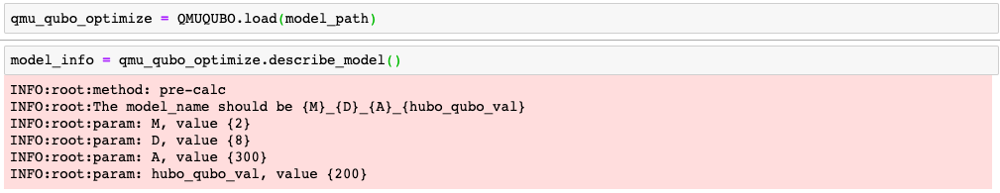

 
Load model file with one QUBO model

We can see the parameters of this model, with M equaling 2, D equaling 8, 
A equaling 300 and hubo_qubo_val equaling 200. 
Actually, we can contain multiple models in this file just 
by giving multiple values for one parameter when creating models.

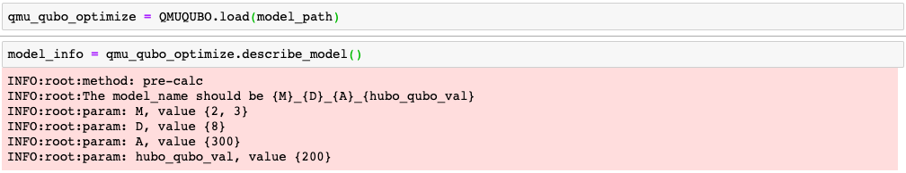

 
Load model file with two QUBO models

 This time, we can see that this model file contains two QUBO models with different M 
 values. Then, we need use **model_name** to get the model for experiments.

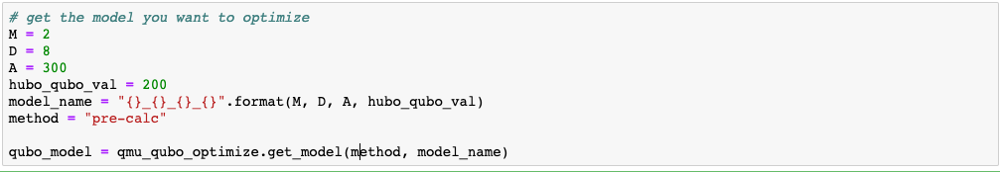

 
Get model using the model name

 We can see that we want to carry out experiment with the QUBO model with M equaling 2.
 After that, we set the parameters for optimization.

| Parameter | Description | Value |
|--- |--- |--- |
|method | annealing method for QUBO problem |'dwave-sa': use the simulated annealer in ocean toolkit  'dwave-qa': use the quantum annealer|
|shots| number of reads, refer to [dwave-sa](https://docs.ocean.dwavesys.com/projects/neal/en/latest/reference/generated/neal.sampler.SimulatedAnnealingSampler.sample.html#neal.sampler.SimulatedAnnealingSampler.sample) and [dwave-qa](https://amazon-braket-ocean-plugin-python.readthedocs.io/en/latest/_apidoc/braket.ocean_plugin.braket_sampler.html) for details |1 to 10,000|
|bucket | the s3 bucket to store your results | - |
|prefix | the name of the folder in your s3 bucket | - |
|device | the arn name to run your quantum annealing| 'arn:aws:braket:::device/qpu/d-wave/Advantage_system4'   'arn:aws:braket:::device/qpu/d-wave/DW_2000Q_6'|

Then, we can run the SA for this problem:

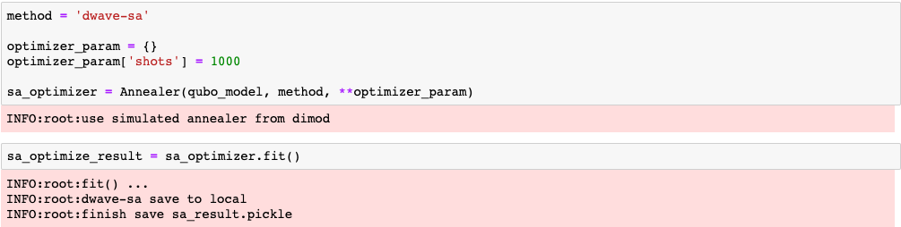

We can tell from the image that we set the number of shots for SA to 1000. 
The result is saved as the local file **./sa_result.pickle.**
Alternatively, we can use QA to solve this problem:

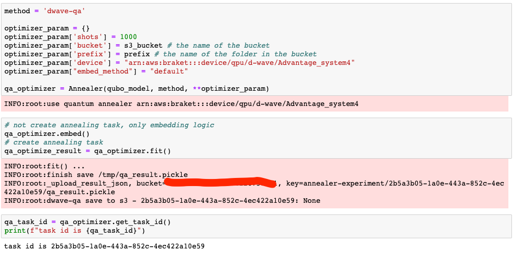

In this QA, we set the number of shots to 1000 and 
choose the 
[Advantage_System4.1](https://docs.dwavesys.com/docs/latest/doc_physical_properties.html)
as the QPU. In addition, the results are saved to your bucket automatically and you 
can get the task id for future process. 
Finally, we can compare the execution time between SA and QA :

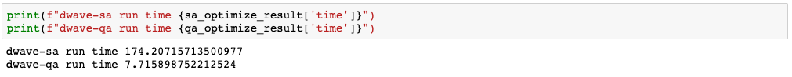

We can tell from the image that SA needs 174.2 seconds 
and QA needs 7.7 seconds to find 
solution.

!!! warning

    Be careful to increase the number of shots for SA to avoid long run time

## Analyze The Quality

After some time, we get the results. As the result indicates, the best answer of quantum annealer only 
occurs once.

This does not always indicate an error. It is actually the characteristic of the problem or how the problem 
is formulated. Because we have different linear and quadratic terms that vary by many orders of magnitude. If we 
set change value of A to some smaller number, like 10 or 100, more occurrences of the best answer will be observed. 
However, these answers usually break the constraints. For more information about this phenomenon, please refer to this 
[Link](https://support.dwavesys.com/hc/en-us/community/posts/1500000698522-Number-of-occurrences-?input_string=number%20occurance).

# Post-Process Result

In this part, we post process the optimizing results for evaluation and visualization.
At first, we prepare the following parameters:

| Parameter | Description | Value |
|--- |--- |--- |
|method | annealing method for QUBO problem |'dwave-sa': use the simulated annealer in ocean toolkit  'dwave-qa': use the quantum annealer|
|raw_path| the path for the original molecule file| './molecule-data/117_ideal.mol2' in this example |
|data_path| the path for the processed molecule file| './qmu_117_ideal_data_latest.mol2' in this example |
|bucket | the s3 bucket to store your results | - |
|prefix | the name of the folder in your s3 bucket | - |
|task_id | the id for your quantum annealing task| '2b5a3b05-1a0e-443a-852c-4ec422a10e59' in this example |

Then we can run the post-process using **ResultParser** object for SA:

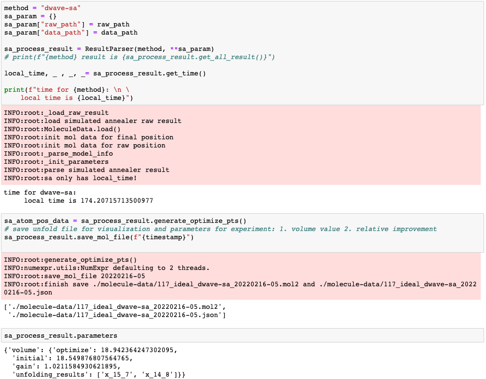

 
Post process for SA

In the first block, we can see the **local time**
for SA is around 174 seconds. 
With the **generate_optimize_pts()** method, the final 3D 
points after unfolding will be generated and saved as json file and mol2 files. The last 
block shows the optimizing results which are also stored in json files. 
It shows that the optimized result gains 
1.0212x increase in volume. The value for **unfolding_results** indicates 
that the rotatable bond 15 should rotate $270^o$ ($360/8*(7-1)$) and 
the rotatable bond 14 should rotate $315^o$ ($360/8*(8-1)$).
At the same time, you can run the post-process for QA:

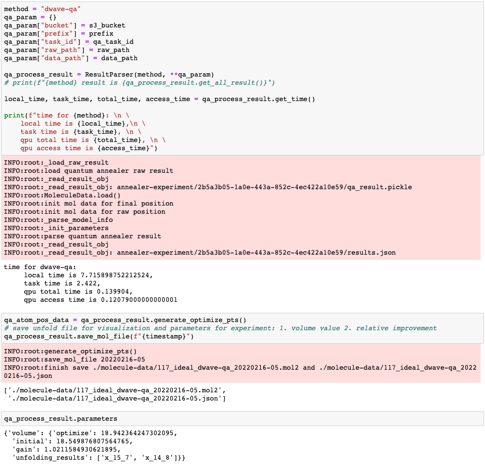

 
Post process for QA

In the first block, we can see that there many types of time metrics for running QA.
This task has the **local time** of 7.7 s, which means the time between calling the api and 
getting the annealing result. The **task time** time is the metric from the json file in 
bucket. We can also see the **qpu total time** and **qpu access time** representing the 
actual time running in the QPU. Please refer to [Operation and Timing](https://docs.dwavesys.com/docs/latest/c_qpu_timing.html)
for details. In same way, the optimized results are translated the 3D points and saved 
as local json and mol2 files. The result indicates that QA gains 
1.021x increase in 
volume. Finally, We can open folders for the optimized results:

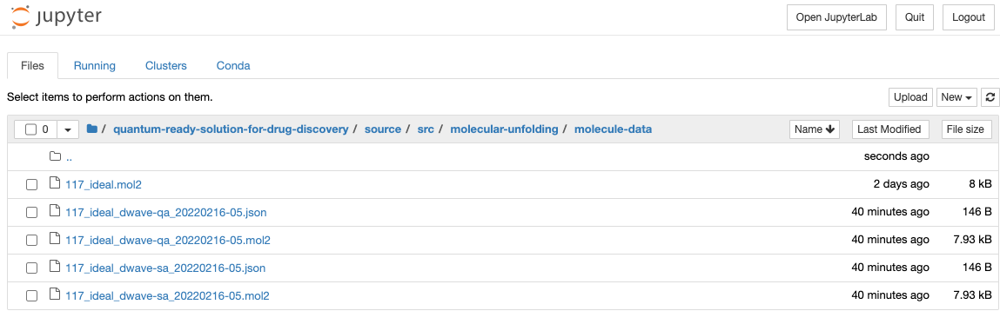

 
Optimize Results

We can the json result and mol2 file of SA and QA are 
stored in this place. If we carry out more 
experiments, more results with time stamp are 
stored incrementally. 
For visualization, 
we can upload the 
result **117_ideal_dwave-qa_20220216-05.mol2** 
into 
[online viewer tool](https://www.rcsb.org/3d-view) 
to see the result:

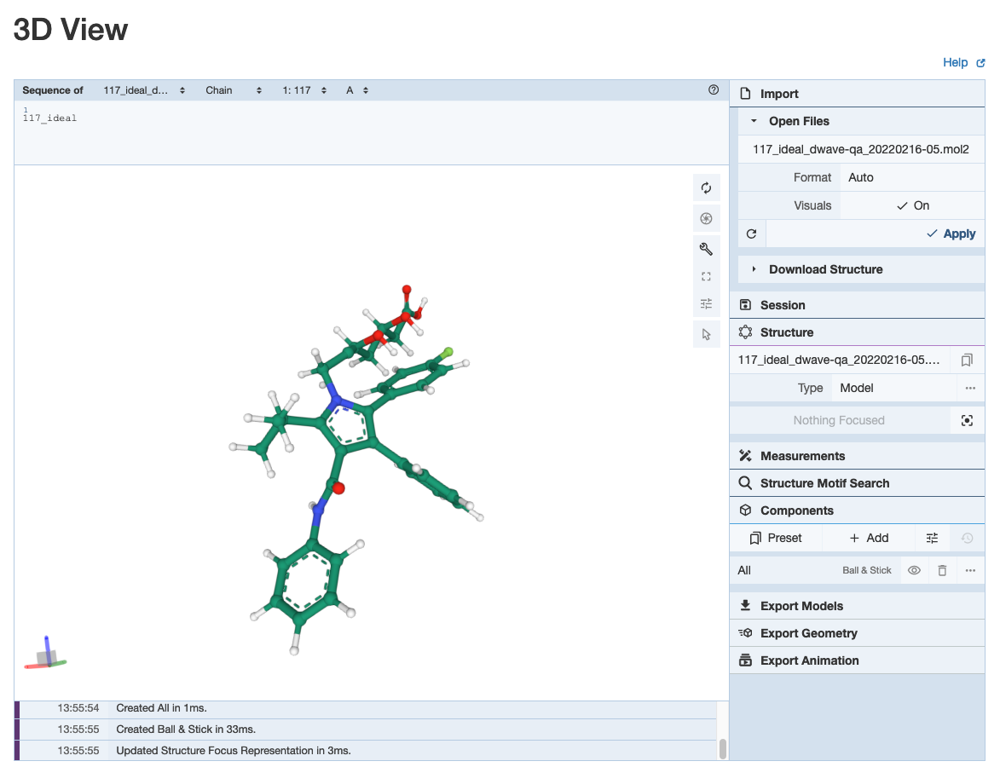

 
Visualization

# References

- 1.[Wiki: Molecular Docking](https://en.wikipedia.org/wiki/Docking_(molecular))

- [Publication: Quantum Molecular Unfolding](https://arxiv.org/abs/2107.13607)

- [Video: Molecular Unfolding with Quantum Annealing](https://www.youtube.com/watch?v=1NmAXIHAF2Y)