## Run Batch Evaluation

We will run batch evaluation through AWS Step Functions workflow and view the result via AWS QuickSight dashboard

### Get Step Functions link from deployment output

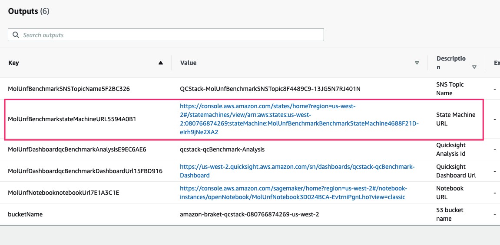

Click the Step Functions link, you will be navigated to AWS Step Functions console.

### Start Execution

In your AWS Step Functions console, click **Start execution** button, the screen is shown as below:

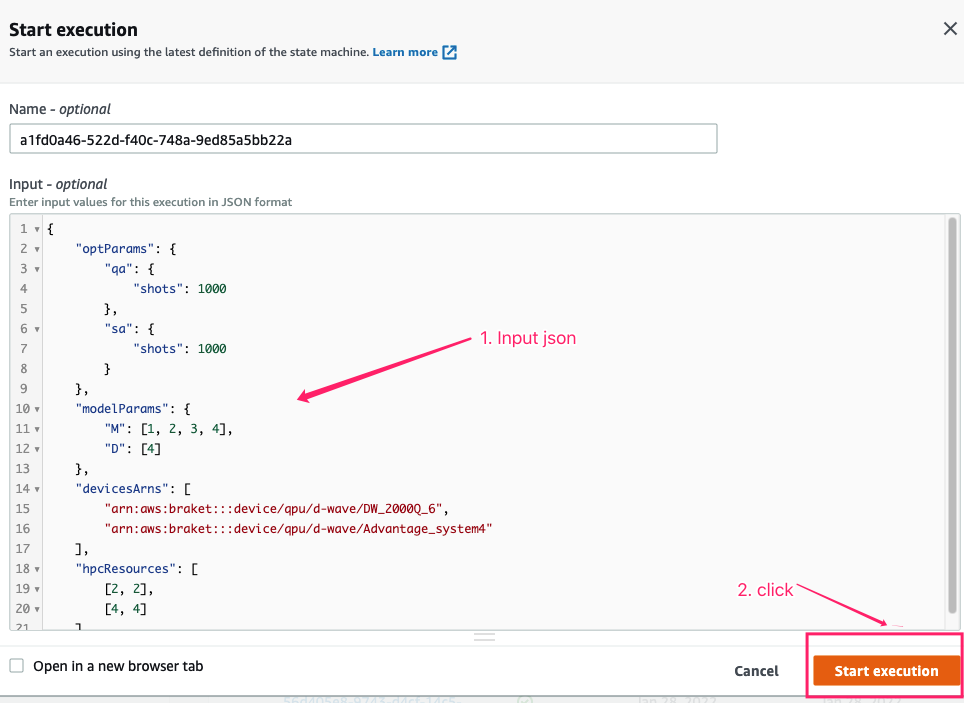

1. (optional) Input evaluation input

     - It will use default input if you do not input anything.
     - If you want to customize the batch evaluation, please refer to the [Input specification](#input-specification) in this section.

1. Click **Start execution**, start batch evaluation
    
    The screen is shown as below:
    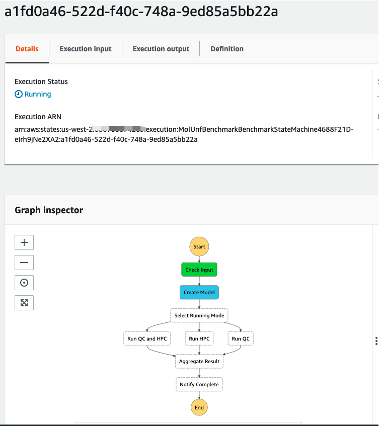

1. Wait for complete
   > The default batch evaluation will take about 15 minutes.

    The screen is shown as below when the evaluation is finished.
    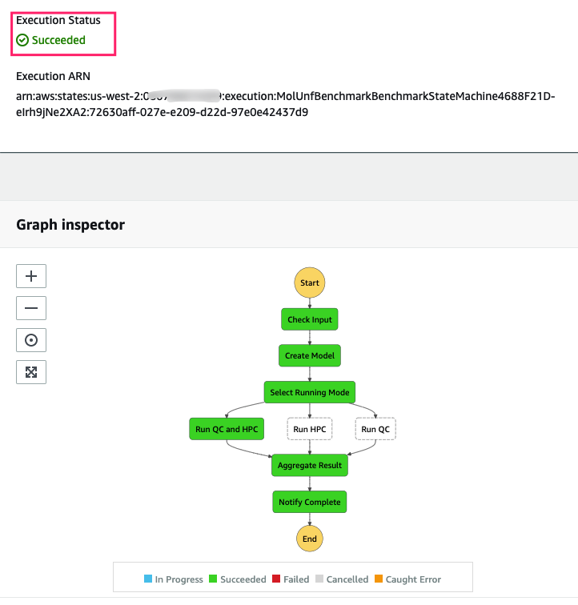
    
### View dashboard

When the batch evaluation is completed, you can view the result in AWS QuickSight dashboard.

* Get dashboard link form CloudFormation output:
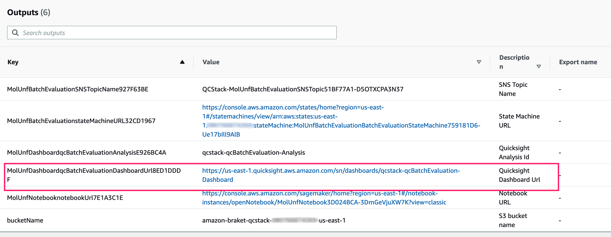

* Click the link, you will be navigated to the dashboard, shown as below:

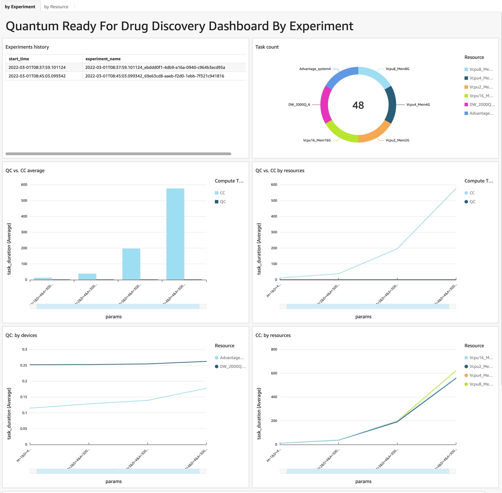

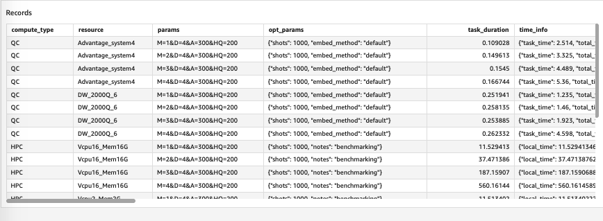

There are two sheets in the dashboard, you can click to switch.
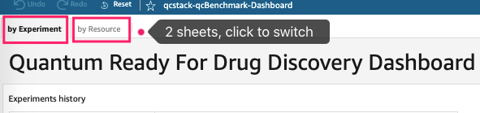

#### Sheet 1: view result by each experiment

In this sheet, you can view batch evaluation result by experiment.

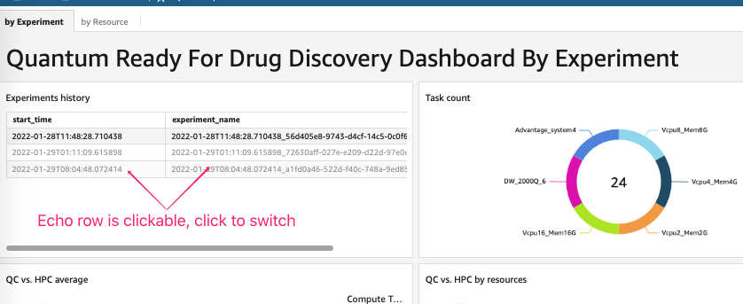

* Experiments hist table

In this sheet, you can view the batch evaluation result by each experiment, rows in the experiments table is clickable, you can click the row to view the result only for that experiment.

* Task count chart
    * It shows total tasks count of the experiment if you select an experiment in **Experiments hist** table.
    * It shows total tasks count of all experiments if no experiment is selected.

* QC vs. HPC charts

    Below two charts show the performance of QC vs. HPC tasks

    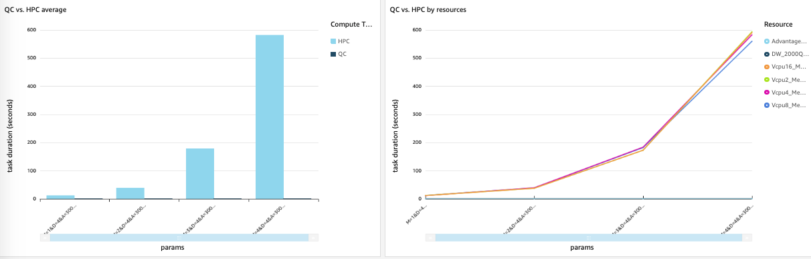
    
    * **QC vs. HPC average**  - compares the average execution time (Y-axis) of QC and HPC tasks by different model parameters (X-axis)
     * **QC vs. HPC by resource**  - compares the execution time (Y-axis) of QC and HPC tasks by different model parameters (X-axis) using different resources(for QC that is different QPU devices, for HPC that is different memory-vCPU)
    
* QC: by devices chart 

    It compares execution time (Y-axis) of different QPU devices by different model parameters (X-axis)

    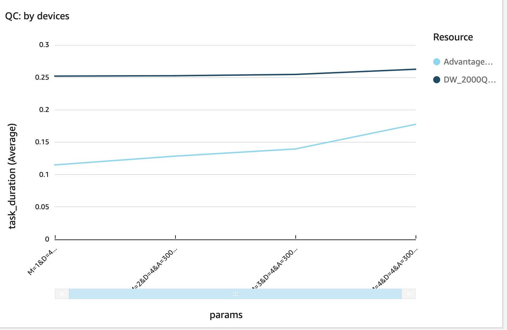

* HPC: by resources

    It compares execution time (Y-axis) of different HPC resources (memory and vCPU) by different model parameters (X-axis)

    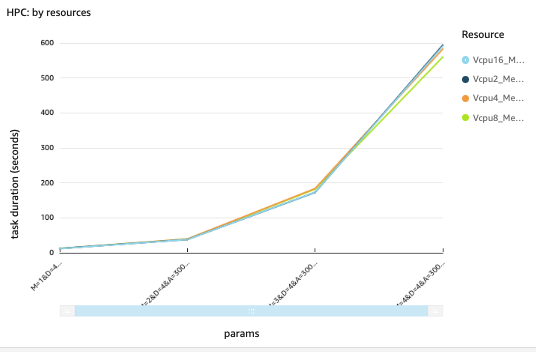

* Records table
   
    It lists the detail information of each task in the selected experiment (if no experiment selected, it lists all)

    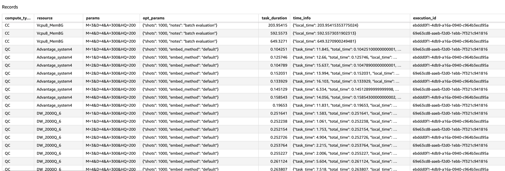

    Fields in this table:

    * **compute_type**: compute type, HPC or QC
    * **resource**: resource name, for QC that is different QPU devices, for HPC that is different memory-vCPU
    * **param**: model parameters. **M**: number of torsions; **D**: angle precision of rotation; **HQ**: hubo-qubo value, energy penalty; **A**: penalty scalar
    * **opt_params**: optimizer parameters
    * **task_duration**: task execution time in seconds
    * **time_info**: for QC, different dimensions of QC task time, `total_time` is the **task_duration** , for HPC, `local_time` is the **task_duration**
    * **execution_id**: the Step Functions execution id
    * **experiment_name**: the experiment name, if input `experimentName` is not empty, it is `execution start time + input experimentName`, otherwise, it is `execution start time + execution_id`
    * **task_id**: for Qc task, it is Braket task id, for HPC, it is empty
    * **result_detail**: the volume size of molecule before and after unfolding
    * **result_location**: the molecule mol2 file after unfolding


#### Sheet 2: view result by each resource

In this sheet, you can view batch evaluation result by each resource and QPU device

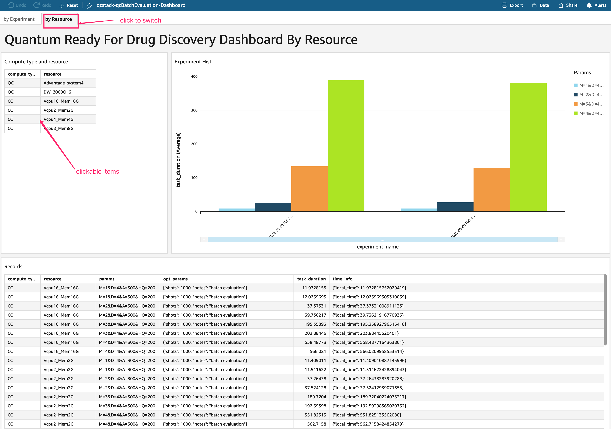

* Compute type and resource table
   
    It lists all resources in batch evaluation, for QC - resources are QPU devices, for HPC - resources are memory and vCPU. Items in the table are clickable, when you click one item (meaning you select it),  metrics in this sheet are switched to that item. If no item selected, it shows averaged metrics.

* Experiment hist chart
    
    It shows execution time (Y-axis) for selected resource by experiment name (X-axis, ordered by time) using different model parameters.

    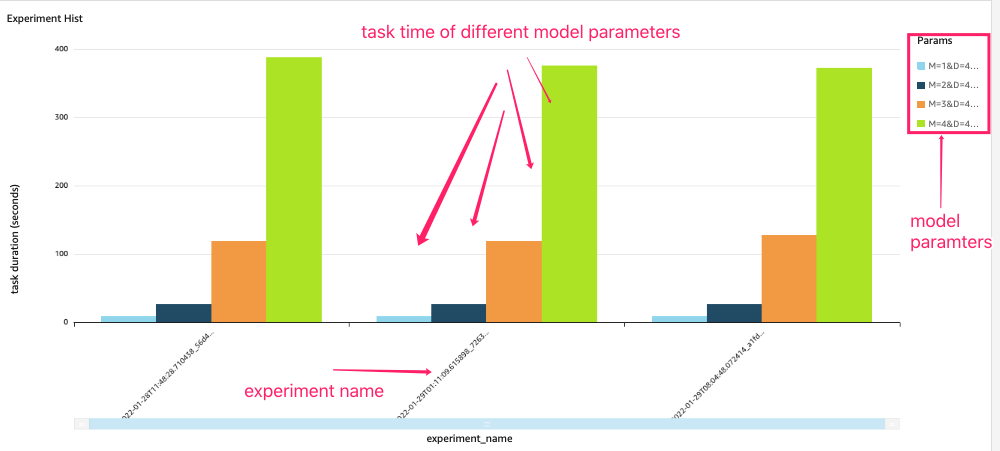  

* Records table
   
    This table is the same as the table in [Sheet 1](#sheet-1-view-result-by-each-experiment).

### Input specification

You can customize parameters of the evaluation by using a json input.

The input schema:

```json
{
    "version": "string",
    "runMode": "string",
    "molFile": "string",
    "modelVersion": "string",
    "experimentName": "string",
    "optParams": {
        "qa": {
            "shots": "int"
        },
        "sa": {
            "shots": "int"
        }
    },
    "modelParams": {
        "M": "int []",
        "D": "int []"
    },
    "devicesArns": "string []",
    "hpcResources": "[int, int] []",
}

```

Definition:

  * **version**:  the version of input schema, current only support value is: '1'
  * **runMode**:  run mode, value can be `ALL`, `HPC` or `QC`, default: 'ALL'; `HPC` - only run HPC tasks, `QC` only run QC tasks, `ALL` - run both tasks
  * **molFile**: S3 url of the mol2 file
  * **modelVersion**: model version, default: 'latest'
  * **experimentName**: the name of the batch evaluation
  * **modelParams**: model parameters, M: number of torsions, D: angle precision of rotation. Please refer to [Notebook Experiment](./notebook-experiment.md) for detail.  Valid values: 

         M: [1, 2, 3, 4, 5, 6, 7]
         D: [4] or [8]

    Note: the max value of M is depended on the value of D, QPU device and input molFile. 
    
    If you use the default molFile (meaning `molFile` is not provided in the input), the max value combinations are listed in below table: 
    
    |Device | D | Max M |
    |--- |--- |--- |
    |  arn:aws:braket:::device/qpu/d-wave/DW_2000Q_6  | 4 | 4 |
    |  arn:aws:braket:::device/qpu/d-wave/DW_2000Q_6  | 8 | 3 |
    |  arn:aws:braket:::device/qpu/d-wave/Advantage_system4  | 4 | 7 |
    |  arn:aws:braket:::device/qpu/d-wave/Advantage_system4  | 8 | 4 |

    If you use your own molFile, the input validation will be skipped, if the value exceeds the device capacity, the execution will be failed. 
   
  * **devicesArns**: QPU device arn. Valid values:
  
        arn:aws:braket:::device/qpu/d-wave/DW_2000Q_6
        arn:aws:braket:::device/qpu/d-wave/Advantage_system4
      
  * **hpcResources**: memory(first element) in GiB and vCPU(second element), e.g. 4GiB memory and 2 vCPU is: `[4, 2]`

A typical (the default) input:

```json
{
    "version": "1",
    "runMode": "ALL",
    "optParams": {
        "qa": {
            "shots": 1000
        },
        "sa": {
            "shots": 1000
        }
    },

    "modelParams": {
        "M": [1, 2, 3, 4],
        "D": [4]
    },
    "devicesArns": [
        "arn:aws:braket:::device/qpu/d-wave/DW_2000Q_6",
        "arn:aws:braket:::device/qpu/d-wave/Advantage_system4"
    ],
    "hpcResources": [
        [2, 2],
        [4, 4],
        [8, 8],
        [16, 16]
    ]
}

```