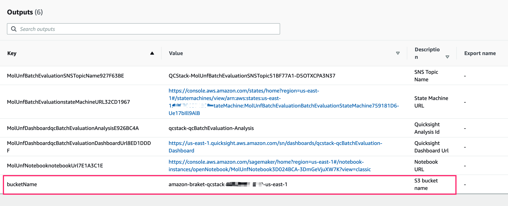

## Batch Evaluate Your Own Model

You have two options to batch evaluate your own model

- Batch evaluate your own mol2 file with out code changes
- Fully customize evaluation code

## Batch evaluate your own mol2 file with out code changes

If you have your own mol2 file, you want to batch evaluate it, you can follow below steps:

1. Upload your mol2 file to the S3 bucket in CloudFormation output, or your own S3 bucket. If you want to use your own S3 bucket, the bucket name must be follow pattern:  `braket-*` or `amazon-braket-*`.

      

1. Specify S3 uri of your mol2 file as the value of `molFile` in the Step Functions input
  
        {
            "molFile" : "<s3 uri of your mol2 file>"
        }

    e.g.

        {
           "molFile": "s3://amazon-braket-gcr-qc-sol-common/qc/raw_model/117_ideal.mol2"
        }     
        
     The full input parameters and schema, please refer to [input specification](../batch-evaluation/#input-specification)

1. Follow int steps in [Batch Evaluation](../batch-evaluation/#start-execution) to run the Step Functions

## Fully customize evaluation code

This solution is an open source project under Apache License Version 2.0. You can leverage it as your base code, make changes on it.

If you want to fully customize the evaluation code, follow below steps to make changes and re-deploy the whole stack from CDK.

### Prerequisites

1. Make sure you have AWS CLI and AWS CDK install in your workspace
    
    > You can follow this doc [AWS CLI](https://docs.aws.amazon.com/cli/latest/userguide/getting-started-install.html) to install AWS CLI.
   
    > You can follow this document [CDK Getting Started](https://docs.aws.amazon.com/cdk/v2/guide/getting_started.html#getting_started_prerequisites) to install and bootstrap CDK

1. Permissions
   
    Your AWS user must have at least [permissions](./permissions.json)

1. QuickSight account
    
    Check your QuickSight account [check your quicksight](../../../deployment/#check-your-quicksight)

1. Make sure you have docker running in your workspace

    > You can follow this document [Docker Install](https://docs.docker.com/engine/install/) to install docker.

### Customize evaluation code

1. Fork the github repository of this solution to your own git repository

1. Clone the project to your own workspace

1. Make changes to source code

1. Update `quicksight_user` and `default_code_repository` in file `source/cdk.context.json`
  
         {
           "quicksight_user": "<your QuickSight user>",
           "default_code_repository": "<your github repository>"
         }

### Deploy stack to your AWS account from CDK

1. Check CloudFormation in your AWS account, make sure you do not have a stack named `QCStack` in your deployment region

1. Check your S3 bucket, make sure no bucket named `amazon-braket-qcstack-<your aws account>-<deployment region>`

1. Deploy changes to your AWS account from CDK

        cd source
        npm run deploy
        
 
1. Wait for the deployment to complete
    
    > deployment will take about 10 minutes 

1. Get output links from CloudFormation output, the links include:
    - Step Functions URL
    - QuickSight Dashboard link
    - Notebook URL
    - S3 Bucket name

1. Follow steps in [Batch Evaluation](../batch-evaluation/) to run your own code with appropriate input

1. [View result](../batch-evaluation/#view-dashboard) through QuickSight dashboard
