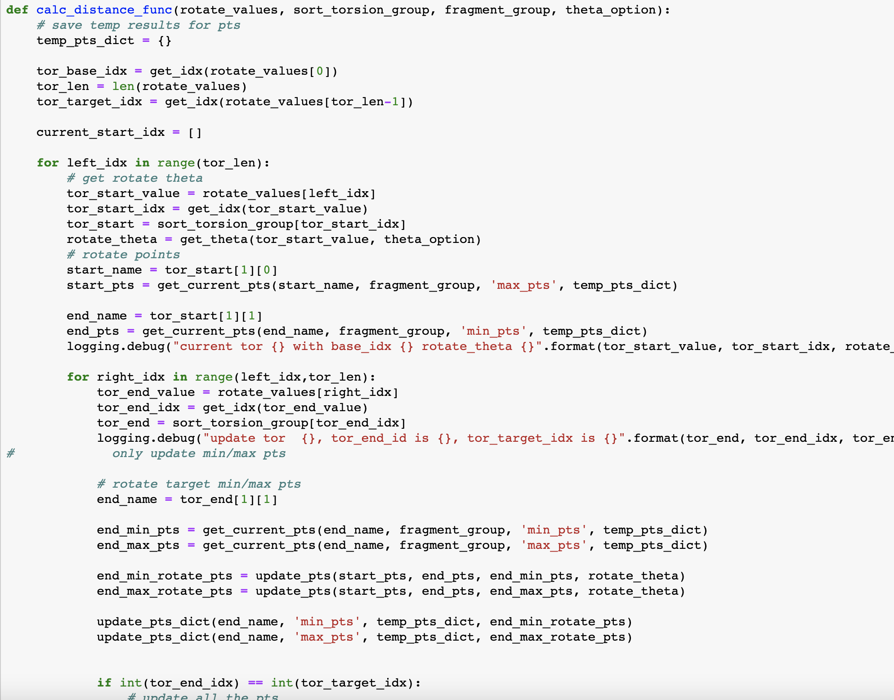
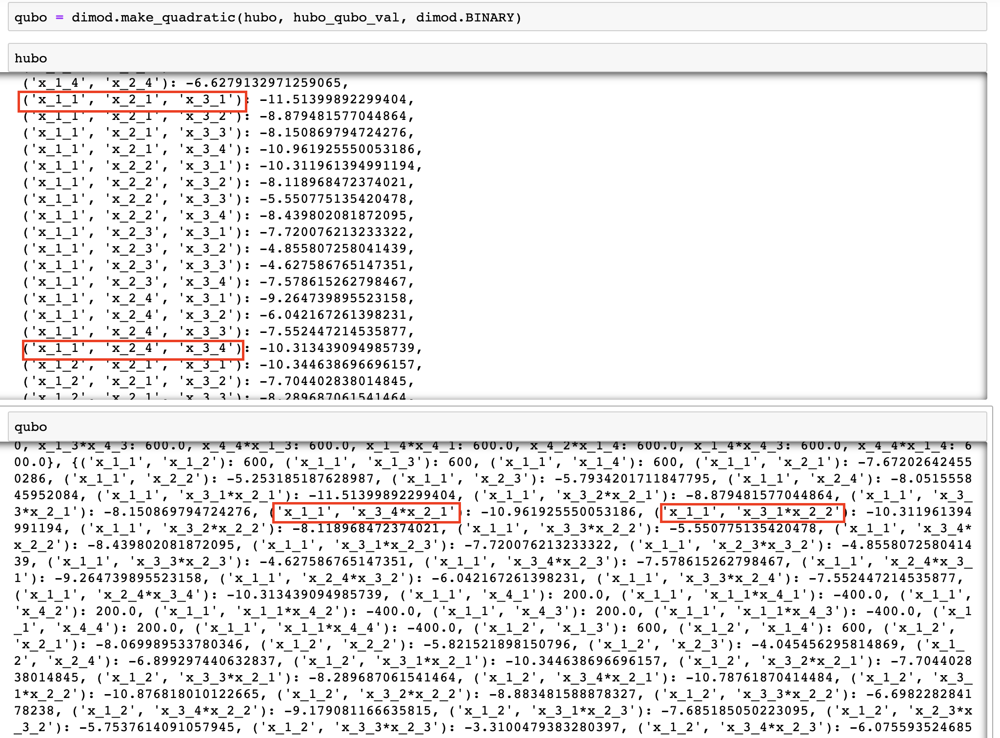
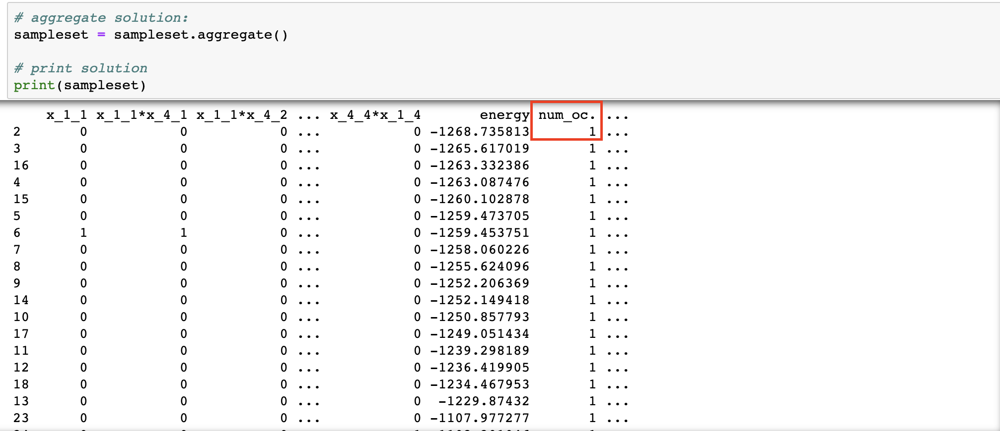

# Background

Molecular Docking (MD) is an important step of the drug discovery process which aims at calculating 
the preferred position and shape of one molecule to a second when they are bound to each other. This step focuses on computationally simulating the molecular recognition process. It aims to achieve an optimized conformation for both the protein and ligand and relative orientation between protein and ligand such that the free energy of the overall system is minimized. 

In this work, The protein or the pocket is considered as a rigid structure. The ligand is considered as a 
flexible set of atoms. There are usually three main phases in MD:

* Ligand expansion
    * Identification of the rotatable bonds
    * Internal distances maximization
    * Remove tool related bias (e.g. smile-to-3D)
* Initial Placement
    * Ligand main fragments decomposition
    * Ligand initial poses identification
    * Placement of the ligand into the pocket with rigid roto-translations
* Shape Refinement
    * Use of the rotatable bonds to modify the ligand shape and to match the protein pocket
    * Docking score maximization

In this work, actually the first phase, ligand expansion or the molecular unfolding (MU), is focused and 
implemented using quantum annealer. This phase is important for improving docking. In fact, an initial
pose of the ligand that is set a priori may introduce shape bias affecting the final quality of the
docking. MU is the technology used for removing such initial bias.

# Build The Model

## Problem Definition

In this problem, the ligand is considered as a flexible set of atoms. Strictly speaking, 
it can be seen as a set of chemical bonds (edges). These bonds have fixed length and 
only a subset of them are rotatable. Because there are some rotatable bonds (torsions)
, the molecule is split into different disjointed fragments. Take one bond for instance, 
the rightmost rotatable one, it splits the molecule into the left and right fragments. 
These fragments can rotate independently from each other around the axis of the bond. This 
idea is graphically reported in the following figure. 

 

 As it indicates, the objective of MU is to find the shape of the ligand that can maximizes 
 the molecular volume. The shape of the ligand can be expressed as the unfolded shape of the
  ligand (the torsion configuration of all the rotatable bonds).

## Formulation

{}

 The original paper has some work to make the story of molecular unfolding complete:

 1. elaboration of .MOL2 file for rotatable bonds
 2. the sorting method based on the betweeness centrality 
 3.  many experiments on a ligand dataset compared with Random Search and GeoDock Search
 4. dealing with the elaboration of .MOL2 file for rotatable bonds i

 In this workshop, we only focus on the constructing of equation for molecular unfolding and 
 the application of it in quantum annealer. We make the following assumptions:

 1. The elaboration of rotatable bonds is already finished
 2. The fragment is considered as the collections of atoms with fixed space 
 3. The geometric center of the fragment is chosen as the distances of the atoms inside

 For more details, please refer to the original publication.

{}

Suppose the ligand has $ M $ torsions, from $ T_i $ to $ T_M $, and each torsion must have the angle 
of rotation $\theta$.

The objective of this model is to find the unfolded torsion configuration $ {\Theta}^{unfold} $ which 
can maximizes the sum of distances $ D(\Theta) $.

$$ {\Theta}^{unfold} = [\theta^{unfold}_1,  \theta^{unfold}_2, ../..., \theta^{unfold}_M] $$

$$ D(\Theta) = \sum_{a,b}D_{a,b}(\theta)^2 $$

The $ D_{a,b}(\theta)^2 $ is $ || \overrightarrow{a}_0 - R(\theta)\overrightarrow{b}_0||^2  $ . 
This is the distance between fragment a and b. $ R(\theta) $ is the rotation matrix associated the torsion angle 
$ \theta $.

Since this is the problem of portfolio optimization, the final configuration can be the combination of any 
angle of any torsion. However, there are some constraints for applying it to real problem: 

1. In terms of the limitation of computation resource, the torsion cannot have the rotation with infinitely small 
precision. This means that there are limited candidates of rotation angles for each torsion. Suppose we have $ M $ 
torsions and they have the same precision of rotation angle : $ \Delta\theta $ . This means that we need $ d $ variables 
for each torsion:

$$ d = \frac{2\pi}{\Delta\theta} $$
For the whole model, we need $ n = d \times M $ binary variables $ x_{ik} $ to represent all the combinations. 
For example, for the torsion $ T_i $, its torsion angle $ \theta_i $ can have $ d $ possible values:

$$ \theta_i = [\theta_i^1,\theta_i^2,\theta_i^3, ../..., \theta_i^d] $$

2. If we only consider the distance, the final result or configuration may have multiple results from the same torsion as long 
as this combination means smaller distance. For example, there may be two binary variables of the same torsion, $ T_i $, in the 
final result:

$$ {\Theta}^{unfold} = [\theta^2_1,  \theta^4_1, ../..., \theta^3_M] $$

This cannot happen in real world. $ T_1 $ can only have one of $ d $ angles finally. So we need to integrate the following constraint into our final model:

$$ \displaystyle\sum\limits_{k=1}^{d} x_{ik} = 1 $$

With these two constraints, this problem can be formulated as the high-order unconstrained binary optimization (HUBO).

$$ O(x_{ik}) = A\displaystyle\sum\limits_i (\displaystyle\sum\limits_{k=1}^d x_{ik}-1)^2 - \displaystyle\sum\limits_{a,b} D_{ab} (\theta)^2 $$

The first part is the constraint for each torsion. If one torsion has more than one angles at last, we will add the punishment term $ A $. 
However, in this implementation we calculate the distance-pair under different configuration in advance. This 
means that we use the absolute distance instead:

$$ O(x_{ik}) = A\displaystyle\sum\limits_i (\displaystyle\sum\limits_{k=1}^d x_{ik}-1)^2 - \displaystyle\sum\limits_{a,b} |D_{ab} (\theta)| $$

## The Code for Model

We have implemented this model in **protein/ligand-unfolding/ligand_unfolding.ipynb**.
Suppose we have finished the parameter setting, we first initialize 
the variables using the following code:

The above code indicates that we have 4 torsions from $ x_1_? $ to $ x_4_? $. Each torsion has four optional rotation angles from $ 0^o $ to $ 270^o $. For example, $ x_3_2 $ means that the torsion 3 rotates 
$ 180^o $.

For constraints, we use the following code to implement: 

As we analyze before, the model does not which variables belong to 
the same physical torsion. For example, $ x_1_1 , x_1_2, x_1_3 $ 
and $ x_1_4 $ belong to the same torsion. The model cannot let only 
one of them become $ 1 $. If the model choose multiple of them, we 
must punish it. As the figure shown, when the model choose more than 
one variables of $x_1_?$ to become $ 1 $, we give it the punishment 
term $ 600 $. 

Most importantly, we use $ calc_distance_func $ to calculate
$ |D_{ab} (\theta)| $ under different $ \theta $.

## Quantum Annealing

The quantum annealing (QA) can be seen as a variation of the simulated annealing (SA). Both QA and SA are meta-heuristic technique for address 
challenging combinatorial problems. QA uses the quantum fluctuation to explore the configuration space instead of thermal effects. Here, we use 
Amazon Braket API to access the Canadian company D-Wave. This annealer is implemented using superconductive qubits. Natively, the quadratic 
unconstrained binary optimization (QUBO) can be solved using quantum annealer:

$$ O(x) = \displaystyle\sum\limits_i h_i x_i + \displaystyle\sum_{i>j} J_{i,j} x_i x_j $$

In QUBO form, $ x_i \in \{0, 1\} $ are binary variables. We can consider it as the angle that we choose for a particular torsion. $h_i$ and $J_{i,j}$
 can be considered as the values encoding the optimization task when we use corresponding angles. However, in our task, it is common that there are 
 more than one torsion between fragments, we model it as the high-order quadratic unconstrained binary optimization (HUBO) problem:

$$ O(x) = \displaystyle\sum\limits_i \alpha_i x_i + \displaystyle\sum_{i,j} \beta_{i,j} x_i x_j + \displaystyle\sum_{i,j,k} \gamma_{i,j,k} x_i x_j x_k + ../... $$

It is often possible to convert HUBOs to QUBOs by using some tricks, 
like adding new ancillary binary variables to replace high-order term. 
In practice, we use the API $ make \_ quadratic() $ in D-Wave software package to make this conversion.

As the image shown, some high-order term of HUBO, like $ ('x\_1\_1','x\_2\_1','x\_3\_1') $, have been 
transformed to binary terms in QUBO. We only highlight some of them.

Congratulations! We have already prepared the model and it is time to test it.

# Optimization

## Adjust Parameters For Optimization

We have our QUBO model for experiments. There are some parameters we should define for optimization.

| Parameter | Description | Value |
|--- |--- |--- |
|A | penalty scalar |1000 |
|hubo_qubo_val | energy penalty of make_quadratic() |5|
|n_c | number of shots for simulated annealing in local instance | 1000|
|n_q | number of shots for quantum annealing in QPU | 1000|
|M | number of torsions for molecular unfolding| [1, all the torsions] |
|D| angle precision of rotation| 8|

We use the following code to set the parameters:

## Run Optimizers

After setting the parameters, we can run the optimization on classic device and quantum device.

### Classical Optimizer for QUBO

### Quantum Optimizer for QUBO

## Analyze The Quality

After some time, we get the results. As the result indicates, the best answer of quantum annealer only 
occurs once.

This does not always indicate an error. It is actually the characteristic of the problem or how the problem 
is formulated. Because we have different linear and quadratic terms that vary by many orders of magnitude. If we 
set change value of $A$ to some smaller number, like 10 or 100, more occurrences of the best answer will be observed. 
However, these answers usually break the constraints. For more information about this phenomenon, please refer to this 
[Link](https://support.dwavesys.com/hc/en-us/community/posts/1500000698522-Number-of-occurrences-?input_string=number%20occurance).

After that, we need some postprocessing to get the results. What we really want are the desired angles of all the torsion.

We test different values of $M$, and we find that when $M > 5$, the quantum annealer can not embed it into its quantum circuit. When 
$M < 3$, we can get comparable results from quantum annealer. In other cases, the results from the quantum annealer are not stable. 
This is interesting that we cannot get the similar results as the publication explains. Any discussion or help is welcome!

   |M |d | Results|
   |--- |--- |--- |
   |1|4|Comparable|
   |2|4|Comparable|
   |3|4|Comparable|
   |4|4|Not Stable|
   |5|4|Not Stable|
   |>5|4|Not Available (Embedding Fail)|

## Analyze The Efficiency

In this workshop, we have test the efficiency of model with different complexity, $ M * d $, on different devices. We test SA on ml.c5.4xlarge, 
ml.m5.4xlarge, and ml.r5.4xlarge. We also test QA on DW_2000Q_6 and Advantage_system1.1. The result shows that, if the tasks run with the same 
number of shots (1000), the quantum annealer has really nice scaling ability for solving combinatorial problems. The Advantage_system1.1 only needs 
3 minutes to solve the QUBO model ($M=5, d=8$), while all the classic computing instance needs over 3 hours. However, there's suspicion that there is 
still much space for improvement in the SA implemented by D-Wave. More strict bench mark is needed.

If we change the number of shots for SA to 1, we get another group data for efficiency. 
