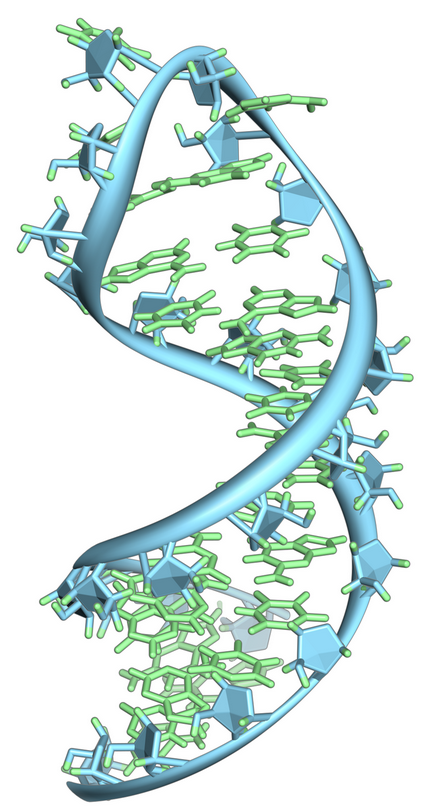

## Notebook experimentation

This notebook implements the work from [RNA Folding Using Quantum Computers](https://journals.plos.org/ploscompbiol/article?id=10.1371/journal.pcbi.1010032) inspired by the work from [QHack 2022 Winner](https://github.com/XanaduAI/QHack2022/issues/114). 

## RNA folding

RNA folding refers to the process by which a single-stranded RNA molecule adopts a specific three-dimensional structure through the formation of intramolecular base pairs. This process is crucial for the proper functioning of RNA in a variety of biological processes, such as gene expression, RNA splicing, and protein synthesis.

Figure 7: A hairpin loop from a pre-mRNA[7](#wiki-rna)

In this work, the quantum annealer is leveraged to predict the secondary structure of RNA. 
To steer the system towards maximizing both the number of base pairs and the average length of the stems, 
a Hamiltonian is formulated in the Binary Quadratic Model (BQM) format. 

After deployment, you can go to select the solution’s root stack on the Stacks page, choose the Outputs tab, and open the link for your notebook. See the file **healthcare-and-life-sciences/b-1-rna-folding-quadratic-unconstrained-binary-optimization/rna-folding-qubo.ipynb** for more details.

# References

- 7.[Wiki: RNA](https://en.wikipedia.org/wiki/RNA)