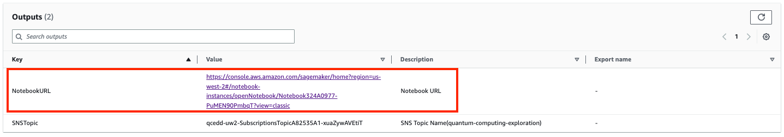

## Notebook experimentation

The workshop implements the [RNA folding using quantum computers](https://journals.plos.org/ploscompbiol/article?id=10.1371/journal.pcbi.1010032) based on the work 
from [QHack 2022 winner](https://github.com/XanaduAI/QHack2022/issues/114) in Amazon Braket.

## RNA folding

RNA folding refers to the process by which a single-stranded RNA molecule adopts a specific three-dimensional structure through the formation of intramolecular base pairs. This process is crucial for the proper functioning of RNA in a variety of biological processes, such as gene expression, RNA splicing, and protein synthesis.

Figure 12: A hairpin loop from a pre-mRNA[7](#wiki-rna)

In this work, the quantum annealer is leveraged to predict the secondary structure of RNA. 
To steer the system towards maximizing both the number of base pairs and the average length of the stems, 
a Hamiltonian is formulated in the Binary Quadratic Model (BQM) format.

## Quantum molecular unfolding on the AWS Cloud

Here we focus on the first phase of MD, ligand expansion, which aims to reduce shape bias that may affect the final quality of docking.  In this solution we use the quantum annealing approach to molecular unfolding (MU) as published by Mato et al. Our solution uses AWS Services to execute this problem on quantum computing hardware, available through AWS Braket. The solution also allows the problem to be run on classic computing hardware, on AWS, for comparison.

## Notebook overview

1. Sign in to the [AWS CloudFormation console](https://console.aws.amazon.com/cloudformation/home?). 
2. On the **Stacks** page, select the solution’s root stack. 
3. Choose the **Outputs** tab and open the link for your notebook.

    

    Figure 7: Notebook URL on the stack's Output tab

4. Open the file under the directory **molecular-folding/molecular_unfolding.ipynb** and choose the kernel **qcenv**.

5. Navigate through the notebook, which consists of four Steps:

    - Step 1: Prepare data - Prepare molecular data for experiments.
    - Step 2: Build model - Build model for molecular unfolding.
    - Step 3: Optimize configuration - Run optimization to find the configuration.
    - Step 4: Process results - Process the results for evaluation and visualization.

# References

- 7.[Wiki: RNA](https://en.wikipedia.org/wiki/RNA)
