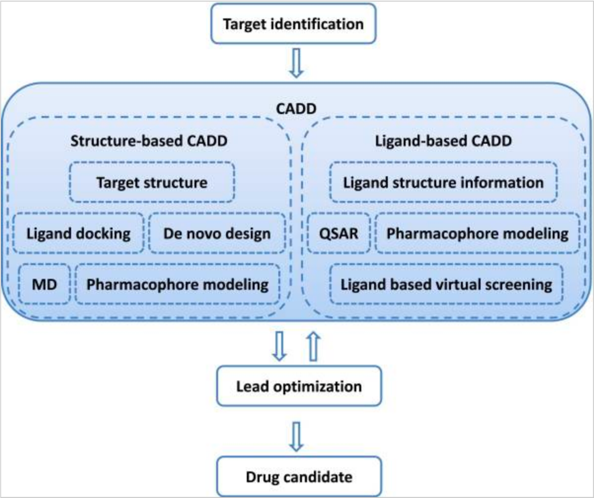

# Background

As of this revision, quantum computing technology is in an early phase, and its full impacts are still being understood ([Quantum computing use cases](https://www.forbes.com/sites/chuckbrooks/2021/03/21/the-emerging-paths-of-quantum-computing/?sh=765b2ed6613e)). We are still in the noisy intermediate-scale quantum (NISQ) era, where the leading quantum processors contain 50 to a few hundred qubits, but are not advanced enough to reach fault-tolerant stage. When we are one day in fault-tolerant quantum computing (FTQC), we can run really powerful algorithms in quantum computers.

Drug discovery is one area where computational researchers are aiming to assess the state of quantum computing. Drug discovery is costly and time-intensive process with high rate of failure of drug candidates. The average R&D cost required to bring a new, FDA approved medicine to patients is estimated to be $2.6 billion[2](#drug-discovery). This includes the cost of many potential medicines that do not make it through to FDA approval. For example, in research for treatments for Alzheimer’s disease over the past 16 years, only four new medicines have been approved out of 123 treatment attempts that were tested in clinical studies. That’s a three percent approval rate. 

Figure 3: Drug Discovery[3](#drug-discovery)

To tackle these problems, innovation and advancements in computer-aided drug design (CADD) aim to increase the productivity in drug research and development. Figure 4 illustrates where CADD approaches, including structured-based methods and ligand-based methods, can fit within the drug discovery process. In particular, drug discovery researchers have identified quantum computing techniques that may be applicable to the components in the general workflow of drug discovery process (Figure 5).

Figure 4: CADD[4](#cadd)

While not as advanced as Fault-tolerant quantum computing (FTQC) shown in Figure 5, Amazon Braket already provides access to Noisy intermediate-scale quantum computing (NISQ). Therefore, it might be beneficial for customers at the forefront of innovations in their fields to start with quantum computing to research application, to build expertise, and secure Intellectual Property (IP).

Figure 5: CADD-QC[5](#cadd)

# References

- 2.“Cost of Developing a New Drug”. Tufts CSDD & School of Medicine and US FDA Infographics, Nov.2014
- 3.[The drug development and approval process is about much more than the final “okay”](https://catalyst.phrma.org/the-drug-development-and-approval-process-is-about-much-more-than-the-final-okay)
- 4.Sliwoski, Gregory, et al. "Computational methods in drug discovery." Pharmacological reviews 66.1 (2014): 334-395
- 5.Cao, Yudong, Jhonathan Romero, and Alán Aspuru-Guzik. "Potential of quantum computing for drug discovery." IBM Journal of Research and Development 62.6 (2018): 6-1.
