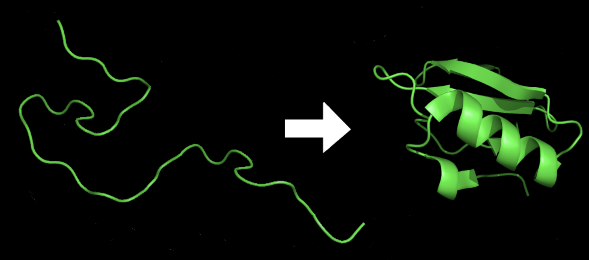
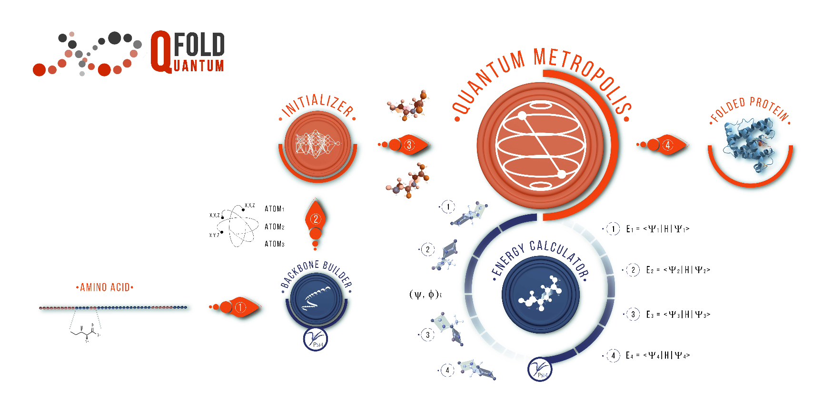

## Notebook experimentation

This notebook implements the [QFold: quantum walk and deep learning to solve protein folding](https://iopscience.iop.org/article/10.1088/2058-9565/ac4f2f) in
 Amazon Braket. This is mainly contributed by [Roberto Campos](https://github.com/roberCO) based on his [implementation](https://iopscience.iop.org/article/10.1088/2058-9565/ac4f2f)

## Protein folding using quantum walk

Protein folding is the process by which a protein molecule assumes its three-dimensional shape, which is essential for its proper function. Proteins are made up of a linear chain of amino acids, and their final structure is determined by the sequence of amino acids and the interactions between them.

During protein folding, the linear chain of amino acids folds into a unique three-dimensional structure, which is stabilized by various types of interactions, such as hydrogen bonds, electrostatic forces, and van der Waals forces. The process of protein folding is highly complex and involves multiple stages, including the formation of secondary structures, such as alpha-helices and beta-sheets, and the packing of these structures into a final three-dimensional shape.

Figure 8: Protein before and after folding[8](#wiki-protein)

In this work, the quantum walks are applied 
to a Metropolis algorithm in order to predict how proteins fold in 3D.
Quantum walks are quantum analogues of classical random walks. In contrast to the classical random walk, where the walker occupies definite states and the randomness arises due to stochastic transitions between states, in quantum walks randomness arises through: (1) quantum superposition of states, (2) non-random, reversible unitary evolution and (3) collapse of the wave function due to state measurements. This is named as Qfold in the original paper.

Figure 9: Scheme of the QFold algorithm[9](#qfold)

After deployment, you can go to select the solution’s root stack on the Stacks page, choose the Outputs tab, and open the link for your notebook. See the file **healthcare-and-life-sciences/c-1-protein-folding-quantum-random-walk/protein-folding-qrw.ipynb** for more details.

# References

- 8.[Wiki: Protein](https://en.wikipedia.org/wiki/Protein_folding)

- 9.[QFold: Quantum Walks and Deep Learning to Solve Protein Folding](https://iopscience.iop.org/article/10.1088/2058-9565/ac4f2f)