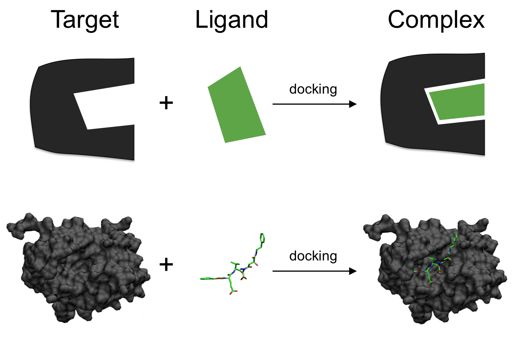

## Notebook experimentation

The workshop implements the [QFold: quantum walk and deep learning to solve protein folding](https://iopscience.iop.org/article/10.1088/2058-9565/ac4f2f) in
 Amazon Braket. This is mainly contributed by [Roberto Campos](https://github.com/roberCO) based on his [implementation](https://iopscience.iop.org/article/10.1088/2058-9565/ac4f2f)

## RNA folding

RNA folding refers to the process by which a single-stranded RNA molecule adopts a specific three-dimensional structure through the formation of intramolecular base pairs. This process is crucial for the proper functioning of RNA in a variety of biological processes, such as gene expression, RNA splicing, and protein synthesis.

Figure 12: A hairpin loop from a pre-mRNA[7](#wiki-rna)

In this work, the quantum annealer is leveraged to predict the secondary structure of RNA. 
To steer the system towards maximizing both the number of base pairs and the average length of the stems, 
a Hamiltonian is formulated in the Binary Quadratic Model (BQM) format.

## Quantum RNA folding on the AWS Cloud

In this solution we use the quantum annealing approach to RNA folding as published by Dillion M.Fox et al. This implementation is also inspired by the work from 
winner in QHack 2022. Our solution uses AWS Services to execute this problem on quantum computing hardware, available through AWS Braket. 
The solution also allows the problem to be run on classic computing hardware, on AWS, for comparison.

## Notebook overview

1. Sign in to the [AWS CloudFormation console](https://console.aws.amazon.com/cloudformation/home?). 
2. On the **Stacks** page, select the solution’s root stack. 
3. Choose the **Outputs** tab and open the link for your notebook.

    

    Figure 13: Notebook URL on the stack's Output tab

4. Open the file under the directory **healthcare-and-life-science/rna-folding/rna-folding-algorithm.ipynb** and choose the kernel **qc_hcls_rna_folding**.

# References

- 7.[Wiki: RNA](https://en.wikipedia.org/wiki/RNA)
