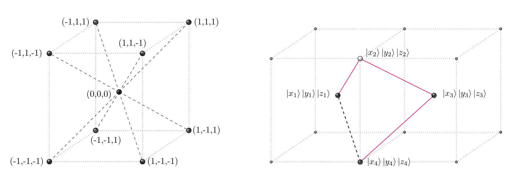

## Notebook experimentation

This notebook implements the [Quantum Speedup for Protein Structure Prediction](https://ieeexplore.ieee.org/document/9374469)
in
Amazon Braket. This is mainly contributed by [Renata Wong](https://scholar.google.com/citations?user=XVFoBw4AAAAJ&hl=en) and [Weng-Long Chang](https://ieeexplore.ieee.org/author/37273919400).

## Protein folding using Grover's search

Protein folding is the process by which a protein molecule assumes its three-dimensional shape, which is essential for its proper function. Proteins are made up of a linear chain of amino acids, and their final structure is determined by the sequence of amino acids and the interactions between them.

During protein folding, the linear chain of amino acids folds into a unique three-dimensional structure, which is stabilized by various types of interactions, such as hydrogen bonds, electrostatic forces, and van der Waals forces. The process of protein folding is highly complex and involves multiple stages, including the formation of secondary structures, such as alpha-helices and beta-sheets, and the packing of these structures into a final three-dimensional shape.

Figure 11: Protein before and after folding[10](#wiki-protein)

In this work, a fast quantum algorithm based on 
Grover's search is proposed. The protein structure
prediction problem is studied in 
three-dimensional hydrophobic-hydrophilic model on body-centered cubic lattice. 
The results show the quadratic speedup 
over its classical counterparts.

Figure 12: Body-centered cubic lattice[11]

Grover's algorithm is a quantum algorithm that 
can be used to search an unsorted database of 
N items in O(sqrt(N)) time. This is a 
significant speedup compared to 
classical algorithms, which require O(N) time to search an unsorted database. 

After deployment, you can go to select the solution’s root stack on the Stacks page, choose the Outputs tab, and open the link for your notebook. See the file **healthcare-and-life-sciences/c-3-protein-folding-grover-search/protein-folding-gs.ipynb** for more details.

# References

- 11.[Wiki: Protein](https://en.wikipedia.org/wiki/Protein_folding)

- 12.[QFold: Quantum Walks and Deep Learning to Solve Protein Folding](https://iopscience.iop.org/article/10.1088/2058-9565/ac4f2f)