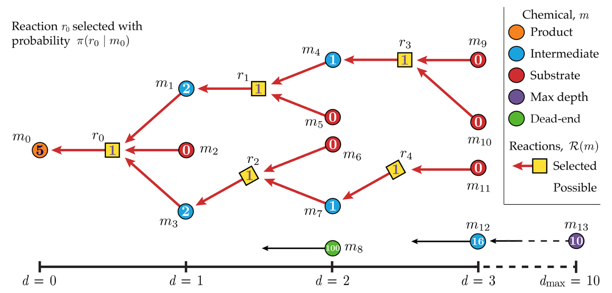

## Notebook experimentation

This notebook implements the retrosynthetic 
planning using quantum reinforcement 
learning. 
This is mainly contributed by [Xiangyu Li](https://github.com/lxy-z) inspired by the publication  
[Learning Retrosynthetic Planning through Simulated Experience](https://pubs.acs.org/doi/10.1021/acscentsci.9b00055).

## Retrosynthetic planning using quantum reinforcement learning

Retrosynthetic planning is a strategy for designing efficient synthetic routes for the preparation of complex organic molecules. It involves breaking down a target molecule into simpler precursor molecules, and then identifying the synthetic pathways that can be used to synthesize those precursors. It is an essential strategy 
for designing efficient synthetic routes 
for complex organic molecules. 

Figure 13: A retrosynthetic analysis example[12](#wiki-retro)

The
quantum reinforcement learning for 
retrosynthetic planning involves 
encoding the target molecule and the 
available synthetic transformations as quantum states. 
The quantum reinforcement learning algorithm can then use these states to 
learn the optimal sequence of synthetic transformations to reach the 
target molecule from a set of starting materials. The algorithm can learn from a database of known reactions, as well as from trial and error in a virtual environment, to optimize the synthesis process. 

After deployment, you can go to select the solution’s root stack on the Stacks page, choose the Outputs tab, and open the link for your notebook. See the file **healthcare-and-life-science/d-1-retrosynthetic-planning-quantum-reinforcement-learning/retrosynthetic-planning-qrl.ipynb** for more details.

# References

- 13.[Learning Retrosynthetic Planning through Simulated Experience](https://pubs.acs.org/doi/10.1021/acscentsci.9b00055).