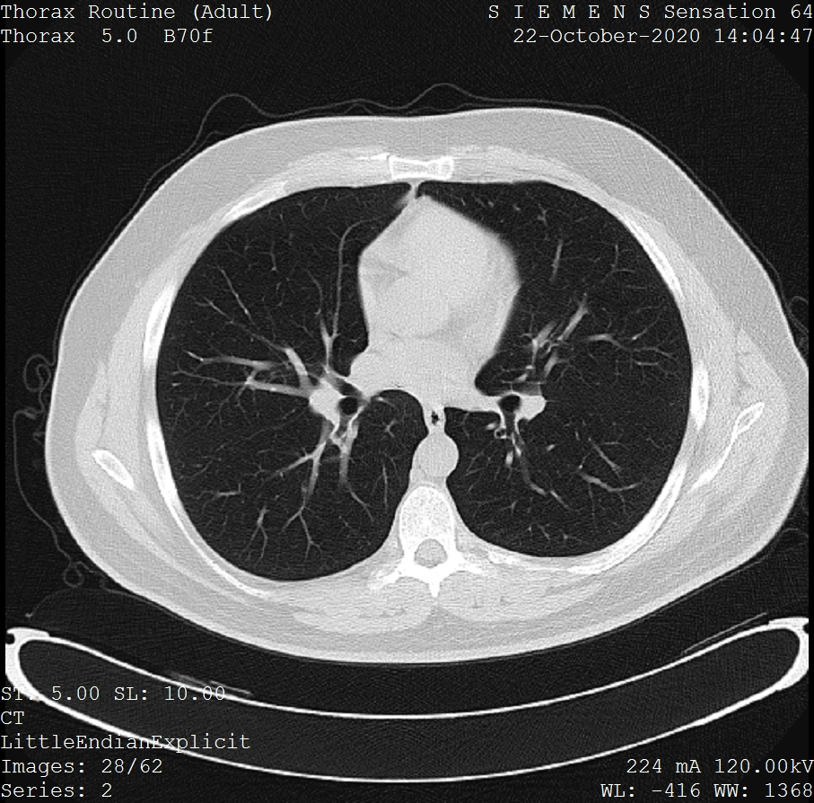

## Notebook experimentation

This notebook implements the medical image analysis using quantum convolutional neural networks (QCNNs).

## Medical image analysis using QCNNs

Medical imaging is the technique and process of imaging the interior of a body for 
clinical analysis and medical intervention, as well as visual representation of the 
function of some organs or tissues (physiology). 
Medical imaging seeks to reveal internal structures hidden by the skin and bones, as well as to diagnose and treat disease

Figure 20: One frame of a CT scan of the chest[12](#wiki-medical-image)

QCNNs use quantum circuits to perform convolution and pooling operations on medical images, 
which are represented as quantum states. These circuits are designed to take 
advantage of the quantum properties of superposition and entanglement, 
which allow for more efficient and powerful processing of large datasets. 
QCNNs can also be used to perform other tasks, such as image segmentation and feature extraction.

## Notebook overview

1. Sign in to the [AWS CloudFormation console](https://console.aws.amazon.com/cloudformation/home?). 
2. On the **Stacks** page, select the solution’s root stack. 
3. Choose the **Outputs** tab and open the link for your notebook.

    

    Figure 21: Notebook URL on the stack's Output tab

4. Open
**healthcare-and-life-science/e-1-medical-image-quantum-convelutional-neural-networks/medical-image-qcnn.ipynb** 
and choose the kernel **qc_hcls_medical_image_qcnn**.

# References

- 12.[Wiki: Medical Image](https://en.wikipedia.org/wiki/RNA)