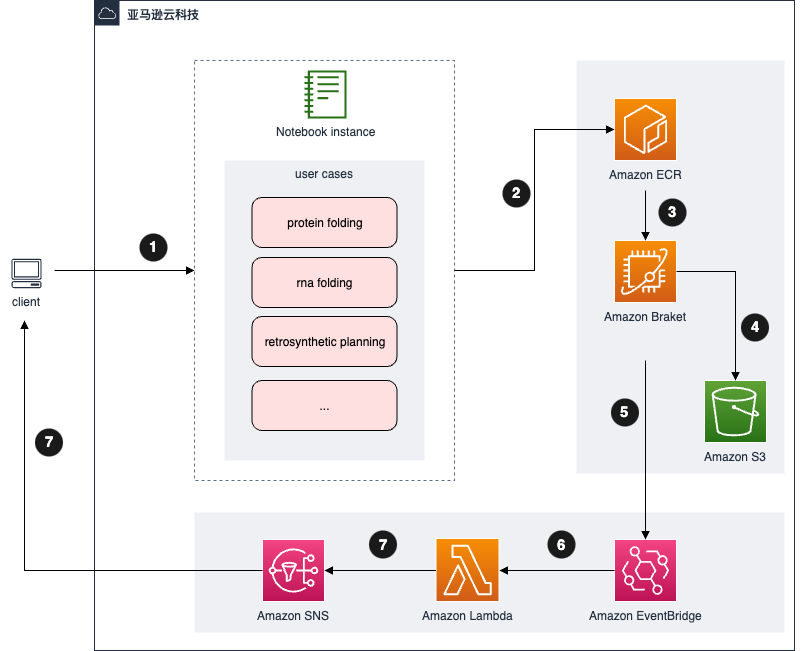

使用默认参数部署解决方案后，在 AWS 中构建的环境如下图所示。

图 1：量子计算探索之药物发现方案架构图

1. 本方案部署一个笔记本实例，从而允许[Amazon SageMaker Notebook](https://docs.aws.amazon.com/sagemaker/latest/dg/nbi.html)用户进行**笔记本实验**。笔记本附带针对不同药物发现问题的用例，如分子展开、RNA 折叠、蛋白质折叠等。

2. 在第一次使用时，系统会将实验所需要的依赖包打镜像并上传至[Amazon ECR][ecr]中。

3. 本方案利用[Amazon Braket][braket] Hybrid Job 进行实验。

4. 实验结果将存在 Amazon S3 中。

5. 一次实验运行多个 Hybrid Job，在 Hybrid Job 完成触发[Amazon EventBridge][eventbridge]中的事件。

6. Amazon EventBridge 触发的事件将被发送到 Lambda 进行分析和汇总。

7. Lambda 向[Amazon SNS][sns] 发送分析报告，所有订阅该主题的订阅者都会通过电子邮件收到此报告。 此步骤是可选的，您可以在部署解决方案时指定用于订阅通知的电子邮件。

8. 您可以回到 SageMaker Notebook 中运行代码，来对实验结果进行分析及展示。默认的结果分析代码中，提供了经典计算和量子计算的结果对比。

[sagemaker]: https://aws.amazon.com/sagemaker/
[braket]: https://aws.amazon.com/braket/
[ecr]: https://aws.amazon.com/ecr/
[s3]: https://aws.amazon.com/s3/
[eventbridge]: https://aws.amazon.com/eventbridge/
[sns]: https://aws.amazon.com/sns/
