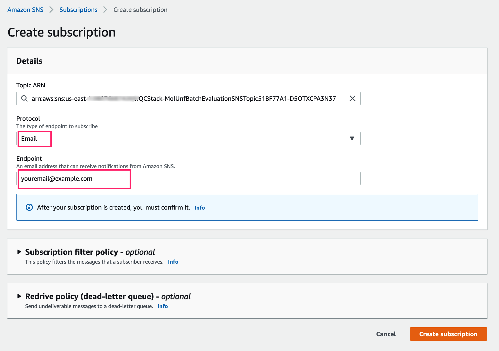
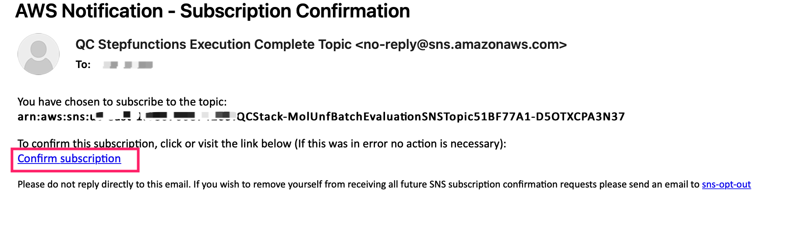

在部署解决方案之前，建议您先查看本指南中有关架构图和区域支持等信息。然后按照下面的说明配置解决方案并将其部署到您的帐户中。

!!! 注意

    在部署此解决方案之前创建账单告警是一种很好的做法。参考这个[链接](https://docs.aws.amazon.com/zh_cn/AmazonCloudWatch/latest/monitoring/monitor_estimated_charges_with_cloudwatch.html)


**部署时间**：约 10 分钟。

## 先决条件
### 注册您的QuickSight账户

!!! notice
    注册QuickSight账户，您需要有对应的正确IAM权限，参见[Signing up for an Amazon QuickSight subscription](https://docs.aws.amazon.com/quicksight/latest/user/signing-up.html)

* 登录到AWS控制台，并找到[QuickSight](https://quicksight.aws.amazon.com/)。

* 如果您还没有QuickSight账户，您需要先注册一个。

* 选择**企业版**，点击**继续**。

* 在**创建您的 QuickSight 账户**页面填写必要的信息:

<center>

|      字段名      |   值 |  说明 |
|:--------------------:|:-------------------:| :-------------------:|
| 身份验证方法 | 选择**使用 IAM 联合身份和 QuickSight 托管的用户** | 默认值 |
| QuickSight区域 | 选择 **US East(N.Virginia)**  | 默认值 |
| QuickSight账户名称 | 字符串 | 唯一的QuickSight账户名称|
| 通知电子邮件地址 | 您的电子邮件地址 | |
| IAM Role| 选择 **使用 QuickSight 托管角色(默认值)**| 默认值 |
| Allow access and autodiscovery for these resources| 选择  **IAM**，**Amazon Athena**| 默认值 |

</center>

### 更新QuickSight权限

* 导航到[IAM Roles](https://console.aws.amazon.com/iamv2/home?#/roles)。

* 搜索角色名字的前缀: `aws-quicksight-service-role`，能找到一个角色名，例如：`aws-quicksight-service-role-v0`。

* 点击角色名字。

* 点击**Add permissions**，在下拉列表中， 点击**Create inline policy**。

* 点击**JSON**标签，贴入下面内容：

```json
{
    "Version": "2012-10-17",
    "Statement": [
         {
            "Effect": "Allow",
            "Action": "s3:ListAllMyBuckets",
            "Resource": "arn:aws:s3:::*"
        },

        {
            "Action": [
                "s3:ListBucket"
            ],
            "Effect": "Allow",
            "Resource": [
                "arn:aws:s3:::amazon-braket-qcstack-*"
            ]
        },

         {
            "Action": [
                "s3:GetObject",
                "s3:GetObjectVersion"
            ],
            "Effect": "Allow",
            "Resource": [
                "arn:aws:s3:::amazon-braket-qcstack-*/*"
            ]
        }
    ]
}

```

* 点击**Review policy**。

* 填入**Name**: `QC-QuickSight-S3-Policy`。

* 点击 **Create policy**。

* 导航到[QuickSight Security & permissions](https://us-east-1.quicksight.aws.amazon.com/sn/admin#aws)。

* 点击按钮**Manage**。

* 在IAM Role中，选择**Use an existing role**。

* 在下拉列表中，选择上面更新的角色，例如：`aws-quicksight-service-role-v0`。

* 点击 **Save**。

### 获取QuickSight用户名

* (可选)进入[QuickSight](https://quicksight.aws.amazon.com/)，在下面的页面中填写您的电子邮件地址。

!!! notice
    本步骤是可选的，只有您的登录IAM用户不是注册QuickSight账户的用户时，才需要做。

<center>


Figure 3: QuickSight电子邮件

</center>

* 进入[QuickSight Admin](https://us-east-1.quicksight.aws.amazon.com/sn/admin)，并记录对应您的电子邮件的**QuickSight Username**(不是QuickSight account name)。

<center>


图 2: QuickSight用户名

</center>


## 部署概述
在亚马逊云科技上部署本解决方案主要包括以下过程：

- 在您的亚马逊云科技账户中启动Amazon CloudFormation模板

## 部署步骤

### 在您的亚马逊云科技账户中启动Amazon CloudFormation模板

我们将AWS CloudFormation的模板部署在了AWS Cloud上。

* 点此通过AWS CloudFormation模板来[部署解决方案][template-url]。
 
* 模板默认使用US West(Oregon) 启动. 如果想要更换启动模板的 AWS Region，请在控制台的导航栏中使用 Region selector进行更改。

* 在**Parameters**下方，检查模板的参数并将其设置为相应值， 选择 **Next**。

<center>

| 参数   | 描述 |
|:-------------------:|:----:|
| QuickSightUser | **QuickSight Username** |

</center>
    

* 在**Configure stack options**页面中，选择**Next**。
   
* 在**Review**页面中，检查并确认设置。检查box acknowledging确保模板将会创建AWS Identity和Access Management (IAM)资源。

* 选择**Create stack**来部署stack。

您可以在AWS CloudFormation控制台中**Status**栏中查看stack的状态。您在大约十分钟内应该看到CREATE_COMPLETE的状态。


## 部署后处理
### 订阅SNS通知(可选)

!!! notice
    本步骤是可选的。

当批量评估执行完成后，如果您想获得Email通知，可以按照下面的步骤订阅SNS通知，您也可以通过[短信](https://docs.aws.amazon.com/sns/latest/dg/sns-mobile-phone-number-as-subscriber.html)订阅通知。

* 在CloudFormation部署的输出中获取SNS主题的名字。

<center>


Figure 7: SNS主题名字

</center>


* 转到[SNS 主题](https://console.aws.amazon.com/sns/v3/home?region=us-east-1#/topics)。

* 点击在CloudFormation部署的输出中的SNS主题。

* 点击 **Create subscription** 按钮。

* 通过邮件订阅SNS主题，填写**Protocol**和**Endpoint**，点击**Create subscription**。

    - Protocol: **Email**
    - Endpoint: `<your-email-address>`

<center>


Figure 8: 邮件订阅SNS主题

</center>

* 确认订阅，检查您的邮件收件箱，您将收到如下的一封邮件，点击邮件中*Confirm Subscription*链接，确认订阅。

<center>


Figure 9: 确认订阅

</center>


[template-url]: https://console.aws.amazon.com/cloudformation/home?region=us-west-2#/stacks/create/template?stackName=QRADDStack&templateURL=https://aws-gcr-solutions.s3.amazonaws.com/AWS-gcr-qc-life-science/v0.8.6/default/QCStack.template.json