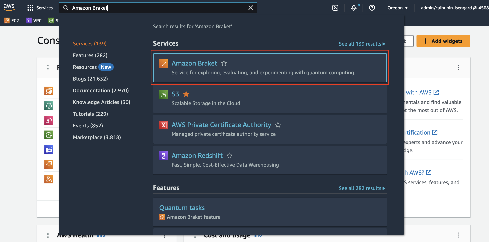
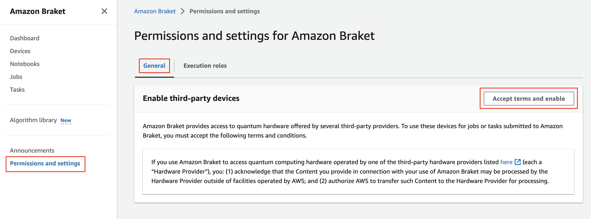
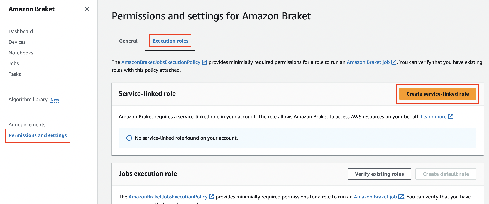
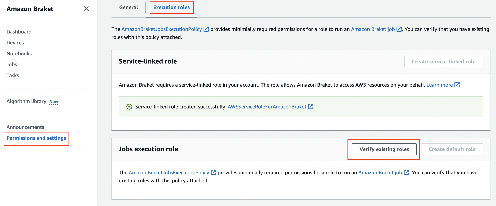
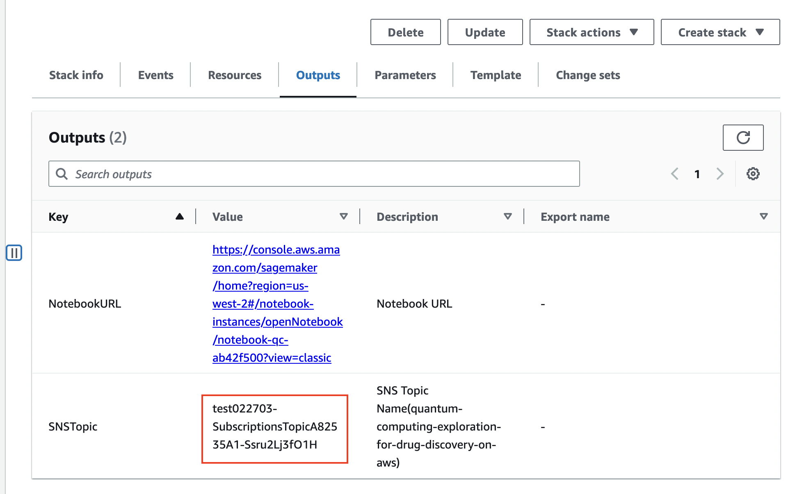

在部署解决方案之前，建议您先查看本指南中有关架构图和区域支持等信息。然后按照下面的说明配置解决方案并将其部署到您的帐户中。

**部署时间**：约 15 分钟

!!! Note "说明"

    建议您在部署此解决方案之前[创建账单告警](https://docs.aws.amazon.com/zh_cn/AmazonCloudWatch/latest/monitoring/monitor_estimated_charges_with_cloudwatch.html)以监控AWS估算费用。

部署本方案需要具有最小的[IAM 权限](https://awslabs.github.io/quantum-computing-exploration-for-drug-discovery-on-aws/en/workshop/permissions.json)。如果您使用定义在此文件中的权限部署本方案，您的 CloudFormation 堆栈的名字将以 `QCEDD`开头， 例如：`QCEDDStack`。

## 准备工作

以下功能如果已经开通，请忽略「准备工作」。

## 准备工作：启动 Amazon Braket 服务，并生成执行角色

1. 登录到[AWS 管理控制台](https://console.aws.amazon.com/)，进入 Amazon Braket 控制台。
   

2. 点击左侧菜单**权限和设置**, 选中标签页**常规**, 点击按钮**接受并启用**
   

3. 切换到标签页**执行角色**,点击**创建服务链接角色**按钮，创建角色
   

4. 点击**验证现有角色**按钮，创建任务执行角色
   

## 步骤 1：启动 CloudFormation 堆栈

1.  登录 AWS 管理控制台，选择按钮[Launch Stack][template-url]以启动模板。您还可以选择直接[下载模板][cf-template-url]进行部署。

2.  默认情况下，该模板将在您登录控制台后默认的区域启动，即美国西部（俄勒冈）区域。若需在指定的区域中启动该解决方案，请在控制台导航栏中的区域下拉列表中选择。

3.  在**创建堆栈**页面上，Amazon S3 URL 文本框中会自动填写这个[模板 URL][cf-template-url]，请确认模板 URL 正确填写，然后选择**下一步**。

4.  在指定堆栈详细信息页面，为您的解决方案堆栈分配一个账户内唯一且符合命名要求的名称。有关命名字符限制的信息，请参阅*AWS Identity and Access Management 用户指南*中的[IAM 和 STS 限制](https://docs.aws.amazon.com/IAM/latest/UserGuide/reference_iam-limits.html)。

5.  在**参数**部分，查看此解决方案模板的参数并根据需要进行修改。
    方案中使用的参数如下：

    | 参数     | 默认值 | 描述           |
    | -------- | ------ | -------------- |
    | snsEmail | 无     | 订阅消息的邮箱 |

6.  选择**下一步**。

7.  在**配置堆栈选项**页面上，保留默认值并选择**下一步**。

8.  在**审核**页面，查看并确认设置。确保选中确认模板将创建 Amazon Identity and Access Management（IAM）资源的复选框。选择**下一步**。

9.  选择**创建堆栈**以部署堆栈。

10. 如果配置了订阅邮件，请关注该邮件收件箱，然后点击 **确认订阅** 链接以确认订阅。

您可以在 AWS CloudFormation 控制台的**状态**列中查看 stack 的状态。正常情况下，大约 15 分钟内可以看到状态为**CREATE_COMPLETE**。

## 步骤 2：（可选）订阅 SNS 通知

当 Job 执行完成后，如果您想获得 Email 通知，可以按照下面的步骤订阅 SNS 通知。您也可以通过短信订阅通知。

1. 登录[AWS CloudFormation 控制台](https://console.aws.amazon.com/cloudformation/)。

2. 在**堆栈**页面，选择本方案的堆栈。

3. 选择**输出**页签，记录 SNS 主题的值。

   

4. 导航至[Amazon SNS 控制台](https://console.aws.amazon.com/sns/v3/home?region=us-east-1#/topics)。

5. 选中**主题**，然后点击在 CloudFormation 部署的输出中的 SNS 主题。

6. 选择**创建订阅**。

7. 在**协议**列表中，选择**电子邮件**。

8. 在**终端节点**文本框中，输入可以从 Amazon SNS 接收通知的电子邮件地址。

9. 选择**创建订阅**。

10. 检查您的邮箱，您将收到一封邮件，点击邮件中*Confirm Subscription*链接，确认订阅。

## 更新 CloudFormation 堆栈

部署完成后，您可以通过更新 CloudFormation 堆栈来修改配置。

!!! Important "重要提示"

如果是 notebook 算法内容发生变更，请删除原来 CloudFormation，并创建新的 CloudFormation，更新 CloudFormation 不能让您的算法变更生效。

1. 登录[AWS CloudFormation](https://console.aws.amazon.com/cloudformation/)管理控制台。

2. 选择本解决方案的根堆栈，而不是嵌套堆栈（NESTED）。

3. 选择**更新**按钮。

4. 选择**使用当前模版**，选择**下一步**。

5. 根据需要更改对应的参数，然后选择**下一步**。

6. 在**配置堆栈选项**页面上，保留默认值并选择**下一步**。

7. 在**审核**页面，查看并确认设置。确保选中确认模板将创建 Amazon Identity and Access Management（IAM）资源的复选框。选择**下一步**。

8. 选择**更新堆栈**以更新堆栈。

[template-url]: https://console.aws.amazon.com/cloudformation/home?region=us-west-2#/stacks/create/template?stackName=QCEDDStack&templateURL={{ cf_template.url }}
[cf-template-url]: {{ cf_template.url }}
