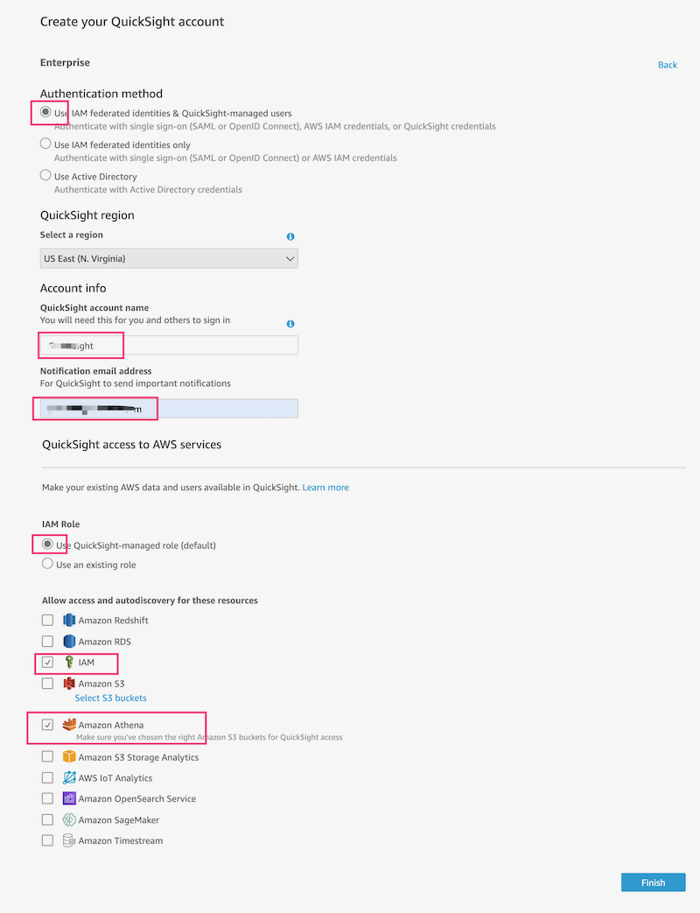
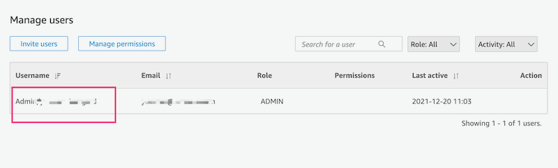
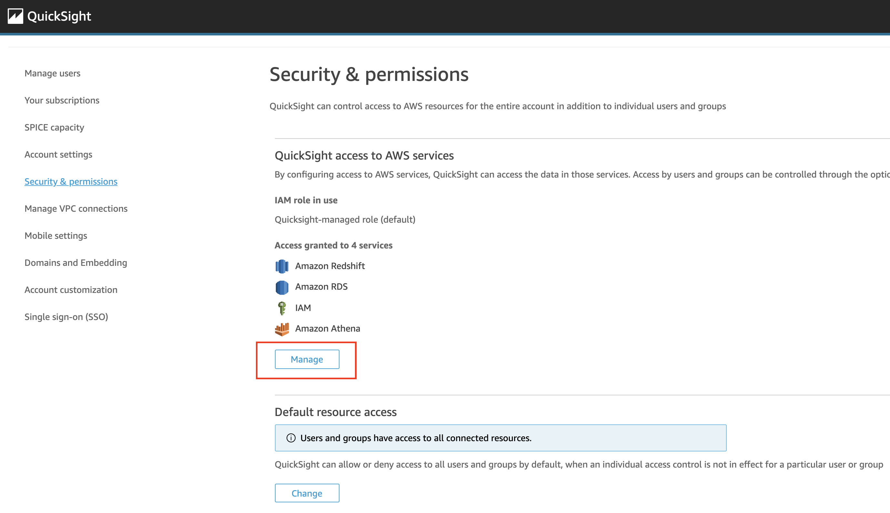
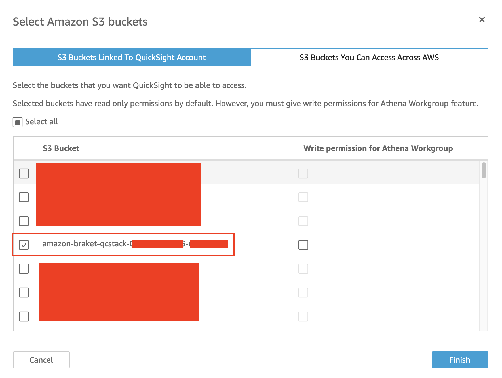

在部署解决方案之前，建议您先查看本指南中有关架构图和区域支持等信息。然后按照下面的说明配置解决方案并将其部署到您的帐户中。

**部署时间**：约 10 分钟。

## 部署概述
在亚马逊云科技上部署本解决方案主要包括以下过程：

- 步骤1：检查您的QuickSight账户
- 步骤2：在您的亚马逊云科技账户中启动Amazon CloudFormation模板。
- 步骤3：更新您的QuickSight权限

## 部署步骤

### 检查您的QuickSight账户

* 登录到AWS控制台，并找到[QuickSight](https://quicksight.aws.amazon.com/)

* 如果您还没有QuickSight账户，您需要先注册一个。

* 选择 **Enterprise**，点击 continue。

* 在 **Create your QuickSight account** 页面填写必要的信息:

* 进入[quicksight admin](https://us-east-1.quicksight.aws.amazon.com/sn/admin), 并记录您的**QuickSight Username**(不是QuickSight account name).

### 部署您的解决方案

我们将AWS CloudFormation的模板部署在了AWS Cloud上。

* 使用[Launch solution in AWS Standard Regions](https://console.aws.amazon.com/cloudformation/home?region=us-west-2#/stacks/new?stackName=qrsdd-stack)来启动AWS CloudFormation模板。
 
* 模板默认使用US West 2 (Oregon) Region 启动. 如果想要更换启动模板的 AWS Region, 请在控制台的导航栏中使用 Region selector进行更改。

* 在 **Create stack** 页面中, 请您检查**Amazon S3 URL** 文本框中[quantum-ready-solution-for-drug-discovery.template](template.md)是否正确，如正确，请选则**Next**按钮。

* 在**Parameters**下方, 检查模板的参数并将其设置为necessary。解决方案采用已下的参数值. 选择 **Next**.

    | Parameter(参数值）   |                                                         Description                                                      |
    |:-------------------:|:----:|
    | MolUnfDashboardquickSightUser | **Quicksight Username** |
    

* 在 **Configure stack options** 页面中, 选择 **Next**.
   
* 在 **Review** 页面中，检查并确认设置。 检查 box acknowledging 确保模板将会创建AWS Identity和Access Management (IAM)资源.

* 选择 **Create stack** 来部署stack.

您可以在AWS CloudFormation控制台中**Status**栏中查看stack的状态。您在大约十分钟内应该看到CREATE_COMPLETE的状态。

### 更新QuickSight的权限

* 定位到Quicksight [admin page](https://us-east-1.quicksight.aws.amazon.com/sn/admin#aws)

* 点击 **Manage**

* 点击**Select S3 Buckets**

* 检查S3桶 `amazon-braket-qcstack-<AWS account>-<region>`

* 点击 **Finish** 并选择 **Save**

