## 运行批量评估

以下介绍通过AWS Step Functions工作流程运行批量评估，并通过Amazon QuickSight控制面板查看结果。

### 术语缩写

- **CC**: Classic computing
- **QC**: Quantum computing

### 从部署输出中获取AWS Step Functions链接

<center>
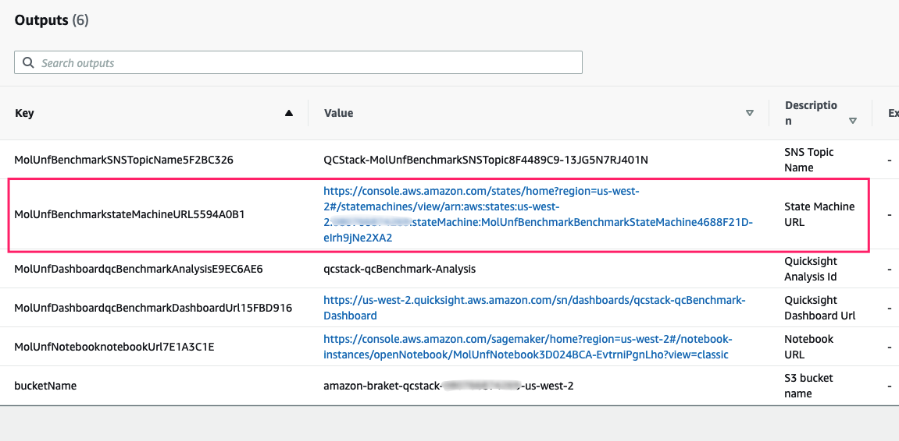

图 1: 部署输出里面的工作流链接

</center>

单击Step Functions链接导航至AWS Step Functions控制台。

## 开始执行

在您的 AWS Step Functions 控制台中，单击 **Start execution** 按钮，屏幕如下所示：

<center>
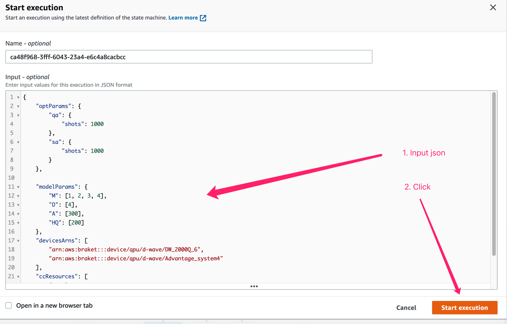

图 2：执行工作流

</center>
    
1. （可选）输入评估

     - 如果您不输入任何内容，它将使用默认输入。
     - 如果要自定义批量评估，
     请参考本节的[输入规范](#input-specification)。

1. 点击**Start Execution**，开始批量评估
    
    画面如下图所示：
    <center>
    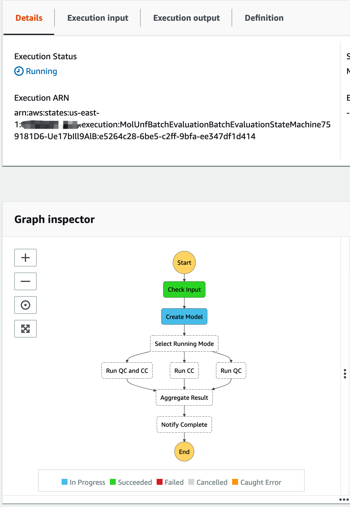

    图 3：执行批量评估
    </center>

1. 等待完成
   > 默认批量评估大约需要 15 分钟。

    评估完成后屏幕显示如下。
    <center>
    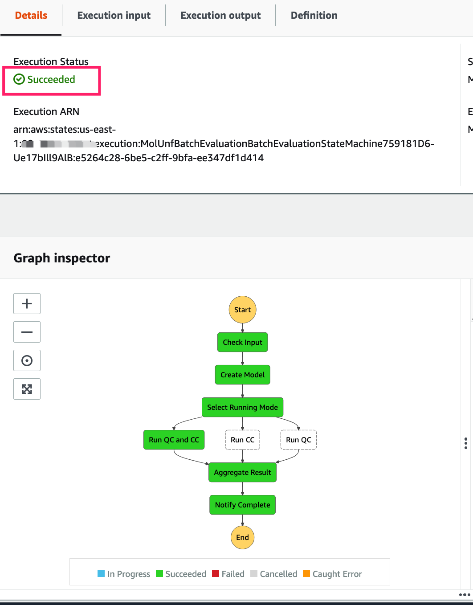

    图 4：完成批量评估
    </center>

### 查看仪表板

批量评估完成后，您可以在 AWS QuickSight 控制面板中查看结果。

* 从 CloudFormation 输出中获取仪表板链接：
<center>
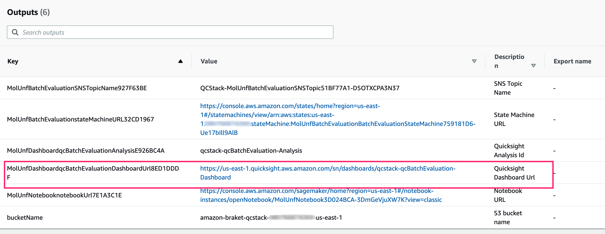
图 5: 仪表盘链接
</center>

* 点击链接，您将被导航到仪表板，如下图所示：

<center>
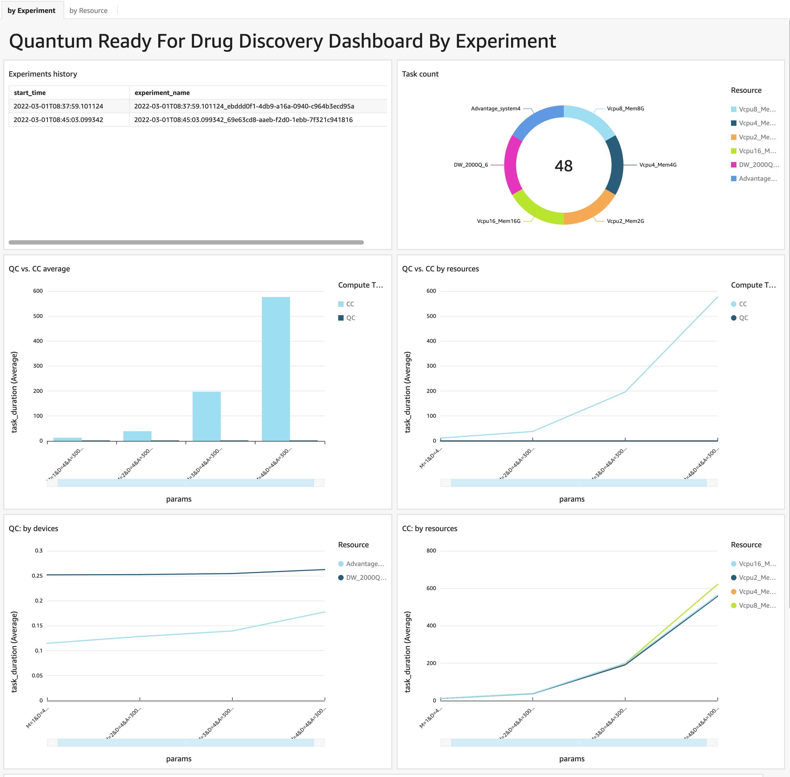

图 6: 仪表盘
</center>

<center>
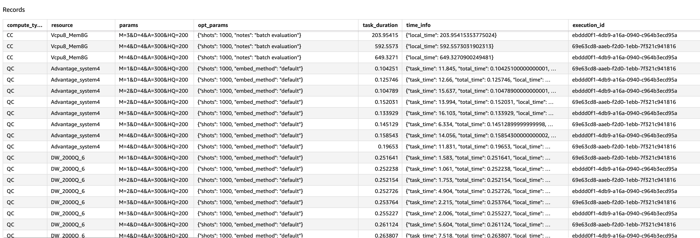

图 7: 仪表盘数据
</center>

Dashboard里面有两张sheet，可以点击切换。

<center>
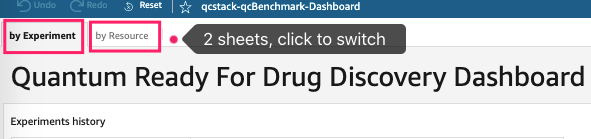

图 8: 仪表盘数据切换
</center>

#### 表 1：查看每个实验的结果

在此表中，您可以按实验查看批量评估结果。

<center>
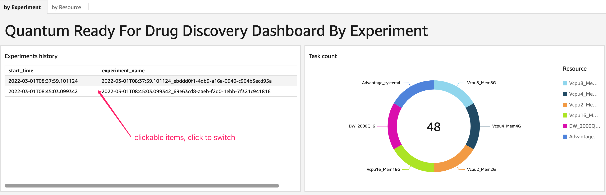

图 9: 查看批量评估结果

</center>

* 实验历史表

在此表格中，您可以查看每个实验的批量评估结果，实验表中的行是可单击的，您可以单击该行仅查看该实验的结果。

* 任务计数图表
    * 如果您在 **Experiments hist** 表中选择一个实验，它会显示实验的总任务数。
    * 如果没有选择实验，它会显示所有实验的总任务数。

* QC 与 CC 图表

    下面两个图表显示了 QC 与 CC 任务的性能

    <center>
    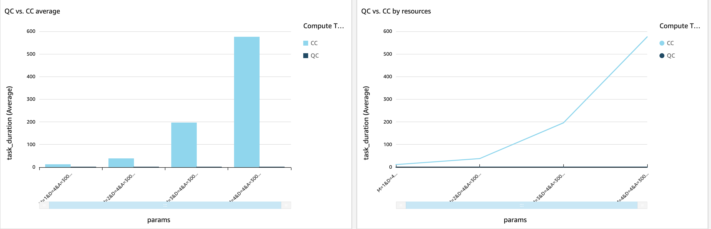
    图 10: CC与QC的运行性能
    </center>
    
    * **QC vs. CC average** - 通过不同模型参数（X 轴）比较 QC 和 CC 任务的平均执行时间（Y 轴）
     * **QC vs. CC by resource** - 通过不同模型参数（X 轴）使用不同资源比较 QC 和 CC 任务的执行时间（Y 轴）（对于 QC 是不同 QPU 设备，对于CC是不同的内存-vCPU）   

* QC：按设备列表

    它通过不同的模型参数（X 轴）比较不同 QPU 设备的执行时间（Y 轴）

    <center>
    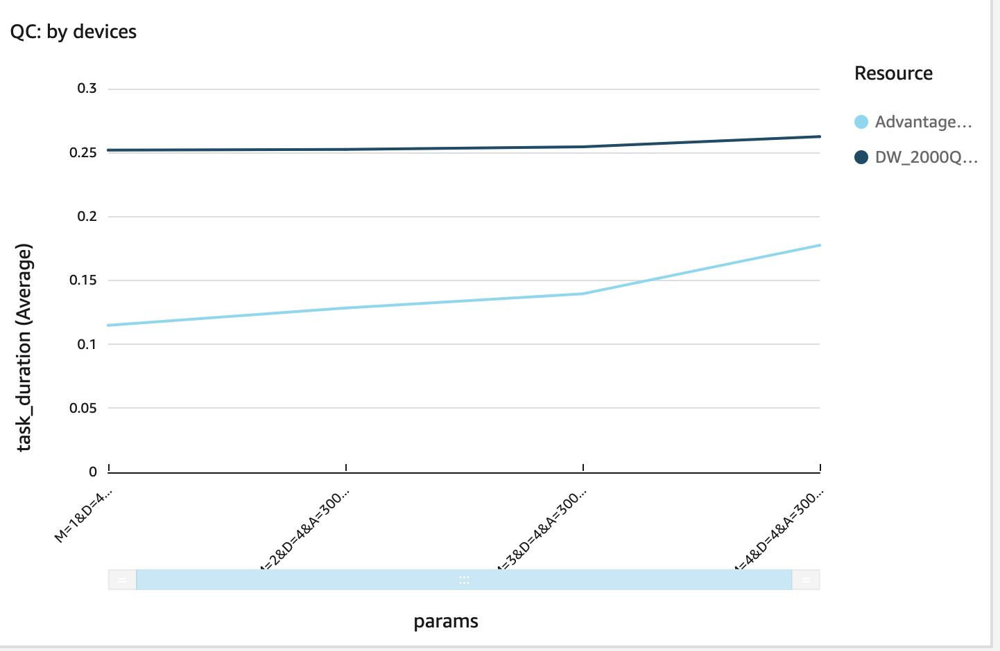

    图 11: 按照QC设备统计的结果
    </center>

* CC：按资源

    它通过不同的模型参数（X 轴）比较不同 CC 资源（内存和 vCPU）的执行时间（Y 轴）

    <center>
    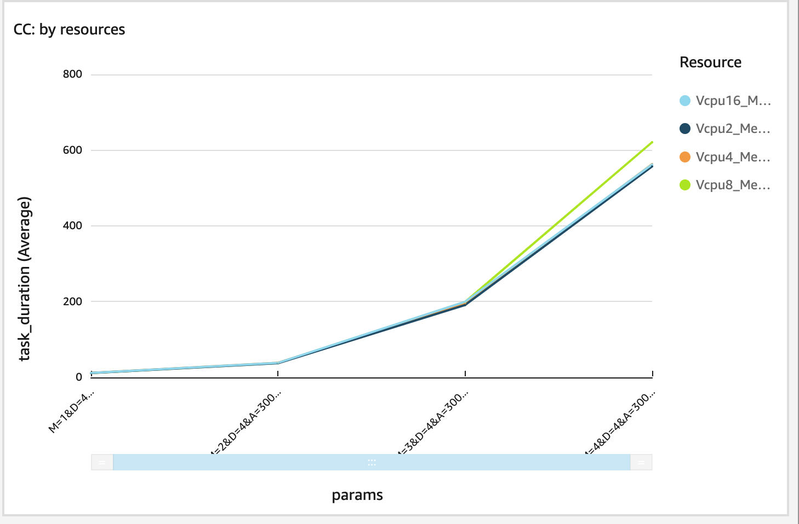

    图 12: 按照CC资源统计的结果
    </center>

* 记录表
   
    它列出了所选实验中每个任务的详细信息（如果没有选择实验，则列出所有）

    <center>
    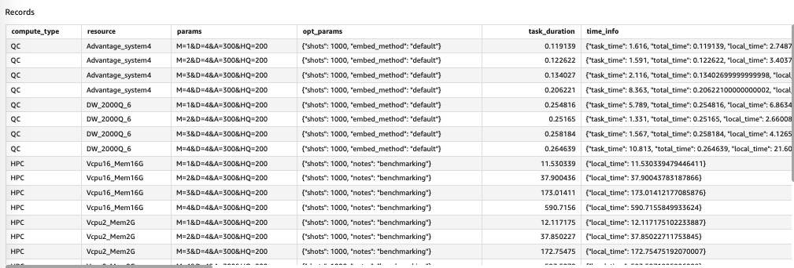

    图 13: 仪表盘记录表
    </center>

    此表中的字段：

    * **compute_type**：计算类型、CC 或 QC
    * **resource**：资源名称，对于不同QPU设备的QC，对于不同内存-vCPU的CC
    * **param**：模型参数。 **M**：扭转次数； **D**：旋转角度精度； **HQ**：hubo-qubo 值，能量惩罚； **A**：惩罚项
    * **opt_params**：优化器参数
    * **task_duration**：任务执行时间，以秒为单位
    * **time_info**：对于QC，不同维度的QC任务时间，`total_time`是**task_duration**，对于CC，`local_time`是**task_duration**
    * **execution_id**：Step Functions 执行 ID
    * **experiment_name**：实验名称，如果输入`experimentName`不为空，则为
    `execution start time + input experimentName`，
    否则为`execution start time +execution_id`
    * **task_id**：对于QC任务，为Braket任务id，对于CC，为空
    * **result_detail**：分子展开前后的体积大小
    * **result_location**：展开后的分子mol2文件

#### 表 2：按每个资源查看结果

在此表中，您可以查看每个资源和 QPU 设备的批量评估结果

<center>
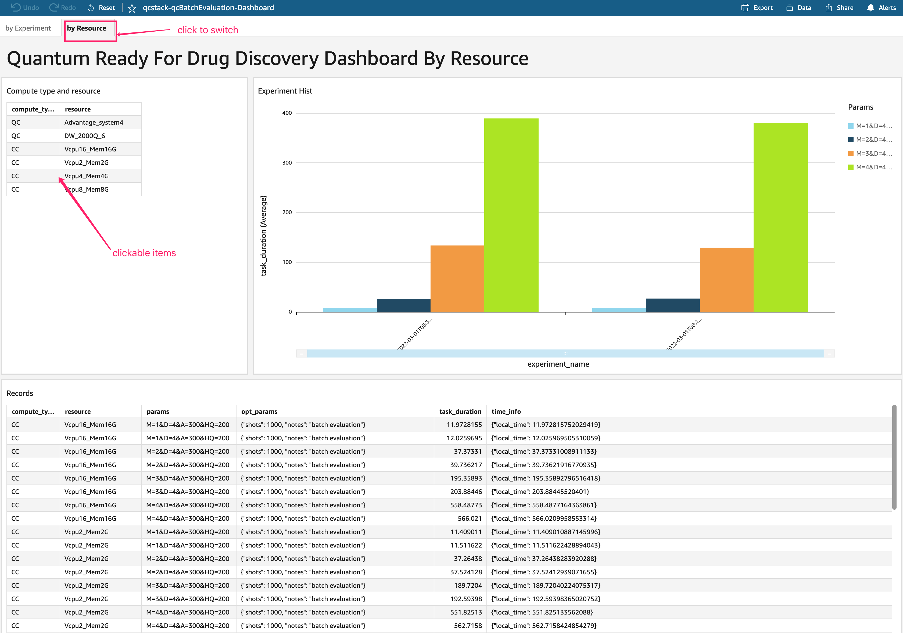

图 14: 按资源查看结果
</center>

* 计算类型和资源表
   
    它列出了批处理评估中的所有资源，对于 QC - 资源是 QPU 设备，对于 CC - 资源是内存和 vCPU。表格中的项目是可点击的，当您单击一个项目（意味着您选择它）时，此工作表中的指标将切换到该项目。如果未选择任何项目，则显示平均指标。


* 实验历史图
    
    它使用不同的模型参数按实验名称（X 轴，按时间排序）显示所选资源的执行时间（Y 轴）。

    <center>
    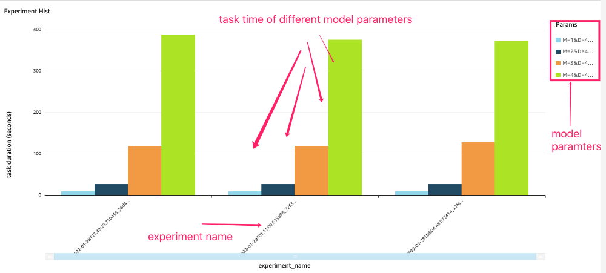

    图15: 按不同模型参数查看结果1
    <center>

* 记录表
   
    此表与**表 1中**的表相同。

### 输入规范

您可以使用 json 输入自定义评估参数。

输入模式：

```json
{
    "version": "string",
    "runMode": "string",
    "mol2文件": "string",
    "modelVersion": "string",
    "experimentName": "string",
    "optParams": {
        "qa": {
            "shots": "int"
        },
        "sa": {
            "shots": "int"
        }
    },
    "modelParams": {
        "M": "int []",
        "D": "int []"
    },
    "devicesArns": "string []",
    "ccResources": "[int, int] []",
}

```

!!! 注意

    所有字段都是可选的

定义：

  * **version**：输入模式的版本，当前仅支持值为：'1'
  * **runMode**：运行模式，值可以是`ALL`、`CC`或`QC`，默认：'ALL'； `CC` - 仅运行 CC 任务，`QC` 仅运行 QC 任务，`ALL` - 运行两个任务
  * **mol2文件**: mol2 文件的 S3 url
  * **modelVersion**：模型版本，默认：'latest'
  * **experimentName**：批次评估的名称
  * **optParams**: 优化器参数, 为QC(qa)和CC(sa)任务设置shots值
  * **modelParams**：模型参数，M：扭转数，D：旋转角度精度。详细
  请参考[建立模型-技术细节](./build-model-detail.md)。有效值：

         M: [1, 2, 3, 4, 5, 6, 7]
         D：[4] 或 [8]

!!! 注意

    M 的最大值取决于 D、QPU 设备和输入 molFile 的值。在输入校验中，M最大值为100。
    在实际执行过程中，如果M值超过设备容量，执行会失败。
        
    如果使用自己的mol2文件，会跳过输入校验，如果值超过设备容量，会执行失败。

* **devicesArns**：QPU 设备 arn。有效值：
  
        arn:aws:braket:::device/qpu/d-wave/DW_2000Q_6
        arn:aws:braket:::device/qpu/d-wave/Advantage_system4
      
  * **ccResources**：GiB 中的内存（第一个元素）和 vCPU（第二个元素），例如4GiB 内存和 2 个 vCPU 是：`[4, 2]`

典型（默认）输入：

```json
{
    "version": "1",
    "runMode": "ALL",
    "optParams": {
        "qa": {
            "shots": 1000
        },
        "sa": {
            "shots": 1000
        }
    },
    "modelParams": {
        "M": [1, 2, 3, 4],
        "D": [4]
    },
    "devicesArns": [
        "arn:aws:braket:::device/qpu/d-wave/DW_2000Q_6",
        "arn:aws:braket:::device/qpu/d-wave/Advantage_system4"
    ],
    "ccResources": [
        [2, 2],
        [4, 4],
        [8, 8],
        [16, 16]
    ]
}
```
