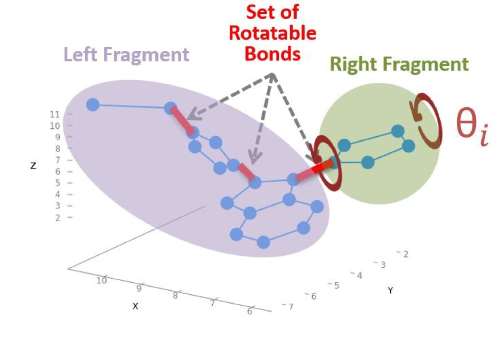
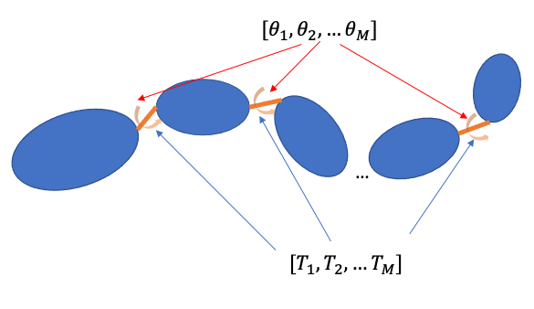
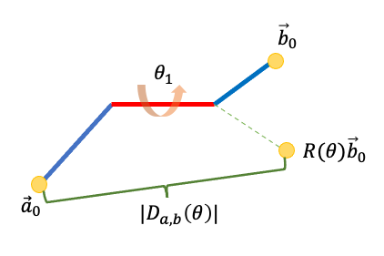
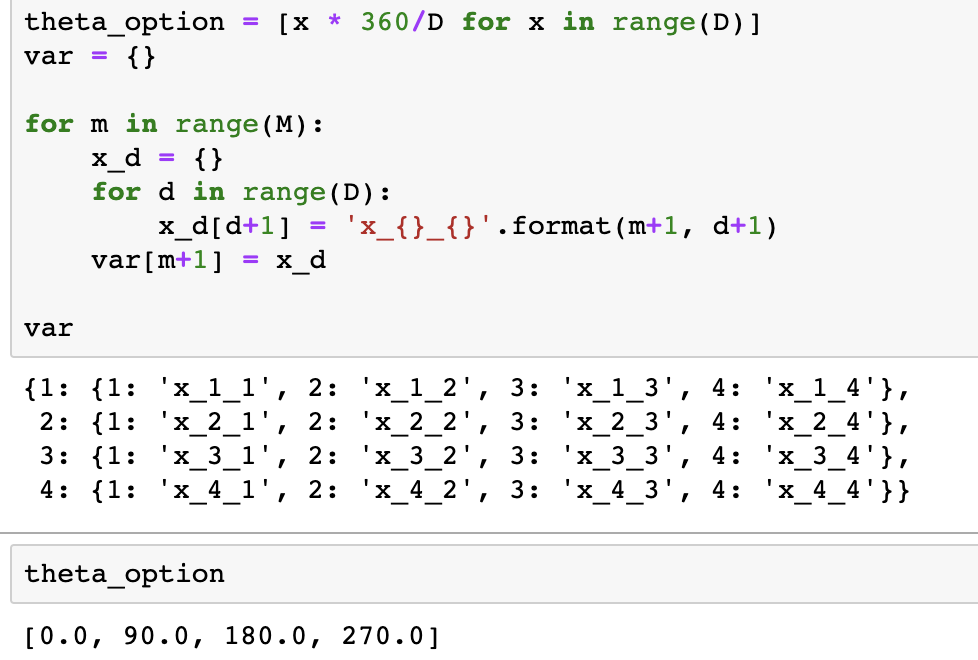
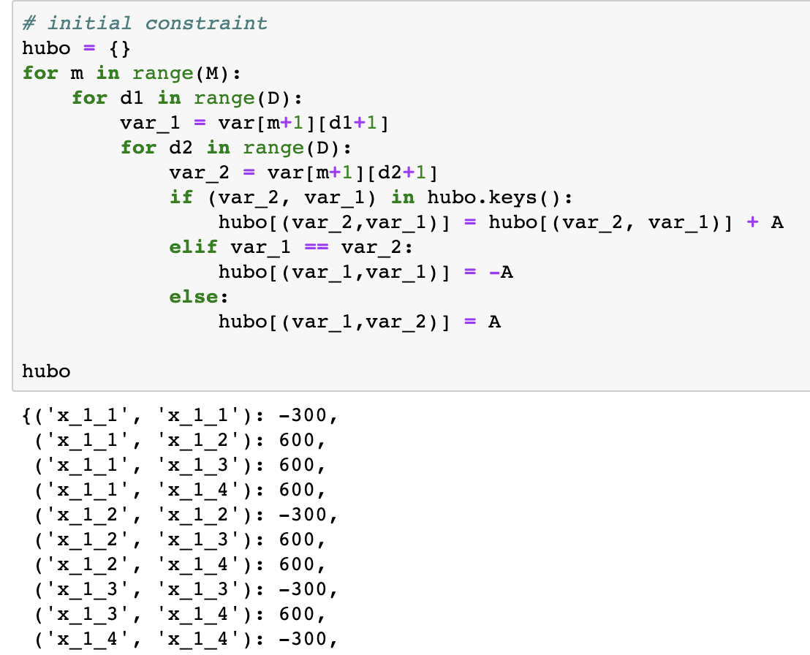
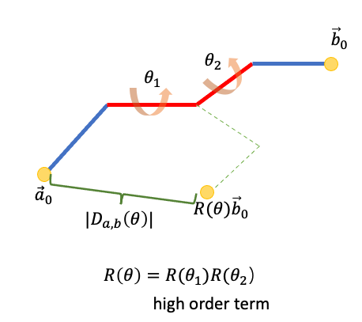

以下内容是搭建模型的技术细节

### 问题定义 

在这个问题中，配体被认为是一组灵活的原子。严格来讲，
它可以看作是一组化学键（边）。这些键具有固定的长度和
只有其中的一个子集是可旋转的。因为有一些可旋转的键（扭转）
，分子被分裂成不同的不连贯片段。以图中最右边的可旋转一个键为例，
它将分子分成左右片段。
这些碎片可以围绕键轴彼此独立旋转。下图展示了这种想法。

<center>

 
 图 1: 可旋转的键[<sup>1</sup>](#qmu-paper)
 
 </center>

正如它所表明的，MU 的目标是找到可以最大化分子体积的配体形状。
配体的形状可以表示为展开的形状（所有可旋转键的扭转构型）。

### 公式

假设配体有 $M$ 扭转，从 $T_i$ 到 $T_M$，
并且每个扭转会有一个转转角度 $\theta$。

<center>



图 2: 多重扭转


</center>


该模型的目标是找到展开的扭转构型
${\Theta}^{unfold}$。这个构型
可以最大化距离 $D(\Theta)$ 的总和:

$$ {\Theta}^{unfold} = [\theta^{unfold}_1,  \theta^{unfold}_2, ../..., \theta^{unfold}_M] $$

$$ D(\Theta) = \sum_{a,b}D_{a,b}(\theta)^2 $$


$D_{a,b}(\theta)^2$ 是 $|| \overrightarrow{a}_0 - R(\theta)\overrightarrow{b}_0||^2$ 。
这是片段a和b之间的距离。 $R(\theta)$ 是与扭转角
$\theta$ 相关的旋转矩阵。

<center>



图 3: 通过一个扭转相连的两个片段

</center>

由于这是组合优化的问题，最终的构型可以是
任何扭转角度的组合。但是，将其应用于实际问题会存在一些限制：

#### 限制-1

受计算资源的限制，扭转不可能有无限小的旋转
精确。这意味着每个扭转的旋转角度候选者是有限的。假设我们有
$M$ 扭转，它们具有相同的旋转角度精度：
$\Delta\theta$ 。这意味着对于每个扭转，我们需要 $d$ 变量来表示不同的旋转状态：

$$ d = \frac{2\pi}{\Delta\theta} $$

对于整个模型，我们需要 $n = d \times M$ 二元变量 $x_{ik}$ 来表示所有组合。
例如，对于扭转 $T_i$，它的扭转角 $\theta_i$ 可以有
$d$ 种可能的值：

$$ \theta_i = [\theta_i^1,\theta_i^2,\theta_i^3, ..., \theta_i^d] $$

#### 限制-2


如果我们只考虑距离，最终的结果或构型
可能有多个结果来自相同的扭转，只要
这种组合意味着更小的距离。例如，可能扭转$T_1$有两个角度被同时选上，
则最后结果变为：

$$ {\Theta}^{unfold} = [\theta^2_1,  \theta^4_1, ../..., \theta^3_M] $$

这在现实世界中不可能发生。 $T_1$ 只能有一个
角度 $d$。所以我们需要将以下约束集成到我们的最终模型中：

$$ \displaystyle\sum\limits_{k=1}^{d} x_{ik} = 1 $$

有了这两个约束，这个问题可以表述为 High-Order Unconstrained Binary Optimization（HUBO）。

$$ O(x_{ik}) = A\displaystyle\sum\limits_i (\displaystyle\sum\limits_{k=1}^d x_{ik}-1)^2 - \displaystyle\sum\limits_{a,b} D_{ab} (\theta)^2 $$

第一部分是每个扭转的约束。如果最后一个扭转有多个角度，我们将添加惩罚项$A$。
然而，在方法pre-calc实现中，我们预先计算了不同构型下的距离对。这
意味着我们可以使用绝对距离来代替：

$$ O(x_{ik}) = A\displaystyle\sum\limits_i (\displaystyle\sum\limits_{k=1}^d x_{ik}-1)^2 - \displaystyle\sum\limits_{a,b} |D_{ab} (\theta)| $$

#### 模型代码
我们在 **source/src/molecualr-unfolding/untiliy/QMUQUBO.py** 里实现了该模型。

我们使用以下逻辑初始化变量

!!! 注意

    以下代码用于描述构建模型的想法。我们可以在源码中找到类似的代码

<center>


图 4: 初始化变量的逻辑
</center>

上面的代码表明我们有来自 $x\_1\_?$ 
到 $x\_4\_?$ 一共4个扭转。每个扭转有四个可选的旋转角度，从 $0^o$ 到
$270^o$。例如$x\_3\_2$表示扭转3旋转
$180^o$。


我们用下面的逻辑引入约束：

<center>


图 5: 约束的逻辑
</center>

正如我们之前分析的那样，模型不知道变量属于哪些
相同的物理扭转。例如，$x\_1\_1$、$x\_1\_2$、$x\_1\_3$
和 $x\_1\_4$ 属于同一个扭转。理论上，模型只能选择其中一个变量。
如果模型选择其中的多个，我们
必须惩罚它。如图所示，当模型选择
$x\_1\_?$ 的多个变量时，我们给它惩罚
项目$600$ （这里是以 $A=300$ 为例）。

最重要的是，我们使用下面的方法来递归计算出不同构型的距离:

```
def update_hubo(torsion_group, up_list, ris):
    if len(torsion_group) == 1:
        for d in range(D):
            final_list = up_list + \
                [var[rb_var_map[torsion_group[0]]][str(d+1)]]
            # distance
            final_list_name = []
            if len(final_list) == 1:
                final_list_name = final_list + final_list
            else:
                final_list_name = final_list

            # update temp points and distance
            self._init_mol_file()

            rb_set = self.mol_data.bond_graph.sort_ris_data[str(
                M)][ris]

            distance = update_pts_distance(
                self.atom_pos_data, rb_set, final_list, var_rb_map, theta_option, True, True)

            hubo_distances[tuple(final_list_name)] = -distance
            logging.debug(
                f"final list {final_list} with distance {distance}")
    else:
        for d in range(D):
            final_list = up_list + \
                [var[rb_var_map[torsion_group[0]]][str(d+1)]]
            update_hubo(torsion_group[1:], final_list, ris)

for ris in mol_data.bond_graph.sort_ris_data[str(M)].keys():
    start = time.time()
    logging.debug(f"ris group {ris} ")
    end = time.time()
    torsion_group = ris.split(",")
    if len(torsion_group) == 1:
        # update constraint
        update_constraint(ris, hubo_constraints)
    logging.debug(torsion_group)
    # update hubo terms
    update_hubo(torsion_group, [], ris)
    logging.debug(
        f"elapsed time for torsion group {ris} : {(end-start)/60} min")
```

### 量子退火

<<<<<<< HEAD
量子退火（QA）可以看作是模拟退火（SA）的一种变体。 QA 和 SA 都是通过启发式技术来解决
具有挑战性的组合问题。 QA 使用量子涨落（quantum fluctuation）而不是热效应来探索组合空间。在这里，我们使用
=======
The quantum annealing (QA) can be seen as a variation of the simulated annealing (SA). Both QA and SA are meta-heuristic technique for address 
challenging combinatorial problems. QA uses the quantum fluctuation to explore the configuration space instead of thermal effects. Here, we use 
Amazon Braket API to access the Canadian company D-Wave. This annealer is implemented using superconductive qubits. Natively, the quadratic 
unconstrained binary optimization (QUBO) can be solved using quantum annealer:

量子退火（QA）可以看作是模拟退火（SA）的一种变体。 QA 和 SA 都是通过启发式技术来解决
具有挑战性的组合问题。 QA 使用量子涨落（quantum fluctuation）而不是热效应来探索配置空间。在这里，我们使用
>>>>>>> 09c9510 (finish zh draft)
用于访问加拿大公司 D-Wave 的 Amazon Braket API。该退火器是使用超导量子比特实现的。原生地，QUBO可以使用量子退火器解决：

$$ O(x) = \displaystyle\sum\limits_i h_i x_i + \displaystyle\sum_{i>j} J_{i,j} x_i x_j $$

在 QUBO 形式中，$x_i \in \{0, 1\}$ 是二进制变量。我们可以将其视为我们为特定扭转选择的角度。 $h_i$ 和 $J_{i,j}$
 当我们使用相应的角度时，可以认为是编码优化任务的值。但是，在我们的任务中，通常有
 片段之间不止一个扭转，我们将其建模为HUBO问题：

$$ O(x) = \displaystyle\sum\limits_i \alpha_i x_i + \displaystyle\sum_{i,j} \beta_{i,j} x_i x_j + \displaystyle\sum_{i,j,k} \gamma_{i,j,k} x_i x_j x_k + ../... $$


<center>


图 6: 拥有多个扭转
</center>

通过使用一些技巧，通常可以将 HUBO 转换为 QUBO，
比如添加新的辅助二元变量来替换高阶项。
在实践中，我们使用 D-Wave 软件包中的 API $make \_ quadratic()$ 来进行这种转换。

<center>


图 7: 将HUBO转为QUBO
</center>

如图所示，HUBO 的一些高阶项，如 $('x\_1\_1','x\_2\_1','x\_3\_1')$
在 QUBO 中转换为二次项。我们只展示了其中的一些转化。


恭喜！我们已经准备好模型，是时候寻找优化构型了。

<<<<<<< HEAD
# 参考
=======
# 引用
>>>>>>> 09c9510 (finish zh draft)
<div id='qmu-paper'></div>
- 1.Mato, Kevin, et al. "Quantum Molecular Unfolding." arXiv preprint arXiv:2107.13607 (2021).