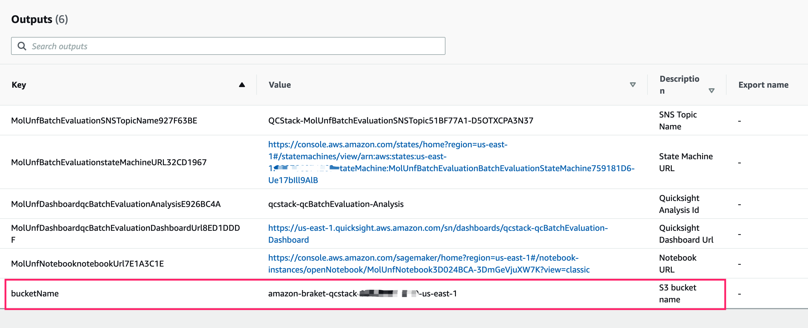

## 批量评估您自己的模型

您有两个选项来批量评估您自己的模型

- 批量评估您自己的 mol2 文件，无需更改代码
- 完全自定义评估代码

## 批量评估您自己的 mol2 文件，无需更改代码

如果您有自己的 mol2 文件，想要批量评估它，您可以按照以下步骤操作：

1. 将您的 mol2 文件上传到 CloudFormation 输出中的 S3 存储桶，或您自己的 S3 存储桶。如果您想使用自己的 S3 存储桶，存储桶名称必须遵循以下模式：`braket-*` 或 `amazon-braket-*`。

    

      

    图 1: S3 路径
    

1. 在 Step Functions 输入中将 mol2 文件的 S3 uri 指定为 `molFile` 的值

     
        {
            "molFile" : "<您的 mol2 文件的 s3 uri>"
        }
   

       例如
    
        {
           “molFile”：“s3://amazon-braket-gcr-qc-sol-common/qc/raw_model/117_ideal.mol2”
        }

    
    完整的输入参数和架构，请参考[输入规范](../batch-evaluation/#输入规范)

1. 按照 [批量评估](../batch-evaluation/#start-execution) 中的步骤运行 Step Functions

## 完全自定义评估代码

该解决方案是 Apache License Version 2.0 下的开源项目。您可以利用它作为您的基本代码，对其进行更改。

如果您想完全自定义评估代码，请按照以下步骤进行更改并从 CDK 重新部署整个堆栈。

### 先决条件

1. 确保您的工作区中安装了 AWS CLI 和 AWS CDK
    
    > 您可以按照此文档 [AWS CLI](https://docs.aws.amazon.com/cli/latest/userguide/getting-started-install.html) 安装 AWS CLI。
   
    > 您可以按照本文档 [CDK 入门](https://docs.aws.amazon.com/cdk/v2/guide/getting_started.html#getting_started_prerequisites) 安装和引导 CDK

1. 权限
   
    您的 AWS 用户必须至少拥有 [permissions](./permissions.json)

1. QuickSight 账号
    
    检查您的 QuickSight 帐户 [检查您的 quicksight](../../../deployment/#check-your-quicksight)

1. 确保您的工作区中运行了 docker

    > 可以按照本文档【Docker Install】（https://docs.docker.com/engine/install/）安装docker。

### 自定义评估代码

1. 将本方案的github仓库fork到自己的git仓库

1. 将项目克隆到自己的工作区

1. 修改源代码

1. 更新文件 `source/cdk.context.json` 中的 `quicksight_user` 和 `default_code_repository`

## 批量评估您自己的模型

您有两个选项来批量评估您自己的模型

- 批量评估您自己的 mol2 文件，无需更改代码
- 完全自定义评估代码

## 批量评估您自己的 mol2 文件，无需更改代码

如果您有自己的 mol2 文件，想要批量评估它，您可以按照以下步骤操作：

1. 将您的 mol2 文件上传到 CloudFormation 输出中的 S3 存储桶，或您自己的 S3 存储桶。如果您想使用自己的 S3 存储桶，存储桶名称必须遵循以下模式：`braket-*` 或 `amazon-braket-*`。

    

      

    图 1: S3 路径
    

1. 在 Step Functions 输入中将 mol2 文件的 S3 uri 指定为 `molFile` 的值

     
        {
            "molFile" : "<你的 mol2 文件的 s3 uri>"
        }
   

       例如
    
        {
           “molFile”：“s3://amazon-braket-gcr-qc-sol-common/qc/raw_model/117_ideal.mol2”
        }

    
    完整的输入参数和架构，请参考[输入规范](../batch-evaluation/#输入规范)

1. 按照 [批量评估](../batch-evaluation/#start-execution) 中的步骤运行 Step Functions

## 完全自定义评估代码

该解决方案是 Apache License Version 2.0 下的开源项目。您可以利用它作为您的基本代码，对其进行更改。

如果您想完全自定义评估代码，请按照以下步骤进行更改并从 CDK 重新部署整个堆栈。

### 先决条件

1. 确保您的工作区中安装了 AWS CLI 和 AWS CDK
    
    > 您可以按照此文档 [AWS CLI](https://docs.aws.amazon.com/cli/latest/userguide/getting-started-install.html) 安装 AWS CLI。
   
    > 您可以按照本文档 [CDK 入门](https://docs.aws.amazon.com/cdk/v2/guide/getting_started.html#getting_started_prerequisites) 安装和引导 CDK

1. 权限
   
    您的 AWS 用户必须至少拥有 [permissions](./permissions.json)

1. QuickSight 账号
    
    检查您的 QuickSight 帐户 [检查您的 quicksight](../../../deployment/#check-your-quicksight)

1. 确保您的工作区中运行了 docker

    > 可以按照本文档【Docker Install】（https://docs.docker.com/engine/install/）安装docker。

### 自定义评估代码

1. 将本方案的github仓库fork到自己的git仓库

1. 将项目克隆到自己的工作区

1. 修改源代码

1. 更新文件 `source/cdk.context.json` 中的 `quicksight_user` 和 `default_code_repository`

        {
            "quicksight_user": "<your QuickSight user>",
            "default_code_repository": "<your github repository>"
        }

### 将堆栈从 CDK 部署到您的 AWS 账户

1. 检查您的 AWS 账户中的 CloudFormation，确保您的部署区域中没有名为“QCStack”的堆栈

1. 检查您的 S3 存储桶，确保没有名为 `amazon-braket-qcstack-<your aws account>-<deployment region>` 的存储桶

1. 利用 CDK 将更改部署到您的 AWS 账户

1. 等待部署完成
    
    > 部署大约需要 10 分钟

1. 从CloudFormation输出中获取输出链接，链接包括：
    - Step Functions URL
    - QuickSight 仪表板链接
    - 笔记本网址
    - S3 存储桶名称

1. 按照 [批量评估](../batch-evaluation/) 中的步骤运行您自己的代码

1. 通过 QuickSight 仪表板 [查看结果](../batch-evaluation/#view-dashboard)
