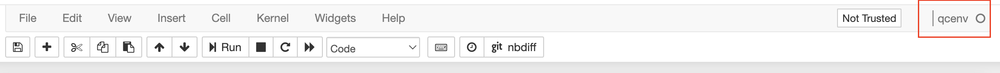

<<<<<<< HEAD
<<<<<<< HEAD
我们尝试在Amazon Braket上面实现出版物[Quantum Molecular Unfolding](https://arxiv.org/abs/2107.13607)和
视频[Molecular Unfolding with Quantum Annealing](https://www.youtube.com/watch?v=1NmAXIHAF2Y)的工作。

分子对接（MD）是药物发现过程中的一个重要步骤，旨在计算
当它们彼此结合时，一个分子对第二个分子的最优位置和形状。
此步骤侧重于通过计算的方式模拟分子的识别过程。
它旨在找到蛋白质和配体的优化构象以及蛋白质和配体之间的相对方向，
从而最小化整个系统的自由能。
=======
分子对接（MD）是药物发现过程中的一个重要步骤，旨在计算
当它们彼此结合时，一个分子对第二个分子的优选位置和形状。
此步骤侧重于计算模拟分子识别过程。
它旨在实现蛋白质和配体的优化构象以及蛋白质和配体之间的相对方向，
从而使整个系统的自由能最小化。
>>>>>>> 1b37d28 (update images for workshop)
=======
我们尝试在Amazon Braket上面实现出版物[Quantum Molecular Unfolding](https://arxiv.org/abs/2107.13607)和
视频[Molecular Unfolding with Quantum Annealing](https://www.youtube.com/watch?v=1NmAXIHAF2Y)的工作。

分子对接（MD）是药物发现过程中的一个重要步骤，旨在计算
当它们彼此结合时，一个分子对第二个分子的最优位置和形状。
此步骤侧重于通过计算的方式模拟分子的识别过程。
它旨在找到蛋白质和配体的优化构象以及蛋白质和配体之间的相对方向，
从而最小化整个系统的自由能。
>>>>>>> 09c9510 (finish zh draft)

图 1: 分子对接[1](#wiki-docking)
 

<<<<<<< HEAD
<<<<<<< HEAD
在这类工作中，蛋白质或者对接口袋被认为是缸体结构。配体责备认为是可以灵活变化的原子集合。
MD通常包含三个步骤:

* 配体展开
    * 可旋转键的识别
    * 内部距离最大化
    * 消除工具相关的偏差 (e.g. smile-to-3D)
* 初始放置
    * 配体主要片段分解
    * 配体初始姿态识别
    * 将配体放入带有刚性旋转平移的对接口袋中
* 形状细化
    * 使用可旋转键来修饰配体形状并匹配蛋白质对接口袋
    * 对接分数最大化

在这项工作中，主要关注利用量子退火器件来实现第一阶段，
配体扩展或分子展开 (MU)。
这个阶段对于改进对接很重要。事实上，一个具有初始
先验设置的配体位姿可能会引入影响最终对接质量的形状偏差。 
MU是用于消除这种初始偏差的技术。

# 笔记本概述

转到 cloudformation 中的部署输出页面
并打开笔记本的链接
=======
In this work, The protein or the pocket is considered as a rigid structure. The ligand is considered as a 
flexible set of atoms. There are usually three main phases in MD:
=======
在这类工作中，蛋白质或者对接口袋被认为是缸体结构。配体责备认为是可以灵活变化的原子集合。
MD通常包含三个步骤:
>>>>>>> 09c9510 (finish zh draft)

* 配体展开
    * 可旋转键的识别
    * 内部距离最大化
    * 消除工具相关的偏差 (e.g. smile-to-3D)
* 初始放置
    * 配体主要片段分解
    * 配体初始姿态识别
    * 将配体放入带有刚性旋转平移的对接口袋中
* 形状细化
    * 使用可旋转键来修饰配体形状并匹配蛋白质对接口袋
    * 对接分数最大化

在这项工作中，主要关注利用量子退火器件来实现第一阶段，
配体扩展或分子展开 (MU)。
这个阶段对于改进对接很重要。事实上，一个具有初始
先验设置的配体位姿可能会引入影响最终对接质量的形状偏差。 
MU是用于消除这种初始偏差的技术。

# 笔记本概述

<<<<<<< HEAD
Go to the deployment output page in your cloudformation
and open the link for your notebook
>>>>>>> 1b37d28 (update images for workshop)
=======
转到 cloudformation 中的部署输出页面
并打开笔记本的链接
>>>>>>> 09c9510 (finish zh draft)

<<<<<<< HEAD
<<<<<<< HEAD
图 2: Cloudformation的输出页面中的笔记本链接

请打开笔记本
(**source/src/molecular-folding/molecular_unfolding.ipynbn**)
并确保笔记本的核是
**qcenv**.
=======
Output of Cloudformation

Please open the notebook 
in **source/src/molecular-folding/molecular_unfolding.ipynb** and make sure that the kernel for this notebook is **qcenv**.
>>>>>>> 1b37d28 (update images for workshop)
=======
图 2: Cloudformation的输出页面中的笔记本链接

请打开笔记本
(**source/src/molecular-folding/molecular_unfolding.ipynbn**)
并确保笔记本的核是
**qcenv**.
>>>>>>> 09c9510 (finish zh draft)

<<<<<<< HEAD
<<<<<<< HEAD
图 3: 实验环境

浏览整个笔记本，您可以找到
它由四个步骤组成：

<!-- |步骤|内容|
|:--|:--|
|[第一步: 准备数据](workshop/a-molecular-unfolding/prepare-data.ipynb)|为实验准备分子数据|
|[第二步: 建立模型](workshop/a-molecular-unfolding/build-model.ipynb)|建立分子展开模型|
|[第三步: 优化配置](workshop/a-molecular-unfolding/optimize-config.ipynb)|运行优化以找到配置|
|[第四步: 后处理](workshop/a-molecular-unfolding/post-process.ipynb)|对结果进行后处理以进行评估和可视化| -->
|步骤|内容|
|:--|:--|
|第一步: 准备数据|为实验准备分子数据|
|第二步: 建立模型|建立分子展开模型|
|第三步: 优化构型|运行优化以找到最佳构型|
|第四步: 后处理|对结果进行后处理以进行评估和可视化|

# 参考

- 1.[Wiki: Molecular Docking](https://en.wikipedia.org/wiki/Docking_(molecular))
=======
Environment for Experiment
=======
图 3: 实验环境
>>>>>>> 09c9510 (finish zh draft)

浏览整个笔记本，您可以找到
它由四个步骤组成：

<!-- |步骤|内容|
|:--|:--|
|[第一步: 准备数据](workshop/a-molecular-unfolding/prepare-data.ipynb)|为实验准备分子数据|
|[第二步: 建立模型](workshop/a-molecular-unfolding/build-model.ipynb)|建立分子展开模型|
|[第三步: 优化配置](workshop/a-molecular-unfolding/optimize-config.ipynb)|运行优化以找到配置|
|[第四步: 后处理](workshop/a-molecular-unfolding/post-process.ipynb)|对结果进行后处理以进行评估和可视化| -->
|步骤|内容|
|:--|:--|
|第一步: 准备数据|为实验准备分子数据|
|第二步: 建立模型|建立分子展开模型|
|第三步: 优化构型|运行优化以找到最佳构型|
|第四步: 后处理|对结果进行后处理以进行评估和可视化|

# 参考

<<<<<<< HEAD
- 1.[Wiki: Molecular Docking](https://en.wikipedia.org/wiki/Docking_(molecular))

- [Publication: Quantum Molecular Unfolding](https://arxiv.org/abs/2107.13607)

- [Video: Molecular Unfolding with Quantum Annealing](https://www.youtube.com/watch?v=1NmAXIHAF2Y)
>>>>>>> 1b37d28 (update images for workshop)
=======
- 1.[Wiki: Molecular Docking](https://en.wikipedia.org/wiki/Docking_(molecular))
>>>>>>> 09c9510 (finish zh draft)
