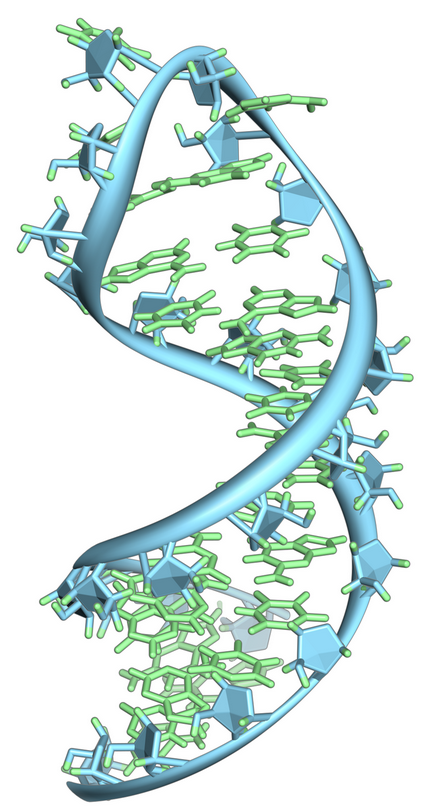

## 笔记本实验

This notebook implements the work from [RNA Folding Using Quantum Computers](https://journals.plos.org/ploscompbiol/article?id=10.1371/journal.pcbi.1010032) inspired by the work from [QHack 2022 Winner](https://github.com/XanaduAI/QHack2022/issues/114).

本笔记本实现了 [使用量子计算机进行 RNA 折叠](https://journals.plos.org/ploscompbiol/article?id=10.1371/journal.pcbi.1010032) 的工作，灵感来自 [QHack 2022 Winner](https://journals.plos.org/ploscompbiol/article? //github.com/XanaduAI/QHack2022/issues/114）。

## RNA折叠

RNA折叠是指单链RNA分子通过形成分子内碱基对而采用特定的三维结构的过程。这个过程对于RNA在各种生物过程中的正常功能至关重要，例如基因表达、RNA剪接和蛋白质合成。

图7: 来自pre-mRNA的发夹环[7](#wiki-rna)

在这项工作中，量子退火被用来预测 RNA 的二级结构。
为了引导系统最大化碱基对的数量和茎的平均长度，
哈密​​顿量以二元二次模型 (BQM) 格式制定。

部署完成后，您可以在**堆栈**页面选择解决方案的根堆栈，选择**输出（Outputs）**，打开笔记本的链接。请到**healthcare-and-life-sciences/a-1-molecular-unfolding-quadratic-unconstrained-binary-optimization/molecular-unfolding-qubo.ipynb**查看细节。

# 参考

- 7.[Wiki: RNA](https://en.wikipedia.org/wiki/RNA)