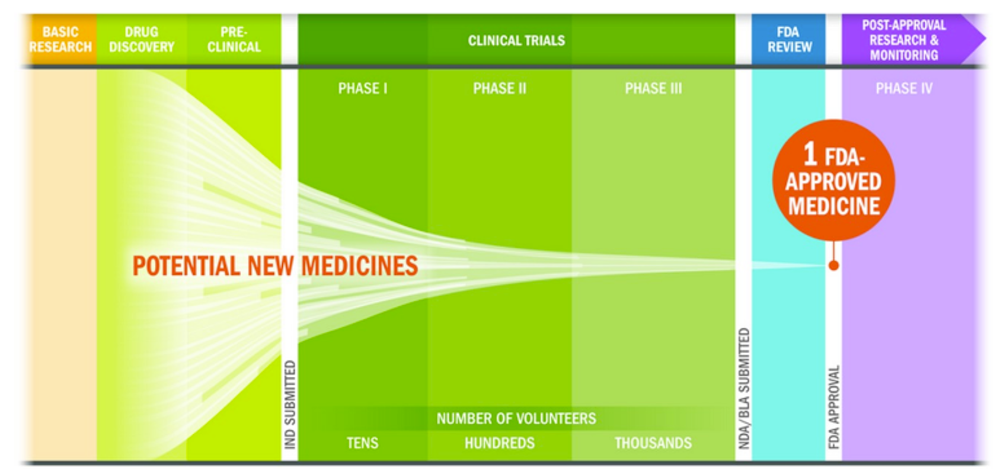
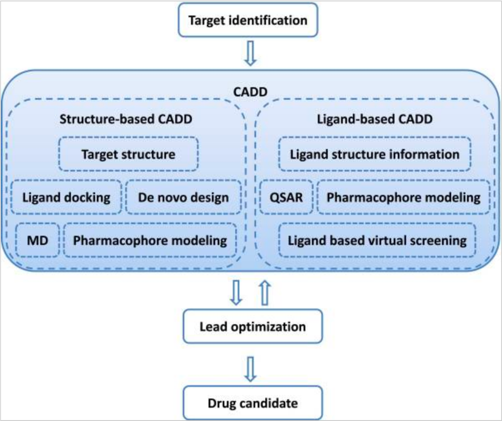
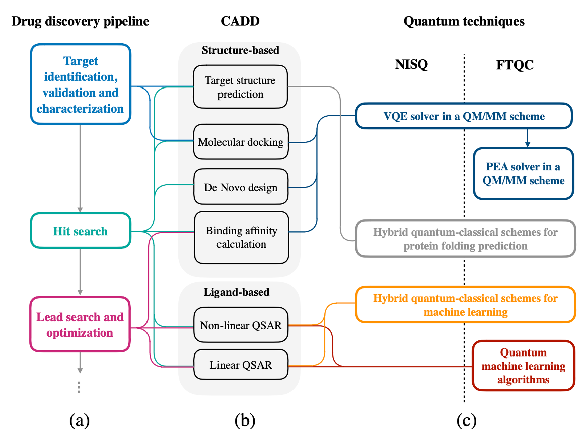

# 背景信息

截至2022年6月，我们可以看到量子计算技术仍处于早期阶段，我们对其真正影响尚未完全了解。量子计算有多个用例，详情可参考[链接](https://www.forbes.com/sites/chuckbrooks/2021/03/21/the-emerging-paths-of-quantum-computing/?sh=765b2ed6613e)。

我们仍在使用嘈杂的中尺寸量子计算机（Noisy intermediate-scale quantum computing，NISQ），其领先的量子处理器包含从50个到几百个量子比特。然而，这与容错量子计算机（Fault-tolerant quantum computing, FTQC）存在巨大差距，后者可以在量子计算机上运行强大的算法。

药物发现问题是计算类研究人员致力于评测量子计算发展阶段的领域之一。生物制药是一个高风险且耗时的流程。从药物发现得到的众多候选药物到得到一颗经过美国食品药品监督管理局（Food and Drug Administration, FDA）批准的药物，至少需要平均10年的时间，以及平均26亿美元的研发成本[2](#drug-discovery)。例如，在过去16年的阿尔茨海默病治疗研究中，在临床研究中测试的123次治疗尝试中，只有四种新药被批准用于治疗阿尔茨海默病，批准率仅有3%。

图 3: 生物制药研发流程[3](#drug-discovery)

为了解决上述问题，研究人员利用计算机辅助药物设计 (CADD) 来提高药物发现的生产效率。如图4所示，CADD有很多方法，有基于结构的和基于配基的。量子计算有望被应用到其中的一些具体环节以提高效率，而研究人员已经列出了对应的技术以及应用的环节，比如将VQE求解器应用到分子对接等。具体可参考图5。

图 4: CADD[4](#cadd)

虽然我们还没有足够的资源构造一个强大的量子计算机，即图5中的容错量子计算机（FTQC)，但是我们已经能够通过Amazon Braket访问嘈杂的中尺寸量子计算机（NISQ）。因此，我们可以更方便开展药物发现与量子计算的研究课题，建立专业知识，和积累知识产权。

图 5: CADD流程里面的量子计算用例[5](#cadd)

# 参考

 - 2.“Cost of Developing a New Drug”. Tufts CSDD & School of Medicine and US FDA Infographics, Nov.2014

 - 3.[The drug development and approval process is about much more than the final “okay”](https://catalyst.phrma.org/the-drug-development-and-approval-process-is-about-much-more-than-the-final-okay)

- 4.Sliwoski, Gregory, et al. "Computational methods in drug discovery." Pharmacological reviews 66.1 (2014): 334-395

- 5.Cao, Yudong, Jhonathan Romero, and Alán Aspuru-Guzik. "Potential of quantum computing for drug discovery." IBM Journal of Research and Development 62.6 (2018): 6-1.