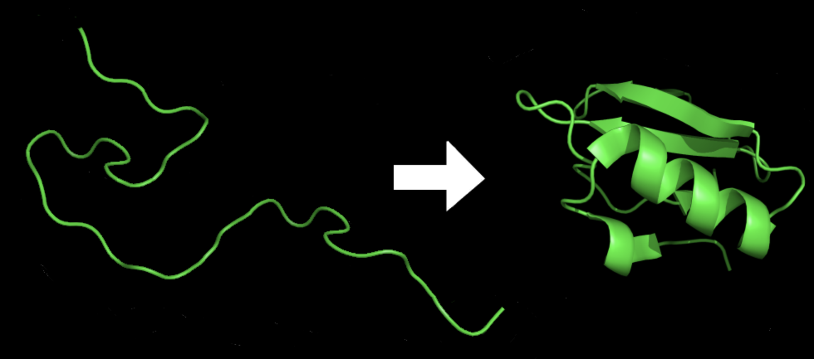

## 笔记本实验

本笔记本基于Amazon Braket实现了
[QFold：quantum walk and deep learning to solve protein folding](https://iopscience.iop.org/article/10.1088/2058-9565/ac4f2f)。这主要是由 [Roberto Campos](https://github.com/roberCO) 基于他的 [implementation](https://iopscience.iop.org/article/10.1088/2058-9565/ac4f2f) 贡献的。

## 使用量子游走的蛋白质折叠

蛋白质折叠是蛋白质分子呈现其三维形状的过程，
这对其正常功能至关重要。
蛋白质由氨基酸的线性链组成，
它们的最终结构由氨基酸的序列和它们之间的相互作用决定。

在蛋白质折叠过程中，线性氨基酸链折叠成独特的三维结构，通过各种类型的相互作用（例如氢键、静电力和范德华力）来稳定该结构。蛋白质折叠的过程非常复杂，涉及多个阶段，包括二级结构的形成，例如 alpha 螺旋和 beta 折叠，以及将这些结构包装成最终的三维形状。

图8: 折叠前后的蛋白质[8](#wiki-protein)

在这项工作中，量子行走被应用
到 Metropolis 算法，以预测蛋白质如何在 3D 中折叠。
量子行走是经典随机行走的量子模拟。与经典的随机游走不同，游走者占据确定的状态，随机性是由于状态之间的随机转换而产生的，在量子游走中，随机性是通过以下方式产生的：(1) 状态的量子叠加，(2) 非随机、可逆的单一演化(3) 状态测量引起的波函数坍缩。这在原始论文中被命名为 Qfold。

图9: QFold算法方案[9](#qfold)

部署完成后，您可以在**堆栈**页面选择解决方案的根堆栈，选择**输出（Outputs）**，打开笔记本的链接。请到**healthcare-and-life-sciences/c-1-protein-folding-quantum-random-walk/protein-folding-qrw.ipynb**查看细节。

# 参考

- 8.[Wiki: Protein](https://en.wikipedia.org/wiki/Protein_folding)

- 9.[QFold: Quantum Walks and Deep Learning to Solve Protein Folding](https://iopscience.iop.org/article/10.1088/2058-9565/ac4f2f)