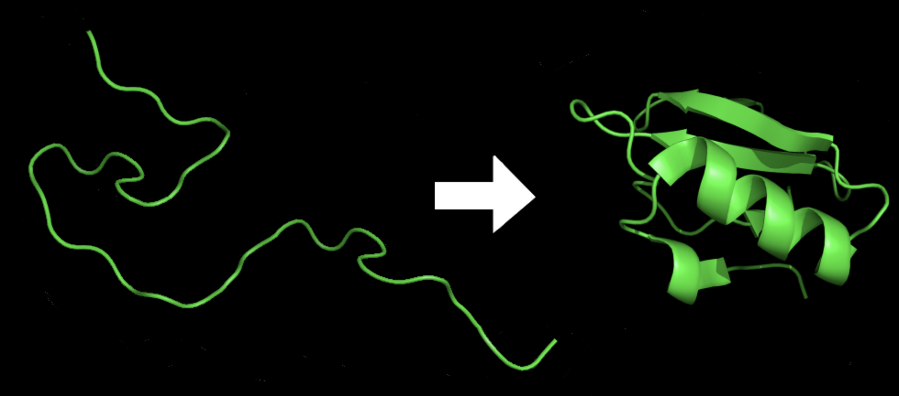
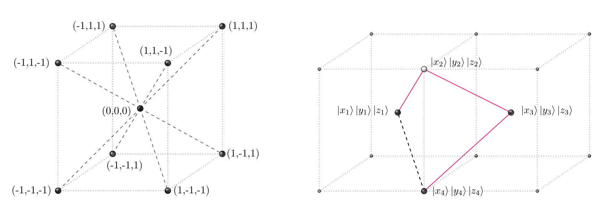

## 笔记本实验

本笔记本基于Amazon Braket实现了[Quantum Speedup for Protein Structure Prediction](https://ieeexplore.ieee.org/document/9374469)。这主要由[Renata Wong](https://scholar.google.com/citations?user=XVFoBw4AAAAJ&hl=en) 和 [Weng-Long Chang](https://ieeexplore.ieee.org/author/37273919400)贡献。

## 使用Grover算法的蛋白质折叠

蛋白质折叠是蛋白质分子呈现其三维形状的过程，
这对其正常功能至关重要。
蛋白质由氨基酸的线性链组成，
它们的最终结构由氨基酸的序列和它们之间的相互作用决定。

在蛋白质折叠过程中，线性氨基酸链折叠成独特的三维结构，通过各种类型的相互作用（例如氢键、静电力和范德华力）来稳定该结构。蛋白质折叠的过程非常复杂，涉及多个阶段，包括二级结构的形成，例如 alpha 螺旋和 beta 折叠，以及将这些结构包装成最终的三维形状。

图11: 折叠前后的蛋白质[8](#wiki-protein)

在这项工作中，基于快速量子算法
建议使用 Grover 搜索。蛋白质结构
预测问题在研究
体心立方晶格的三维疏水-亲水模型。
结果显示二次加速
超过其经典同行。

图12: 体心立方晶格[11]

Grover 算法是一种量子算法，它
可用于搜索未分类的数据库
O(sqrt(N)) 时间内的 N 项。这是一个
显着加速相比
经典算法，需要 O(N) 时间来搜索未排序的数据库。

部署完成后，您可以在**堆栈**页面选择解决方案的根堆栈，选择**输出（Outputs）**，打开笔记本的链接。请到**healthcare-and-life-sciences/c-3-protein-folding-grover-search/protein-folding-gs.ipynb**查看细节。

# 参考

- 11.[Wiki: Protein](https://en.wikipedia.org/wiki/Protein_folding)

- 12.[QFold: Quantum Walks and Deep Learning to Solve Protein Folding](https://iopscience.iop.org/article/10.1088/2058-9565/ac4f2f)