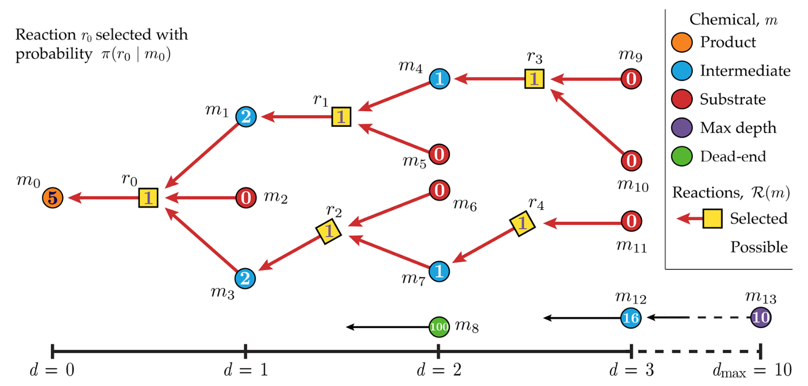

## 笔记本实验

这个笔记本实现了使用量子强化学习进行逆合成规划。
这主要由[Xiangyu Li](https://github.com/lxy-z)贡献，灵感来自于
[Learning Retrosynthetic Planning through Simulated Experience](https://pubs.acs.org/doi/10.1021/acscentsci.9b00055)

## 使用量子强化学习的逆合成规划

逆合成计划是一种设计用于制备复杂有机分子的有效合成路线的策略。它涉及将目标分子分解成更简单的前体分子，然后确定可用于合成这些前体的合成途径。这是一个必不可少的策略
用于设计高效的合成路线
对于复杂的有机分子。

图13: 逆合成分析示例[12](#wiki-retro)

这
量子强化学习
逆合成计划涉及
编码目标分子和
可用的合成变换作为量子态。
然后量子强化学习算法可以使用这些状态来
学习合成变换的最佳序列以达到
从一组起始材料中提取目标分子。该算法可以从已知反应的数据库中学习，也可以从虚拟环境中的反复试验中学习，以优化合成过程。

部署完成后，您可以在**堆栈**页面选择解决方案的根堆栈，选择**输出（Outputs）**，打开笔记本的链接。请到**healthcare-and-life-science/d-1-retrosynthetic-planning-quantum-reinforcement-learning/retrosynthetic-planning-qrl.ipynb**查看细节。

# 参考

- 13.[Learning Retrosynthetic Planning through Simulated Experience](https://pubs.acs.org/doi/10.1021/acscentsci.9b00055).