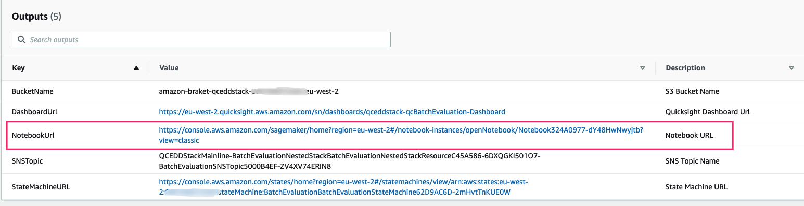

## 笔记本实验

此笔记本使用量子卷积神经网络 (QCNNs) 实现医学图像分析。

## 利用QCNNs进行医学图像分析

医学成像是对身体内部进行成像的技术和过程
临床分析和医疗干预，以及视觉表现
某些器官或组织的功能（生理学）。
医学成像旨在揭示隐藏在皮肤和骨骼中的内部结构，以及诊断和治疗疾病

图20: 胸部 CT 扫描的一帧[12](#wiki-medical-image)

QCNNs 使用量子电路对医学图像执行卷积和池化操作，
表示为量子态。这些电路的目的是采取
利用叠加和纠缠的量子特性，
这允许对大型数据集进行更高效和强大的处理。
QCNNs 还可用于执行其他任务，例如图像分割和特征提取。

## 笔记本概览

1. 登录 [AWS CloudFormation 控制台](https://console.aws.amazon.com/cloudformation/home?)。
2. 在 **Stacks** 页面上，选择解决方案的根堆栈。
3. 选择 **Outputs** 选项卡并打开笔记本的链接。

    

    图 21：堆栈输出选项卡上的笔记本 URL

4. 打开
**healthcare-and-life-science/d-1-retrosynthetic-planning-quantum-reinforcement-learning/retrosynthetic-planning-qrl.ipynb**目录下的文件，
选择内核**qc_hcls_retrosynthetic_planning_qrl**。

4. 打开
**healthcare-and-life-science/e-1-medical-image-quantum-convelutional-neural-networks/medical-image-qcnn.ipynb**并选择内核
**qc_hcls_medical_image_qcnn**.

# 参考

# References

- 12.[Wiki: Medical Image](https://en.wikipedia.org/wiki/RNA)